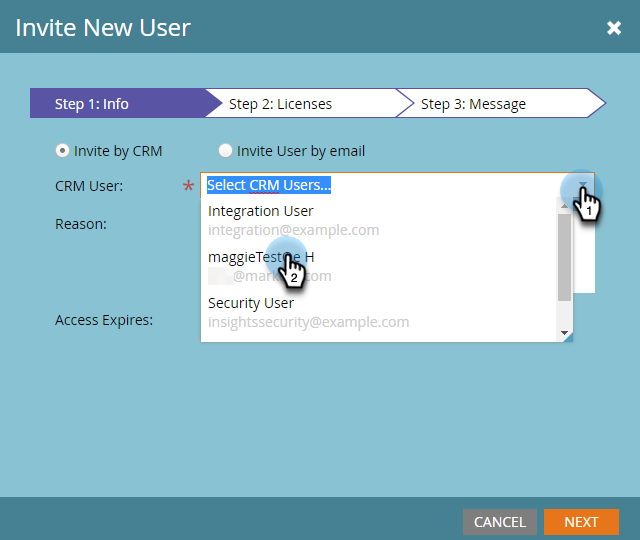
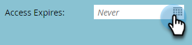

# Einladen von Benutzern zum Zugriff auf Kontoeinblicke {#invite-users-to-access-account-insight}

Führen Sie die folgenden Schritte aus, um Benutzern Zugriff auf Kontoeinblicke zu gewähren.

1. Klicks **Admin**.

   

1. Klicks **Benutzer und Rollen** im Baum. Klicken Sie anschließend auf **Vertriebsbenutzer** und **Neuen Vertriebsbenutzer einladen**.

   

   Es gibt zwei Möglichkeiten, Benutzer einzuladen: per CRM oder per E-Mail. In diesem Beispiel verwenden wir Einladen nach CRM.

   >[!NOTE]
   >
   >Wenn Sie über die CRM-Benutzerliste neue (Nicht-Marketo-) Benutzer einladen, können Sie mehrere Personen gleichzeitig einladen. Einladung per E-Mail ist 1 für 1.

1. Klicken Sie auf **CRM-Benutzer** und wählen Sie den gewünschten Benutzer aus.

   

   >[!NOTE]
   >
   >Wenn Sie **Benutzer per E-Mail einladen** Geben Sie einfach ihren Vornamen, Nachnamen und ihre E-Mail-Adresse ein und fahren Sie mit Schritt 4 fort.

1. Um ein Ablaufdatum für den Zugriff des Benutzers festzulegen (optional), klicken Sie auf das Kalendersymbol. Er ist standardmäßig auf &quot;never&quot;gesetzt.

   

1. Klicks **Nächste**.

   

1. Überprüfen Sie die **Kontoeinblick** aktivieren und auf **Nächste**.

   

1. Überprüfen Sie die Versandnachricht, nehmen Sie die gewünschten Änderungen vor (optional) und klicken Sie auf **Senden**.

   
