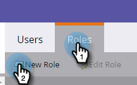
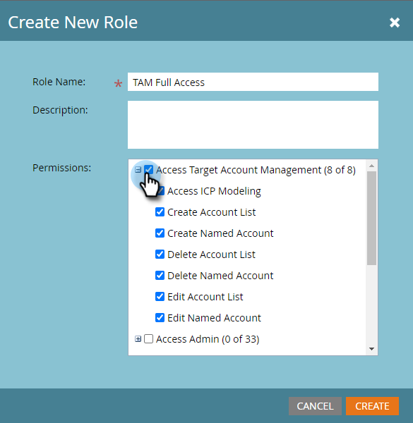

# Berechtigungen {#permissions}

Sie müssen Berechtigungen einrichten, damit Ihre Benutzer TAM verwenden können. Und so geht das.

1. Klicken Sie auf **[!UICONTROL Admin]**.

   

1. Klicken Sie auf **[!UICONTROL Benutzer und Rollen]**.

   

   >[!NOTE]
   >
   >Sie können TAM-Berechtigungen für eine vorhandene Rolle hinzufügen oder eine brandneue erstellen. In diesem Beispiel wird eine neue Rolle verwendet.

1. Klicken Sie auf **[!UICONTROL Rollen]** und dann auf **[!UICONTROL Neue Rolle]**.

   

1. Geben Sie einen [!UICONTROL Rollennamen] ein und klicken Sie auf das Symbol **+** neben dem Kontrollkästchen **[!UICONTROL Verwaltung des Target-]** .

   

1. Um _alle_ Berechtigungen auszuwählen, aktivieren Sie einfach das Kontrollkästchen **[!UICONTROL Zugriff auf Target-]**).

   

   >[!NOTE]
   >
   >Sie haben auch die Möglichkeit, nur einige der Optionen auszuwählen. Aktivieren Sie dazu jedes Kontrollkästchen einzeln.

1. Klicken Sie auf **+**, um das Menü **[!UICONTROL Zugriff auf Admin]** zu öffnen. Aktivieren Sie das **[!UICONTROL Zugriff auf ABM Admin]**-Kontrollkästchen (ABM ist der vorherige Name für TAM) und klicken Sie auf **[!UICONTROL Erstellen]**.

   

   Ihre neue TAM-Rolle kann jetzt [einem Benutzer zugewiesen) ](/help/marketo/product-docs/administration/users-and-roles/managing-user-roles-and-permissions.md#assign-roles-to-a-user).
