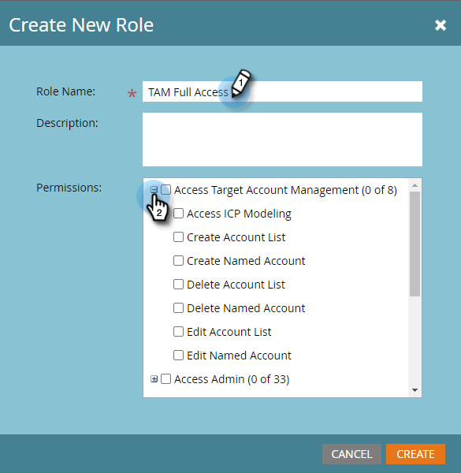

# Berechtigungen {#permissions}

Sie müssen Berechtigungen einrichten, damit die Benutzer TAM verwenden können. So geht es.

1. Klicken Sie auf **Admin**.

   

1. Klicken Sie auf **Benutzer und Rollen**.

   

   >[!NOTE]
   >
   >Sie können TAM-Berechtigungen für eine vorhandene Rolle hinzufügen oder eine neue erstellen. In diesem Beispiel wird eine neue Rolle verwendet.

1. Klicken Sie auf **Rollen** und dann **Neue Rolle**.

   

1. Geben Sie einen Rollennamen ein und klicken Sie auf das Symbol **+** neben dem Kontrollkästchen Kontoverwaltung für Zugriff auf Zielgruppe.

   

1. Um _alle_-Berechtigungen auszuwählen, aktivieren Sie einfach das Kontrollkästchen **Kontoverwaltung für Zielgruppe aufrufen**.

   

   >[!NOTE]
   >
   >Sie haben auch die Möglichkeit, nur einige der Optionen auszuwählen. Markieren Sie dazu die einzelnen Kontrollkästchen einzeln.

1. Klicken Sie auf **+**, um das Menü &quot;Zugriffsadministrator&quot;zu öffnen. Markieren Sie das Kontrollkästchen **Zugriff auf ABM Admin** (ABM ist der vorherige Name für TAM) und klicken Sie auf **Erstellen**.

   

   Ihre neue TAM-Rolle kann nun [einem Benutzer zugewiesen werden](/help/marketo/product-docs/administration/users-and-roles/managing-user-roles-and-permissions.md#assign-roles-to-a-user)!
