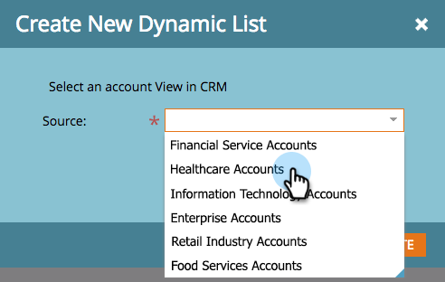

# Kontenlisten {#account-lists}

Eine Kontenliste ist eine Sammlung benannter Konten, die als Ziel ausgewählt werden können. Mit Account-Listen können Sie benannte Accounts nach Branche, Standort oder Größe des Unternehmens auswählen.

Zusätzlich zu den Kontolisten können Sie auch dynamische Kontolisten erstellen, die aus öffentlichen CRM-Kontoansichten generiert werden. Eine CRM-Kontoansicht ist ein Regelsatz, der beim Anzeigen von Konten als Filter dient. Sie können damit beispielsweise Konten suchen, bei denen die Branche das Gesundheitswesen ist *und der* über 100 Millionen US-Dollar beträgt.

>[!NOTE]
>
>In Marketo Target Account Management erstellte Account-Listen sind beim Erstellen von Smart Lists und Web-Kampagnen in [Web Personalization) automatisch ](/help/marketo/product-docs/web-personalization/using-web-segments/web-segments.md).

## Erstellen einer neuen Kontoliste {#create-a-new-account-list}

1. Klicken Sie auf **Neu** und wählen Sie **Neue Kontoliste erstellen**.

   

1. Benennen Sie Ihre Liste und klicken Sie auf **Erstellen**.

   

1. Nachdem Sie Ihre Kontoliste erstellt haben, beginnen Sie mit dem [Hinzufügen benannter Konten](/help/marketo/product-docs/target-account-management/target/named-accounts/add-an-existing-named-account-to-an-account-list.md)!

   >[!NOTE]
   >
   >Marketo zeigt nur Einblicke für Kontolisten mit 2.000 oder weniger benannten Konten an.

## Erstellen einer neuen Liste für dynamische Konten {#create-a-new-dynamic-account-list}

1. Klicken Sie auf **Neu** und wählen Sie **Neue dynamische Liste erstellen**.

   

1. Wählen Sie im Dialogfeld eine **CRM-Kontoansicht** aus der Dropdown-Liste aus oder geben Sie den Namen ein, um danach zu suchen.

   

1. Klicken Sie auf **Erstellen**.

   

   >[!NOTE]
   >
   >Stellen Sie in Salesforce sicher, dass Sie dem Synchronisierungsbenutzer Berechtigungen für Listenansichtsobjekte gewähren.

## Umbenennen einer Kontoliste {#rename-an-account-list}

>[!NOTE]
>
>Diese Schritte gelten nur für Kontolisten. _Dynamic_-Kontolisten verwenden den Namen der zugehörigen CRM-Kontoansichten.

1. Wählen Sie das Konto aus, das Sie umbenennen möchten, klicken Sie auf die Dropdown **Liste der Kontoaktionen** und wählen Sie **Kontoliste umbenennen**.

   

1. Geben Sie den neuen Namen ein und klicken Sie auf &quot;**&quot;**.

   

   >[!NOTE]
   >
   >Die CRM-Kontoansicht wird alle 8 Stunden mit der dynamischen Kontoliste synchronisiert. Wenn sie noch nicht synchronisiert sind, synchronisiert Marketo sie im nächsten Zyklus.

## Löschen einer Kontoliste {#delete-an-account-list}

>[!NOTE]
>
>Diese Schritte sind sowohl für Kontolisten als auch für dynamische Kontolisten identisch.

1. Wählen Sie das zu löschende Konto aus, klicken Sie auf die Dropdown **Liste „Aktionen“ und** Sie **Kontoliste löschen**.

   

1. Klicken Sie auf **Löschen**.

   

>[!MORELIKETHIS]
>
>* [Ein vorhandenes benanntes Konto zu einer Kontoliste hinzufügen](/help/marketo/product-docs/target-account-management/target/named-accounts/add-an-existing-named-account-to-an-account-list.md)
>* [Einblicke in Kontolisten](/help/marketo/product-docs/target-account-management/measure/account-list-insights.md)
