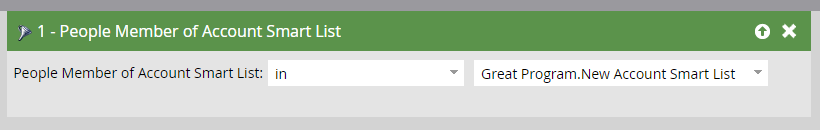

# Intelligente Kontolisten {#account-smart-lists}

So können Sie Ihre hochwertigen Konten schnell und präzise identifizieren.

>[!NOTE]
>
>Diese Funktion ist nur für Benutzer verfügbar, die sowohl über das Target Account Management-Add-on als auch über eine lizenzierte TAM verfügen.

## Erstellen einer intelligenten Kontoliste {#create-an-account-smart-list}

1. Navigieren Sie in Marketo zu **Marketingaktivitäten**.

   

1. Wählen Sie das gewünschte Programm aus.

   

1. Klicken Sie auf **Neu** und wählen Sie **Neues lokales Asset**.

   

1. Klicken **Intelligente Kontoliste**.

   

1. Geben Sie einen Namen ein und klicken Sie auf **Erstellen** (Beschreibung und Beschriftungen sind optional).

   

Ihre Konto-Smart-Liste wurde erstellt! Anweisungen zum Definieren der Regeln finden Sie unten.

## Konto-Smart-List-Regeln {#account-smart-list-rules}

Smart-Listen für Konten funktionieren ähnlich wie standardmäßige Smart-Listen, mit einer wichtigen Ausnahme: Container.

1. Klicken Sie zum Definieren Ihrer Konto-Smart-Liste auf die Schaltfläche **Intelligente Listenregeln für Konten** Registerkarte.

   

1. Wählen Sie die gewünschten Kontofilter aus. In diesem Beispiel wählen wir _Industrie ist Gesundheitswesen_.

   

   

   >[!NOTE]
   >
   >In Ihrer [Ranking und Optimierung von Kontoprofilen](/help/marketo/product-docs/target-account-management/account-profiling/account-profiling-ranking-and-tuning.md) wird als benutzerdefinierte Kontoattribute angezeigt, die in Ihrer intelligenten Kontoliste verwendet werden können. Diese benutzerdefinierten Attributdaten basieren auf dem Zeitpunkt, zu dem das Kontoprofilmodell erstellt/aktualisiert wurde.

1. Wählen Sie die Filter für übereinstimmende Personen aus. In diesem Beispiel wählen wir _Bundesstaat Kalifornien_.

   

**OPTIONALER SCHRITT**: Hier kommen Container herein. Wenn Sie einen zusätzlichen Filter für übereinstimmende Personen auswählen, können Sie ihn unter den ersten Filter legen oder _in_ Erstellen eines Containers. In diesem Beispiel erstellen wir einen Container, indem wir _Auftragstitel ist CFO_.

So sieht der Container aus.

>[!NOTE]
>
>Beim Erstellen eines Containers mit Filtern wird eine &quot;und&quot;-Regel erstellt, d. h., es werden nur alle kombinierten Ergebnisse zurückgegeben. In diesem Beispiel entfällt eine Branche des Gesundheitswesens auf Kalifornien. _und_ mit einer Person, die als CFO gelistet ist. Wenn Sie keine Container verwenden möchten, legen Sie einfach den Filter unter/über dem vorhandenen ab.

Und das ist es! Im folgenden Abschnitt erfahren Sie, wie Sie Ihre intelligente Kontoliste nutzen können.

>[!TIP]
>
>Wie bei standardmäßigen Smart-Listen können Sie auch erweiterte Logik verwenden, um Ihre Ergebnisse weiter zu verfeinern. Dazu benötigen Sie mindestens drei Filter. In den Konto-Smart-Listen entspricht ein Container (unabhängig von der Anzahl der darin enthaltenen Filter) einem Filter.

## Konto-Smart-List-Aktionen {#account-smart-list-actions}

Auf der Registerkarte Übersicht Ihrer Smart-Liste Konto werden Ihnen einige Aktionsoptionen angezeigt.

**Export**: Dadurch werden die Ergebnisse Ihrer Konto-Smart-Liste als CSV exportiert.

**Klonen**: Kopiert Ihre intelligente Kontoliste.

**An Werbenetzwerk senden**: Sendet die Liste als neue übereinstimmende Zielgruppe an LinkedIn.

Sie können Ihre intelligente Kontoliste auch in einer standardmäßigen Smart-Kampagne/-Liste referenzieren, indem Sie die _Personen, die Mitglied der intelligenten Kontoliste sind_ Filter.

>[!NOTE]
>
>Die Ergebnisse der Smart-Liste &quot;Personen mit Konto&quot;zeigen jede Person in den identifizierten Konten an, nicht nur Personen, die über die Filter für übereinstimmende Personen in der Konto-Smart-Liste gefunden wurden.

>[!NOTE]
>
>**Definition**
>
>**Personen, die Mitglied der intelligenten Kontoliste sind**: In diesem Fall bezieht sich das Wort &quot;Mitglied&quot;auf das Konto selbst, also bedeutet &quot;Mitglied des Benutzers&quot; die Personen (Marketo-Datensätze) in diesen Konten.
