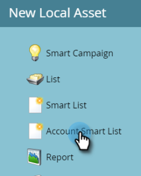

# Intelligente Kontolisten {#account-smart-lists}

So können Sie schnell und präzise Ihre hochwertigen Konten identifizieren.

>[!NOTE]
>
>Diese Funktion steht nur jenen zur Verfügung, die sowohl über das Add-on [!UICONTROL Target Account Management] als auch über eine TAM-Lizenz verfügen.

## Erstellen einer [!UICONTROL Smart-Liste für Konten] {#create-an-account-smart-list}

1. Navigieren Sie in Marketo zu **[!UICONTROL Marketing-Aktivitäten]**.

   

1. Suchen und wählen Sie Ihr gewünschtes Programm aus.

   

1. Klicken Sie auf **[!UICONTROL Neu]** und wählen Sie **[!UICONTROL Neues lokales Asset]**.

   

1. Klicken Sie **[!UICONTROL Smart-Liste Konto]**.

   

1. Geben Sie einen Namen ein und klicken Sie auf **[!UICONTROL Erstellen]** (Beschreibung und Beschriftungen sind optional).

   

Ihre [!UICONTROL Smart List des Kontos] wurde erstellt! Anweisungen zum Definieren der Regeln finden Sie unten.

## [!UICONTROL Regeln für Smart-Listen]Konten {#account-smart-list-rules}

[!UICONTROL Konto-Smart]Listen funktionieren ähnlich wie Standard-Smart-Listen, mit einer bemerkenswerten Ausnahme: Container.

1. Um Ihre [!UICONTROL Smart-Liste für Konten] zu definieren, klicken Sie auf die Registerkarte **[!UICONTROL Regeln für Smart-Listen für Konten]**.

   

1. Wählen Sie Ihre gewünschten Kontofilter aus. In diesem Beispiel wählen wir &quot;_[!UICONTROL &quot; &#x200B;] &quot;[!UICONTROL &quot;]_.

   

   

   >[!NOTE]
   >
   >Die ICP-Indikatordaten, die in Ihrem [Account-Profiling, Ranking und Tuning](/help/marketo/product-docs/target-account-management/account-profiling/account-profiling-ranking-and-tuning.md) verwendet wurden, werden als benutzerdefinierte Kontoattribute zur Verwendung in Ihrer Account-Smart-Liste angezeigt. Diese benutzerdefinierten Attributdaten basieren auf dem Zeitpunkt, zu dem das Kontoprofilmodell erstellt/aktualisiert wurde.

1. Wählen Sie Ihre passenden Personenfilter aus. In diesem Beispiel wählen wir &quot;_ist Kalifornien_.

   

**OPTIONALER SCHRITT**: Hier kommen Container ins Spiel. Wenn Sie einen zusätzlichen Filter für übereinstimmende Personen auswählen, können Sie ihn unter dem ersten Filter ablegen oder _in_ einen Container erstellen. In diesem Beispiel erstellen wir einen Container, indem wir _Auftragstitel ist CFO_ hinzufügen.

So wird der Container aussehen.

>[!NOTE]
>
>Beim Erstellen eines Containers mit Filtern wird eine „Und“-Regel erstellt, d. h. es werden nur alle Ergebnisse kombiniert zurückgegeben. In diesem Beispiel Konten bei einer Branche des Gesundheitswesens zusammen mit einem Standort in Kalifornien _und_ mit einer Person, die als CFO aufgeführt ist. Wenn Sie keine Container verwenden möchten, legen Sie den Filter einfach unter/über dem vorhandenen ab.

Und das war&#39;s! Im folgenden Abschnitt erfahren Sie, wie Sie Ihre [!UICONTROL Account Smart List“ &#x200B;] können.

>[!TIP]
>
>Genau wie bei standardmäßigen Smart Lists können Sie erweiterte Logik verwenden, um Ihre Ergebnisse weiter zu verfeinern. Dazu benötigen Sie mindestens drei Filter. In [!UICONTROL Konto-Smart-Listen] entspricht ein Container (unabhängig von der Anzahl der darin enthaltenen Filter) einem Filter.

## [!UICONTROL Konto-Smart-]) {#account-smart-list-actions}

Auf der Registerkarte Übersicht Ihrer [!UICONTROL Smart List des Kontos] werden Sie einige Aktionsoptionen feststellen.

**[!UICONTROL Exportieren]**: Dadurch werden die Ergebnisse Ihrer [!UICONTROL Konto-Smart-Liste] als CSV exportiert.

**[!UICONTROL Klonen]**: Erstellt eine Kopie Ihrer [!UICONTROL Konto-Smart-Liste].

**[!UICONTROL An Werbenetzwerk senden]**: Sendet die Liste an [!DNL LinkedIn] als neue übereinstimmende Zielgruppe.

Sie können auch in einer [!UICONTROL &#x200B; Smart-Kampagne/Liste auf Ihre &#x200B;]Account-Smart-Liste“ verweisen, indem Sie den Filter _[!UICONTROL People Member of Account Smart List]_ verwenden.

>[!NOTE]
>
>Die Ergebnisse der Smart-Liste [!UICONTROL Personen Mitglied des Kontos] zeigen jede Person in den identifizierten Konten an, nicht nur Personen, die über Filter für übereinstimmende Personen in der Smart-Liste des Kontos gefunden werden.

>[!NOTE]
>
>**Definition**
>
>**[!UICONTROL Personen-Mitglied der Konto-Smart-]**: In diesem Fall bezieht sich das Wort „Mitglied“ auf das Konto selbst, sodass „Personen-Mitglied“ die tatsächlichen Personen (Marketo-Einträge) in diesen Konten bedeutet.
