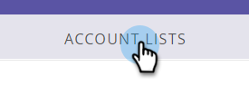
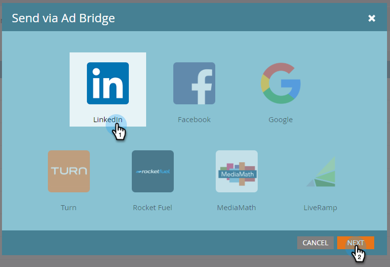
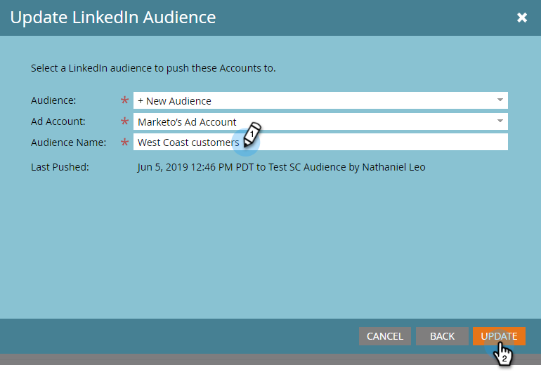

# Erstellen einer mit dem Konto abgeglichenen Zielgruppe in [!DNL LinkedIn] {#create-an-account-matched-audience-on-linkedin}

Erstellen Sie übereinstimmende Zielgruppen für das [[!DNL LinkedIn] Anzeigen-Targeting](https://business.linkedin.com/marketing-solutions/ad-targeting/account-targeting) aus Ihren TAM-Kontolisten. [!DNL LinkedIn] passt die Liste an die Konten in ihrem System an, und Sie können basierend auf dieser Kontoliste eine [!DNL LinkedIn] Zielgruppe erstellen, die über [!DNL LinkedIn] Kanäle hinweg aktiviert werden soll. Dadurch können Marketing-Fachleute Personen innerhalb oder außerhalb ihrer Datenbank ansprechen.

>[!PREREQUISITES]
>
>[Abgestimmte  [!DNL LinkedIn]  als LaunchPoint-Service hinzufügen](/help/marketo/product-docs/demand-generation/ad-network-integrations/add-linkedin-matched-audiences-as-a-launchpoint-service.md)

1. Klicken Sie in TAM auf die **[!UICONTROL Kontolisten]**.

   

1. Wählen Sie Ihre gewünschte Kontoliste aus.

   

1. Klicken Sie auf die **[!UICONTROL Aktionen der Kontoliste]** und wählen Sie **[!UICONTROL Senden über AdBridge]** aus.

   

1. Wählen Sie **[!DNL LinkedIn]** und klicken Sie auf **[!UICONTROL Weiter]**.

   

1. Klicken Sie auf **[!UICONTROL Dropdown-]** „Zielgruppe“. Sie können eine vorhandene Zielgruppe auswählen oder eine neue erstellen. In diesem Beispiel erstellen wir eine neue Zielgruppe (wenn Sie eine vorhandene Zielgruppe auswählen, fahren Sie mit Schritt 7 fort).

   

1. Klicken Sie auf **[!UICONTROL Werbekonto]** und wählen Sie das Ziel-Werbekonto aus.

   

1. Benennen Sie Ihre Audience und klicken Sie auf **[!UICONTROL Aktualisieren]**.

   

Und das war&#39;s. Die Liste Ihrer Konten wurde auf [!DNL LinkedIn] übertragen.

>[!MORELIKETHIS]
>
>[Verwenden einer Marketo-Liste oder Smart-Liste als  [!DNL LinkedIn] -Zielgruppensegment](/help/marketo/product-docs/demand-generation/social/social-functions/use-a-marketo-list-or-smart-list-as-a-linkedin-audience-segment.md)
