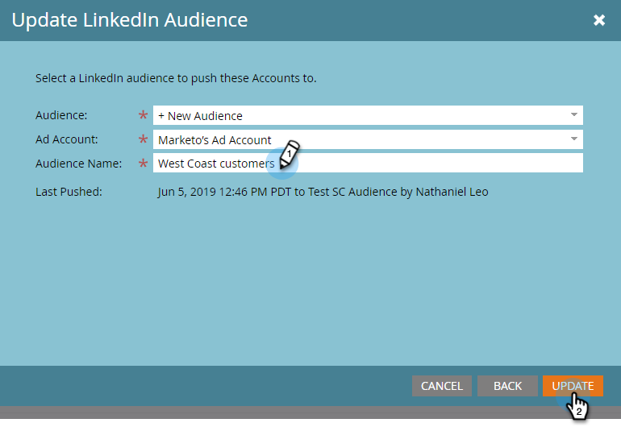

# Erstellen einer mit einem Konto übereinstimmenden Zielgruppe in LinkedIn {#create-an-account-matched-audience-on-linkedin}

Erstellen Sie passende Zielgruppen aus Ihrem TAM-Konto für das Anzeigen-Targeting mit LinkedIn [1. ](https://business.linkedin.com/marketing-solutions/ad-targeting/account-targeting) LinkedIn ordnet die Liste den Konten in seinem System zu und Sie können eine LinkedIn-Zielgruppe auf der Grundlage dieser Kontoliste erstellen, um sie über LinkedIn-Kanäle zu aktivieren. Dadurch können Marketing-Experten Personen in oder außerhalb ihrer Datenbank ansprechen.

>[!PREREQUISITES]
>
>[Hinzufügen von LinkedIn Matched Audiences als LaunchPoint-Dienst](/help/marketo/product-docs/demand-generation/ad-network-integrations/add-linkedin-matched-audiences-as-a-launchpoint-service.md)

1. Klicken Sie in TAM auf die Registerkarte **Kontolisten** .

   

1. Wählen Sie Ihre gewünschte Kontoliste aus.

   

1. Klicken Sie auf das Dropdown-Menü **Kontolistenaktionen** und wählen Sie **Über AdBridge senden** aus.

   

1. Wählen Sie **LinkedIn** und klicken Sie auf **Weiter**.

   

1. Klicken Sie auf das Dropdown-Menü **Zielgruppe** . Sie können eine existierende Zielgruppe auswählen oder eine neue erstellen. In diesem Beispiel erstellen wir eine neue (wenn Sie eine bestehende Zielgruppe auswählen, gehen Sie zu Schritt 7 über).

   

1. Klicken Sie auf das Dropdown-Menü **Anzeigenkonto** und wählen Sie das Zielanzeigenkonto aus.

   

1. Benennen Sie Ihre Zielgruppe und klicken Sie auf **Aktualisieren**.

   

Und das ist es. Ihre Kontoliste wurde an LinkedIn übermittelt.

>[!MORELIKETHIS]
>
>[Verwenden einer Marketo-Liste oder Smart-Liste als LinkedIn-Zielgruppensegment](/help/marketo/product-docs/demand-generation/social/social-functions/use-a-marketo-list-or-smart-list-as-a-linkedin-audience-segment.md)
