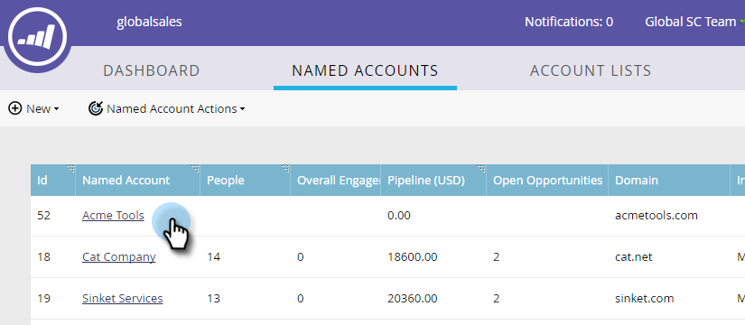
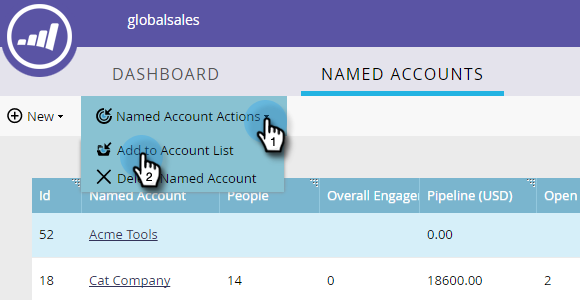

# Hinzufügen eines vorhandenen [!UICONTROL benannten Kontos] zu einer Kontoliste {#add-an-existing-named-account-to-an-account-list}

Das Hinzufügen eines benannten Kontos zu einer Kontoliste ist einfach.

>[!NOTE]
>
>Dies gilt nur für Kontolisten, nicht **für** Kontolisten.

1. Wählen Sie die Zeile des benannten Kontos aus, dem Sie hinzufügen möchten.

   

1. Klicken Sie auf die **[!UICONTROL Benannte Kontoaktionen]** und wählen Sie **[!UICONTROL Zur Kontoliste hinzufügen]** aus.

   

1. Klicken Sie auf **[!UICONTROL Dropdown-]** „Kontoliste“, wählen Sie die gewünschte Kontoliste aus und klicken Sie auf **[!UICONTROL Hinzufügen]**.

   

>[!MORELIKETHIS]
>
>[Erstellen eines [!UICONTROL benannten Kontos]](/help/marketo/product-docs/target-account-management/target/named-accounts/create-a-named-account.md)
