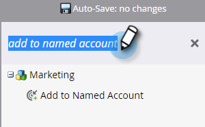

# Personen zu einem benannten Konto hinzufügen {#add-people-to-a-named-account}

Es gibt drei verschiedene Möglichkeiten, Personen manuell zu einem benannten Konto in TAM hinzuzufügen.

## Flow-Akt. {#single-flow-action}

1. Klicken Sie auf **Database**.

   

1. Geben Sie die E-Mail-Adresse der Person ein und drücken Sie die Eingabetaste.

   

1. Klicken Sie auf die Person, um sie auszuwählen. Klicken Sie auf das Dropdown-Menü **Persönliche Aktionen**, klicken Sie auf **Marketing** und wählen Sie **Zu benanntem Konto hinzufügen** aus.

   

1. Klicken Sie auf die Dropdownliste **Benanntes Konto**, wählen Sie das gewünschte benannte Konto aus und klicken Sie auf **Jetzt ausführen**.

   

## Fluss intelligenter Kampagnen - Schritt {#smart-campaign-flow-step}

1. Wählen Sie Ihre Smart-Kampagne aus und klicken Sie auf **Fluss**.

   

1. Geben Sie in das Suchfeld &quot;Zu benanntem Konto hinzufügen&quot;ein.

   

1. Ziehen Sie den Filter auf die Arbeitsfläche.

   

1. Klicken Sie auf die Dropdownliste **Spezifisches Konto** und wählen Sie das gewünschte spezifische Konto aus.

   

   Das ist es! Als Nächstes planen (oder aktivieren) Sie Ihre Smart-Kampagne. Im Flussschritt werden qualifizierte Personen zum angegebenen Konto hinzugefügt.

## Listenimport {#list-import}

1. Wählen Sie Ihre Liste aus, klicken Sie auf das Dropdown-Menü **Listenaktionen** und wählen Sie **Importliste** aus.

   

1. Nachdem Sie Ihre Datei und Einstellungen ausgewählt haben, klicken Sie auf **Weiter**.

   

1. Ordnen Sie die gewünschten Felder zu. Stellen Sie sicher, dass das Feld **Spezifisches Konto** zugeordnet ist.

   

1. Wählen Sie die gewünschten Einstellungen aus und klicken Sie dann auf **Importieren**.

   

>[!MORELIKETHIS]
>
>[ Lead to Account Match](/help/marketo/product-docs/target-account-management/target/named-accounts/lead-to-account-matching.md)
