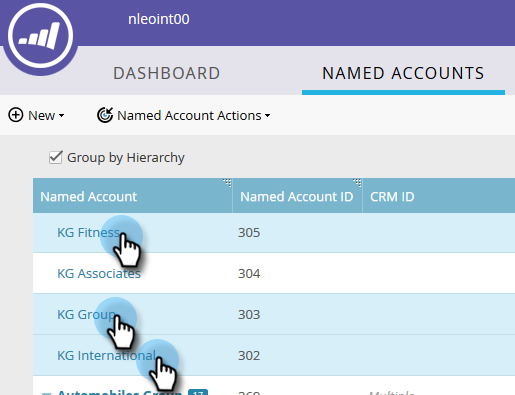

# Erstellen einer Hierarchie {#create-a-hierarchy}

Hierarchien sollen in CRMs erstellt werden. Wenn Sie jedoch kein CRM haben, führen Sie die folgenden Schritte aus, um eine Hierarchie manuell zu erstellen.

1. Klicken Sie in &quot;Spezifische Konten&quot;auf die **Nach Hierarchie gruppieren** aktivieren.

   

   >[!NOTE]
   >
   >Nur Nicht-CRM-Konten können zum manuellen Erstellen einer Hierarchie verwendet werden. CRM-verknüpfte Konten müssen ihre Hierarchien im CRM erstellen lassen.

1. Wählen Sie bei gedrückter Strg- (Windows) bzw. Befehlstaste (Mac) alle Konten aus, die Sie in einer Hierarchie gruppieren möchten.

   

1. Klicken Sie auf **Spezifische Kontoaktionen** und wählen Sie **Link zum benannten Konto**.

   

   >[!NOTE]
   >
   >Wenn Sie die Verknüpfung von Konten aufheben möchten, gehen Sie wie oben beschrieben vor, wählen Sie jedoch **Verknüpfung von benanntem Konto aufheben**.

1. Wählen Sie ein übergeordnetes benanntes Konto aus der Dropdownliste aus und klicken Sie auf **Link**.

   

1. Ihre benannten Konten sind jetzt Teil einer Hierarchie. Klicken Sie auf den Pfeil links, um alle untergeordneten Konten anzuzeigen.

   
