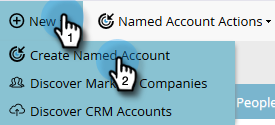

# Erstellen Sie ein [!UICONTROL benanntes Konto] {#create-a-named-account}

Führen Sie die folgenden Schritte aus, um ein benanntes Konto manuell zu erstellen.

1. Klicken [!UICONTROL &#x200B; in „Benannte &#x200B;]&quot; auf die **[!UICONTROL Neu]** und wählen Sie **[!UICONTROL Benanntes Konto erstellen]**.

   

1. Füllen Sie die gewünschten Felder aus und klicken Sie auf **[!UICONTROL Erstellen]**.

   

   >[!TIP]
   >
   >Klicken Sie direkt auf ein benanntes Konto, um dessen Dashboard anzuzeigen.

>[!MORELIKETHIS]
>
>[Personen zu einem [!UICONTROL &#x200B; Konto hinzufügen]](/help/marketo/product-docs/target-account-management/target/named-accounts/add-people-to-a-named-account.md)
