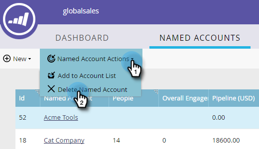

# Löschen eines [!UICONTROL &#x200B; Kontos] {#delete-a-named-account}

Führen Sie diese kurzen Schritte aus, um ein benanntes Konto zu löschen.

1. Wählen Sie die Zeile der benannten Konten aus, die Sie löschen möchten.

   

   >[!NOTE]
   >
   >Strg+Klicken (Windows) bzw. Befehl+Klicken (Mac), um mehrere benannte Konten auszuwählen.

1. Klicken Sie auf die **[!UICONTROL Benannte Kontoaktionen]** und wählen Sie **[!UICONTROL Benanntes Konto löschen]**.

   

1. Klicken Sie auf **[!UICONTROL Löschen]**.

   

   >[!NOTE]
   >
   >Konten, die mit Ihrem CRM synchronisiert wurden, können in TAM nicht gelöscht werden. Wenn die Löschoption nicht verfügbar ist oder Sie die Meldung „Diese Konten können nicht gelöscht werden, da ein oder mehrere CRM-Konten ausgewählt sind“ erhalten, müssen sie direkt im CRM gelöscht werden.
