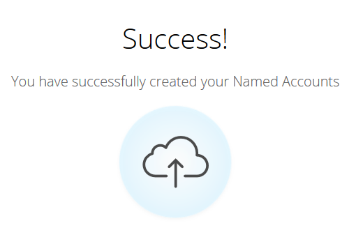

# Erkunden von Konten {#discover-accounts}

Verwenden Sie die Option „Entdecken“, um potenzielle Zielkonten zu identifizieren.

## CRM-Kontos entdecken {#discover-crm-accounts}

Identifizieren Sie potenzielle Zielkonten in Ihrem CRM.

>[!NOTE]
>
>Nachdem Sie Ihr CRM mit dem Marketo-TAM verbunden haben, zeigt **Entdecken von CRM** Konten) alle CRM-Konten und relevante Informationen an, um Ihnen bei der Auswahl der richtigen benannten Konten zu helfen. Marketo fügt zusätzlich zu den vom CRM erhaltenen Informationen weitere Informationen hinzu.

**Personen** (in „CRM-Konten entdecken“ und &quot;Marketo-Unternehmen entdecken„): Umfasst sowohl Kontakte als auch Leads. Leads können mit der Marketo-Funktion [Lead-Konto-Zuordnung](/help/marketo/product-docs/target-account-management/target/named-accounts/lead-to-account-matching.md) erkannt werden.

**Potenzielle Personen** (in CRM-Konten entdecken und Marketo-Unternehmen entdecken): Zeigt, wie viele Leads Marketo gefunden hat, die möglicherweise zu einem CRM-Konto gehören könnten.

**Benutzerdefiniertes CRM-Feld** (nur in „CRM-Konten erkennen„): Auf diese Weise können Sie Ihre Vertriebs- und Marketing-Organisation für die Auswahl der richtigen Zielkonten abstimmen. Nachdem Sie [das benutzerdefinierte CRM-Feld ](/help/marketo/product-docs/target-account-management/setup-tam/create-a-custom-field-for-crm-discovery.md) Marketo TAM zugeordnet haben, zeigen wir Ihnen die zugeordneten Daten, damit Sie Ihre Zielkonten identifizieren können.

1. Klicken Sie unter Benannte Konten auf die **Neu** und wählen Sie **CRM-Konten suchen**.

   

1. Ein neues Fenster/eine neue Registerkarte wird geöffnet. Wählen Sie die CRM-Konten aus, die Sie Ihren spezifischen Konten hinzufügen möchten, und klicken Sie auf **Weiter**.

   

1. Der Bildschirm Vorschau bestätigt die Anzahl der ausgewählten Elemente. Klicken Sie auf **Erstellen**.

   

   Das ist alles, was dazu gehört!

   

## Marketo-Unternehmen entdecken {#discover-marketo-companies}

Identifizieren Sie die richtigen Unternehmen für das Targeting.

>[!NOTE]
>
>In Entdecken Sie Marketo-Unternehmen werden Sie Marketo-Unternehmen sehen, die nicht aus Ihrem CRM stammen.

1. Klicken Sie unter Benannte Konten auf die **Neu** und wählen Sie **Marketo-Unternehmen entdecken** aus.

   

1. Ein neues Fenster/eine neue Registerkarte wird geöffnet. Wählen Sie die Firmen aus, die Sie Ihren Named Accounts hinzufügen möchten, und klicken Sie auf **Weiter**.

   

   >[!NOTE]
   >
   >In &quot;Marketo-Unternehmen entdecken“ und „CRM entdecken“ führt Marketo automatisch folgende Schritte durch:
   >
   >* Sucht Personen in Ihrer Marketo-Datenbank, die diese Firma in ihrem Datensatz aufgelistet haben. Wenn für einige der Attribute (z. B. „Branche„) mehrere Werte angezeigt werden, liegt dies daran, dass Marketo verschiedene Werte für diese einzelnen Personen gefunden hat. Das Attribut mit den meisten Treffern gewinnt
   >
   >Nur in **CRM entdecken** wird Marketo automatisch:
   >
   >* Synchronisiert und verknüpft CRM-Kontakte mit dem benannten Konto
   >
   >Nur **Marketo-Unternehmen entdecken** Marketo automatisch:
   >
   >* Filtert die meisten Internet-Dienstleister und öffentlichen Domains (z. B. yahoo.com, gmail.com) als Firmennamen heraus
   >
   >* Dedupliziert CRM-Konten. Wenn Sie „Acme“ in einem Datensatz und „Acme Inc“ (oder eines der folgenden Suffixe: Co, Corp, Corporation, GmbH, Inc, Incorporated, LLC, LLP, LP, Ltd, PA, PC, PLC, PLC) haben, werden wir diese in TAM als „Acme“ zusammenführen

1. Klicken Sie unter der Spalte Benanntes Konto auf den Abwärtspfeil, um die Dropdown-Liste anzuzeigen.

   

   >[!CAUTION]
   >
   >Künftig werden alle neuen Personen aus diesen ausgewählten Unternehmen automatisch ihren jeweiligen benannten Konten zugewiesen. Bitte überprüfen Sie diese Unternehmen und stellen Sie sicher, dass sie dem richtigen benannten Konto zugewiesen sind.

1. Um ein vorhandenes Konto auszuwählen, klicken Sie auf die **Benanntes Konto**, wählen Sie das gewünschte Konto aus und klicken Sie dann auf **Weiter**.

   

   Sie haben auch die Möglichkeit, ein neues benanntes Konto zu erstellen, indem Sie den gewünschten Namen direkt in das Dropdown-Feld eingeben. Wenn Sie fertig sind, klicken Sie auf eine Stelle außerhalb des Felds…

   

   …und Sie sehen Ihr neues benanntes Konto. Klicken Sie dann einfach auf **Weiter** wie in Schritt 4.

   

1. Klicken Sie auf **Erstellen**.

   

   Gute Arbeit!

   

>[!NOTE]
>
>Wenn zwischen den von Ihnen ausgewählten CRM-Konten und den Elementen im Discover CRM-Raster eine Diskrepanz auftritt, liegt dies wahrscheinlich an einem oder mehreren der folgenden Gründe:
>
>* Unterschiedliche CRM-Konten mit ähnlichen Namen, die dedupliziert wurden
>* Die nächste geplante Synchronisierung ist noch nicht erfolgt

>[!MORELIKETHIS]
>
>[Lead-Konto-Zuordnung](/help/marketo/product-docs/target-account-management/target/named-accounts/lead-to-account-matching.md)
