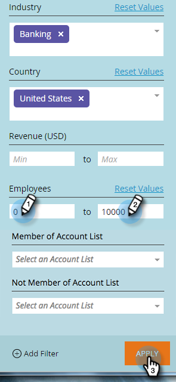

# Filtern in [!UICONTROL benannten Konten] {#filtering-in-named-accounts}

Filtern ist eine hervorragende Möglichkeit, Daten schnell einzugrenzen.

>[!NOTE]
>
>Daten in Filter-Dropdown-Listen spiegeln alle verfügbaren Felder in Ihrem CRM wider, die mit Marketo synchronisiert wurden.

1. Klicken Sie auf das Filtersymbol.

   

   >[!NOTE]
   >
   >Es gibt mehrere Kombinationen von Suchparametern. In diesem Beispiel suchen wir: _[!UICONTROL Branche] = Bankwesen, [!UICONTROL Land] = Vereinigte Staaten, Max [!UICONTROL Mitarbeiter] = 10000_.

1. Klicken Sie auf **[!UICONTROL Dropdown-]** „Branche“ und wählen Sie **[!UICONTROL Banking]**.

   

1. Klicken Sie auf **[!UICONTROL Dropdown-]** „Land“ und wählen Sie **[!UICONTROL Vereinigte Staaten]**.

   

1. Geben **[!UICONTROL unter &quot;]**&quot; in das Feld **Min** „10000“ in das Feld **Max** ein und klicken Sie dann auf **[!UICONTROL Apply]**.

   

   Und das war&#39;s! Die gefilterten Ergebnisse werden auf der linken Bildschirmseite angezeigt.

   >[!NOTE]
   >
   >Um weitere Filter zur Auswahl hinzuzufügen, klicken Sie **[!UICONTROL Filter hinzufügen]** unten links im Formular.
