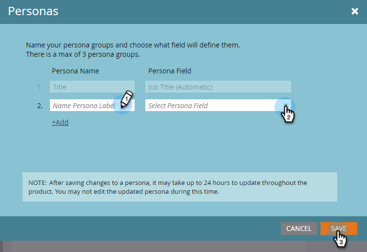

# Verwenden von Personas {#using-personas}

Personas sind eine hervorragende Möglichkeit, Ihre ABM-Zielgruppe zu segmentieren und für eine bestimmte Untergruppe von Personen zu vermarkten.

## Persona hinzufügen {#add-a-persona}

1. Klicken Sie in My Marketo auf **Admin**.

   

1. Wählen Sie in der Struktur **Target-Kontoverwaltung** aus.

   

1. Klicken Sie auf **Bearbeiten**.

   

   >[!NOTE]
   >
   >Die Rolle Auftragstitel ist standardmäßig enthalten. Sie kann nicht geändert oder gelöscht werden.

1. Um weitere Personas hinzuzufügen, klicken Sie auf **+Hinzufügen**.

   

1. Geben Sie Ihrer Rolle einen Namen und wählen Sie das entsprechende Feld in der Dropdown-Liste aus. Sie können bis zu zwei weitere Personas hinzufügen. Klicken Sie auf **Speichern**, wenn Sie fertig sind.

   

   >[!NOTE]
   >
   >Nur benutzerdefinierte Salesforce-Felder vom Typ „Auswahlliste“, die mit Ihrer Marketo-Instanz synchronisiert wurden, sind in der Dropdown-Liste „Personafeld“ verfügbar, wenn Sie eine Rolle erstellen.

## Personas anzeigen {#view-your-personas}

Zeigen Sie Ihre Personas an, indem Sie ein bestimmtes benanntes Konto besuchen.

1. Wählen Sie das gewünschte benannte Konto aus.

   

1. Klicken Sie auf **Registerkarte** Personas“.

   

1. Alle Ihre Personas werden aufgelistet. Klicken Sie auf eine Zahl, um die Liste der Personen anzuzeigen.

   

   >[!NOTE]
   >
   >Das X in der Titelrolle fungiert als Platzhalterzeichen. Beispielsweise umfasst „CXO“ CEOs, CFOs usw.

## Personenfilter {#persona-filters}

1. Verwenden Sie in einer Smart-Liste persönliche Filter, um Inhalte für eine bestimmte Personengruppe zu vermarkten.

