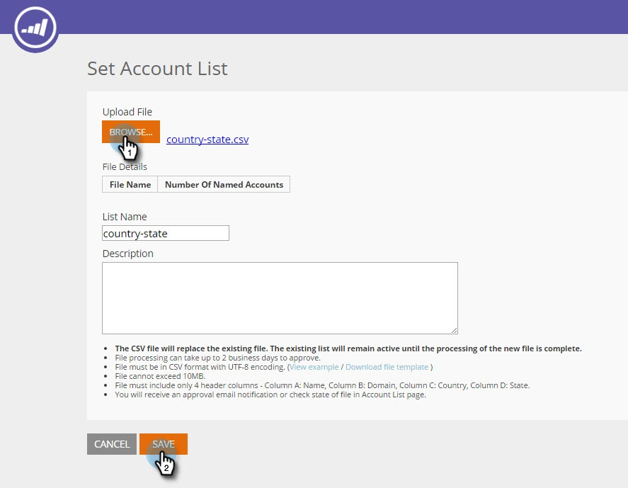

# Neue Kontoliste erstellen {#create-a-new-account-list}

Erstellen Sie eine Liste mit Organisations- und Domänennamen und laden Sie sie hoch, um diese wichtigen Konten mit personalisierten Kampagnen anzusprechen.

>[!NOTE]
>
>Dieser Artikel gilt nur für ältere Web-ABM-Kunden. Wenn Sie nach September 2016 Web ABM erworben haben, führen Sie stattdessen die Schritte in [diesem Artikel](https://docs.marketo.com/display/DOCS/Account+Lists#AccountLists-CreateaNewAccountList) aus.

## Neue Kontoliste erstellen {#create-a-new-account-list-1}

1. Wechseln Sie zu **Kontolisten**.

   

1. Wählen Sie **Neu erstellen** aus.

   

1. Wählen Sie **Durchsuchen** aus und laden Sie Ihre CSV-Datei hoch (stellen Sie sicher, dass die CSV-Datei die Kriterien erfüllt). Fügen Sie einen **Namen** und eine **Beschreibung** hinzu. Klicken Sie auf **Speichern**.

   

   >[!NOTE]
   >
   >**Welches Format hat die CSV-Datei?**
   >
   >Stellen Sie sicher, dass die CSV-Datei mit dem spezifischen Konto die folgenden Anforderungen erfüllt:
   >
   >* Als CSV-Format gespeichert
   >* Höchstens 10 MB
   >* Nur 4 Spalten mit der Kopfzeile Spalte A: Name, Spalte B: Domäne, Spalte C: Land, Spalte D: US-Bundesstaat.
   >* Bis zur Genehmigung hochgeladener Dateien können bis zu 2 Werktage vergehen.
   >* Sie erhalten per E-Mail eine Genehmigung, oder prüfen Sie den Dateistatus auf der Seite für benannte Konten.
   >* Die Gesamtzahl der Datensätze/Zeilen, die für alle hochgeladenen Listen gesammelt wurden, beginnt bei 10.000, das größte Paket insgesamt 100.000.

   >[!NOTE]
   >
   >**Beispiel der CSV-Datei**
   >
   >* Zeile 1 Spalte A Wert = Organisation
   >* Zeile 1 Spalte B Wert = Domäne
   >* Zeile 1 Spalte C Wert = Land
   >* Zeile 1 Spalte D Wert = US-Status
   >* Einer der Spaltenwerte ist obligatorisch. Wenn Sie jedoch sowohl Organisations- als auch Domänennamen angeben, werden die Übereinstimmungsraten der Kontoliste verbessert.
   >* Land und Bundesland sind optionale Werte.
   >
   >   * Verwenden Sie für den Ländernamen den vollständigen Ländernamen oder die Abkürzungsnummer. Z. B. USA oder USA.
   >   * Verwenden Sie für einen US-Bundesstaat den 2-Buchstaben-Abkürzungscode, d. h. CA. Nur US-Staaten werden anerkannt.
   >
   >

## Bearbeiten einer Kontoliste {#edit-an-account-list}

Klicken Sie auf der Seite **Kontolisten** auf das Symbol **Bearbeiten** in der Liste.

Wählen Sie **Durchsuchen** aus und laden Sie Ihre neue CSV-Datei hoch. Diese Datei ersetzt die Originaldatei. Klicken Sie auf **Speichern**. Die neu hochgeladene Datei befindet sich im Status &quot;Ausstehend&quot;, bis sie vom Marketo-Support genehmigt wurde. Sobald sich der Status &quot;Ausstehend&quot; befindet, bleibt die Originaldatei aktiv.

Die CSV-Datei ersetzt die vorhandene Datei. Die vorhandene Liste bleibt aktiv, bis die Verarbeitung der neuen Datei abgeschlossen ist.

## Eine Liste mit benannten Konten löschen {#delete-a-named-account-list}

1. Klicken Sie auf der Seite **Kontolisten** auf das Symbol Löschen der Liste, die Sie löschen möchten.

   

1. Es wird eine Meldung angezeigt, die bestätigt, ob Sie die Liste löschen möchten. Klicken Sie auf **OK**.

   

>[!MORELIKETHIS]
>
>[Erstellen eines Segments mit einer Kontoliste](/help/marketo/product-docs/web-personalization/account-based-web-marketing/create-a-segment-using-an-account-list.md)
