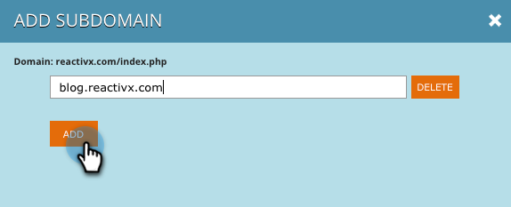
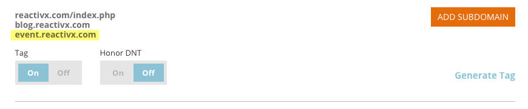

# Hinzufügen von Subdomains in [!UICONTROL Kontoeinstellungen] {#add-subdomains-in-account-settings}

So fügen Sie in den Kontoeinstellungen Subdomains zu Ihren primären [!UICONTROL &#x200B; hinzu]. Auf diese Weise können Sie Subdomains verwalten, die sich auf das spezifische RTP-JavaScript Ihrer primären Domain beziehen. Es wird empfohlen, das [!DNL Javascript]-Tag für alle hinzugefügten Subdomains bereitzustellen.

1. Navigieren Sie in Web Personalization zu **[!UICONTROL Kontoeinstellungen]**.

   

1. Auf der Seite „Domain-Konfiguration“ wird eine Liste aller primären Domains angezeigt, die mit Ihrem Konto verknüpft sind. In jedem Abschnitt wird zuerst die primäre Domain aufgeführt (siehe unten), gefolgt von allen Subdomains. Klicken Sie **[!UICONTROL Subdomain hinzufügen]**.

   

1. Klicken Sie auf **[!UICONTROL Hinzufügen]**.

   

1. Geben Sie die Subdomain-URL ein. Klicken Sie auf **[!UICONTROL Hinzufügen]** oder **[!UICONTROL Löschen]**, um Ihre Liste der Subdomains zu verwalten, und klicken Sie dann **[!UICONTROL OK]** wenn Sie fertig sind.

   

1. Ihre neu hinzugefügte Subdomain wird jetzt aufgelistet.

   

   >[!NOTE]
   >
   >Wenn Sie Ihrem Konto _primäre_ Domains hinzufügen möchten, wenden Sie sich an den [Marketo-Support](https://nation.marketo.com/t5/support/ct-p/Support?profile.language=de).
