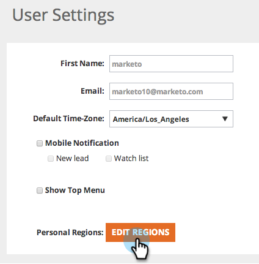

# Regionen bearbeiten {#edit-regions}

Möchten Sie die regionalen Benutzereinstellungen ändern, damit nur Daten für Ihre spezifische Region angezeigt werden?

1. Navigieren Sie zu **Benutzereinstellungen**.

   

1. Klicken Sie **Regionen bearbeiten**.

   

1. Überprüfen Sie Ihre Länder oder Bundesstaaten, die mit Ihrer Region verbunden sind.

>[!NOTE]
>
>Wenn Sie die USA auswählen, werden unten auf der Seite alle US-Bundesstaaten -Optionen zur Auswahl geöffnet.
