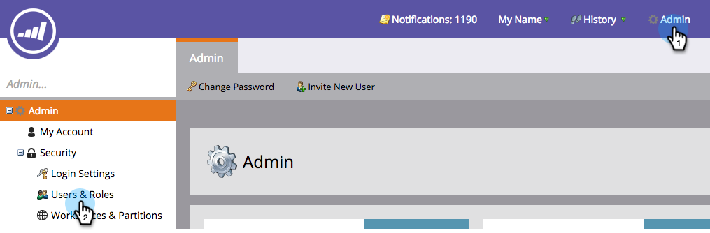

# Anmelden und Benutzerverwaltung {#login-and-user-management}

## Erstellen einer Web-Personalization-Benutzerrolle {#create-a-web-personalization-user-role}

1. Wechseln Sie zum Abschnitt **Admin** und klicken Sie dann auf **Benutzer und Rollen**.

   

1. Klicken Sie auf **Rollen**.

   

   >[!NOTE]
   >
   >Wenn die Web Personalization (WP)-Benutzerrolle bereits vorhanden ist, stellen Sie sicher, dass sie wie in Schritt 4 gezeigt konfiguriert ist.

1. Klicken Sie auf **Neue Rolle**.

   

1. Geben Sie einen Rollennamen ein und wählen Sie Berechtigungen aus. Klicken Sie auf **Erstellen** (diese Rolle muss [für alle Arbeitsbereiche gelten](/help/marketo/product-docs/administration/users-and-roles/managing-marketo-users.md)).

   

   >[!TIP]
   >
   >Um Benutzern Zugriff auf alles in Targeting und Personalization zu gewähren, müssen Sie die Kontrollkästchen _all_ aktivieren.

## Benutzerberechtigungen für Web Personalization und Predictive Content {#web-personalization-and-predictive-content-user-permissions}

**Targeting und Personalization**: Benutzer hat nur Anzeigeberechtigungen, wenn diese Berechtigung nur ausgewählt ist.

**Admin Web Personalization + Predictive**: Der Benutzer hat nur Zugriff auf die Kontoeinstellungen und Inhaltseinstellungen für die Web Personalization- und Predictive Content-App. Benutzer können Seiten in der App anzeigen, haben jedoch keine Berechtigungen zum Erstellen, Bearbeiten, Löschen und Starten.

**Predictive Content Editor**: Der Benutzer hat Editor-Zugriff auf die App &quot;Predictive Content&quot;. Die Berechtigung ermöglicht das Erstellen, Bearbeiten und Löschen von Inhaltselementen. Inhalte können nicht für die prädiktive Verwendung im Web oder in E-Mails aktiviert werden.

**Predictive Content Launcher**: Der Benutzer hat Zugriff auf alle Funktionen für prädiktive Inhalte, mit Ausnahme der Konto- und Inhaltseinstellungen. Mit dieser Berechtigung können Sie Inhaltselemente erstellen, bearbeiten, löschen und aktivieren.

**Webkampagneneditor**: Der Benutzer hat Editor Zugriff auf alle Web Personalization-Funktionen, um Webkampagnen zu erstellen, zu bearbeiten und zu löschen, jedoch nicht zu starten.

**Web Campaign Launcher**: Der Benutzer hat Zugriff auf alle Web-Personalization-App-Funktionen, mit Ausnahme der Konto- und Inhaltseinstellungen. Mit dieser Berechtigung können Sie Webkampagnen erstellen, bearbeiten, löschen und starten.

## WP-Rolle Benutzern zuweisen {#assign-wp-role-to-user}

1. Wechseln Sie zu **Benutzer**.

   

1. Wählen Sie den Benutzer aus, dem WP Zugriff gewährt werden soll, und klicken Sie auf **Benutzer bearbeiten**.

   

1. Wählen Sie die WP-Benutzerrolle für alle Arbeitsbereiche aus.

   

1. Neu aktivierte Benutzer sehen bei der nächsten Anmeldung in My Marketo die Kachel **Web Personalization** .

   
