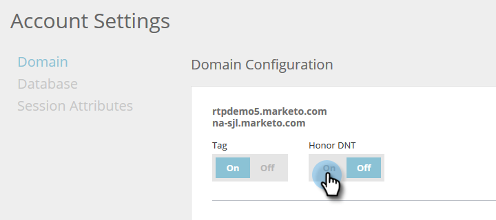

# Einstellung von [!UICONTROL Web Personalization] auf „Nicht verfolgen“ {#setting-web-personalization-to-do-not-track}

Web-Besuchende können ihren Browser so einstellen, dass das Tracking durch eine Website verhindert wird, indem sie „Nicht verfolgen“ (DNT) wählen. Dadurch wird das Tracking für diesen bestimmten Browser und dieses Gerät verhindert.

In [!UICONTROL Web Personalization] und [!UICONTROL Predictive Content] kann ein Marketing-Experte einen Umschalter festlegen, um anzugeben, ob die Einstellung „Nicht verfolgen“ (DNT) des Browsers unterstützt oder ignoriert werden soll. Der Umschalter für Konten ist standardmäßig auf Aus gesetzt, was bedeutet, dass der DNT von der Anwendung nicht berücksichtigt wird.

## Aktivieren oder Deaktivieren des Umschalters {#enable-or-disable-the-toggle}

1. Navigieren Sie **[!UICONTROL Kontoeinstellungen]**.

   

1. Wählen Sie [!UICONTROL Domain] und [!UICONTROL Domain-Konfiguration] die Option **[!UICONTROL Ein]** aus, um den Umschalter [!UICONTROL DNT berücksichtigen] zu aktivieren.

   

   Wenn der Umschalter auf [!UICONTROL Ein] gesetzt ist, berücksichtigt und unterstützt Web Personalization die Einstellung „Nicht verfolgen“ (DNT) des Browsers und verfolgt keine Web-Aktivität und führt keine Kampagnen oder Inhaltsempfehlungen auf Ihrer Website aus.

   >[!NOTE]
   >
   >Das Einstellen des Umschalters auf [!UICONTROL Ein] kann sich auf den Wert und die Funktionalität von Marketo in bestimmten Bereichen auswirken.

1. Um den Umschalter [!UICONTROL Honor DNT] zu deaktivieren und die Einstellung Do No Track (DNT) des Browsers zu ignorieren, wählen Sie **[!UICONTROL Aus]** unter [!UICONTROL Honor DNT] aus.
