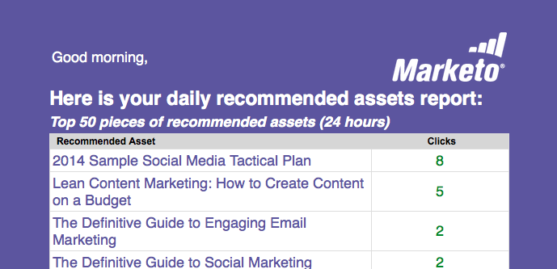

# E-Mail-Berichte {#email-reports}

Informationen zum Anpassen des automatisierten E-Mail-Berichts, den der Benutzer erhält[ finden Sie im Abschnitt „Benutzereinstellungen](/help/marketo/product-docs/web-personalization/getting-started/user-settings.md).

## Web Personalization Email Reports {#web-personalization-email-reports}

Tägliche oder wöchentliche E-Mail-Berichte werden an die E-Mail-Adresse des Benutzers gesendet und enthalten die neuesten Leistungsdaten zu Organisation, Person, Kampagne und Assets.

Die folgenden Berichte stehen zur Verfügung:

## Täglicher/wöchentlicher Organisationsbericht {#daily-weekly-organizations-report}

Der tägliche/wöchentliche Bericht sendet dem Benutzer eine E-Mail mit den 50 meistbesuchten Organisationen, einschließlich des Namens der Organisation, des Standorts, der Anzahl der Besuche, der Seitenansichten und der verwendeten Referrer-Site oder des verwendeten Suchbegriffs.

## Täglicher/wöchentlicher Personenbericht {#daily-weekly-people-report}

Der tägliche/wöchentliche Personenbericht sendet dem Benutzer eine E-Mail mit den neuesten 100 Personen von der Website entsprechend: E-Mail-Adresse der Person, Organisationsname, Standort, Bundesland, Datum der Personenerfassung und Segmente, zu denen diese Person gehört.

## Erstklassige Echtzeit-Kampagnen {#top-performing-real-time-campaigns}

Der Bericht zu den leistungsstärksten Echtzeit-Kampagnen sendet dem Benutzer eine E-Mail der leistungsstärksten Echtzeit-Kampagnen, die den Namen der Kampagne, Impressionen, Klicks, das Segment, auf das die Kampagne reagiert hat, und die Konversionsrate der Kampagne enthält.

## Bericht zu Assets mit der besten Leistung {#top-performing-assets-report}

Der Assets-Bericht mit der besten Leistung sendet dem Benutzer eine E-Mail mit den Assets mit den besten Inhalten, in der der Asset-Name und der Prozentsatz der Übereinstimmungen im Vergleich zu anderen Assets angezeigt werden.

## Empfohlener Assets-Bericht {#recommended-assets-report}

Der empfohlene Assets-Bericht sendet dem Benutzer eine E-Mail mit allen Inhalten und der Anzahl der Klicks, die aus in der Inhaltsempfehlungs-Engine angezeigten Inhalten stammen.

## Zusammenfassender Bericht {#summary-report}

Der Zusammenfassungsbericht sendet dem Benutzer eine E-Mail (monatlich oder vierteljährlich) aller Kampagnen und empfohlenen Inhaltsleistung basierend auf der Anzahl der Klicks und der Anzahl der Personen (direkt oder unterstützt), die mit der personalisierten Kampagne oder den empfohlenen Inhalten interagiert haben und dann eine bekannte Person geworden sind. Der Bericht vergleicht die Ergebnisse mit dem Vormonat oder dem Vorquartal.

>[!NOTE]
>
>**Definitionen**
>
>**Direkte Konversion**: Ein Web-Besucher, der auf eine personalisierte Kampagne oder ein empfohlenes Inhalts-Asset klickt und in derselben Besuchssitzung fortfährt, jedes Formular auf der Website mit seiner E-Mail-Adresse auszufüllen.
>
>**Unterstützte Konversion**: Ein Web-Besucher, der ein beliebiges Formular auf der Website ausfüllt und seine E-Mail-Adresse verlässt, während er bei einem vorherigen Besuch (innerhalb der letzten 6 Monate) auf eine personalisierte Kampagne oder ein empfohlenes Inhalts-Asset geklickt hat.

>[!NOTE]
>
>Marketo Web Personalization erfasst die E-Mail-Adresse des Web-Besuchers für jedes Formular, das auf der Website ausgefüllt wird. Dieser wird auf der Web Personalization People -Seite angezeigt und ist die Person, die im Zusammenfassungsbericht verwendet wird.

Informationen zum Anpassen des automatisierten E-Mail-Berichts, den der Benutzer erhält[ finden Sie im Abschnitt „Benutzereinstellungen](/help/marketo/product-docs/web-personalization/getting-started/user-settings.md).
