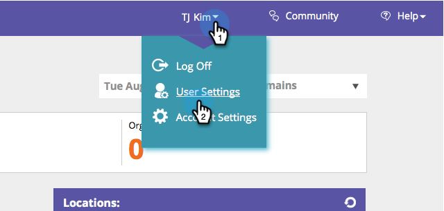
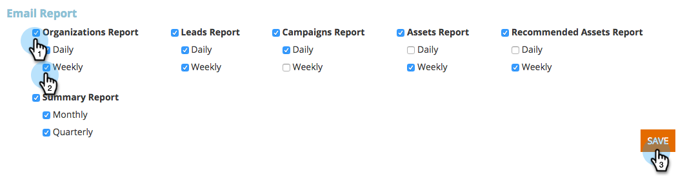

# Aktivieren/Deaktivieren von Berichtsabonnements {#enable-disable-report-subscriptions}

[!UICONTROL Web Personalization] verfügt über mehrere nützliche Berichte, die per E-Mail gesendet werden. So können Sie sie abonnieren.

1. Melden Sie sich bei [!UICONTROL Web Personalization] an. Klicken Sie unter Ihrem Anmeldenamen auf &quot;**[!UICONTROL &quot;]**.

   

1. Wählen Sie den Bericht aus, den Sie abonnieren möchten, und geben Sie die Häufigkeit an. Klicken Sie auf **[!UICONTROL Speichern]**.

   

   Um das Abonnement des Berichts zu kündigen, deaktivieren Sie und klicken Sie auf **[!UICONTROL Speichern]**.
