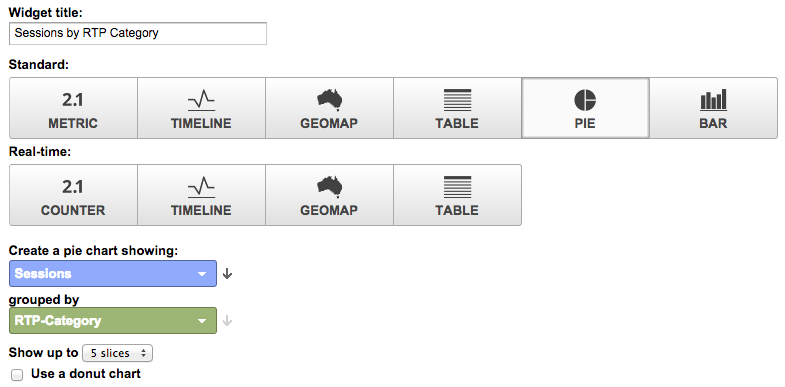

# Benutzerdefinierte RTP-Dashboards in Google Universal Analytics {#custom-rtp-dashboards-in-google-universal-analytics}

>[!PREREQUISITES]
>
>[Integrieren von RTP mit Google Universal Analytics](/help/marketo/product-docs/web-personalization/reporting-for-web-personalization/web-analytics-integrations/integrate-rtp-with-google-universal-analytics.md)

In diesem Beitrag wird erläutert, wie Sie RTP-Dashboards in Google Universal Analytics (GUA) einrichten. Die Daten, die von RTP an GUA gesendet werden, können als zwei separate benutzerdefinierte Dashboards eingerichtet werden:

* RTP B2B
* RTP-Interaktion

## Einrichten eines benutzerdefinierten Dashboards {#setting-up-a-custom-dashboard}

1. Melden Sie sich bei Google Analytics an. Klicken Sie **oberen Menü auf** Berichterstellung“. Klicken Sie **Dashboards** und **+Neues benutzerdefiniertes Dashboard**.

   

1. Wählen Sie **Leere Arbeitsfläche**, fügen Sie einen **Dashboard-Namen** hinzu und klicken Sie auf **Dashboard erstellen**.

1. Klicken Sie **Widget hinzufügen**, um ein neues Widget zu erstellen.

   

## RTP B2B-Dashboard {#rtp-b-b-dashboard}

Dieses Dashboard ermöglicht es Benutzern, ihre Website-Performance aus einer B2B-Perspektive zu analysieren.

Es enthält Informationen wie die Quelle der Besuche und das Verhalten vor Ort nach Branche, Umsatz, Größe, Account-basierten Listen und Zielgruppensegmenten.

Das Dashboard besteht aus drei Spalten

* Traffic-Quelle
* Segmentierung
* Firmographischer Drilldown

1. Erstellen Sie ein neues Dashboard mit dem Namen **RTP B2B Dashboard** und definieren Sie die folgenden Widgets:

<table> 
 <thead> 
  <tr> 
   <th> 
    

      Spalte 1: Traffic-Quellen
    
</th> 
   <th> 
    
 <strong>Spalte 2: Segmentierung</strong> 
    
</th> 
   <th> 
    
 <strong>Spalte 3 - Firmographische Aufschlüsselung</strong> 
    
</th> 
  </tr> 
 </thead> 
 <tbody> 
  <tr> 
   <td> 
    <ul> 
     <li>Name: Sitzungen nach Segmenten und Kanälen</li> 
     <li>Widget-Typ: Leiste </li> 
     <li>Erstellen Sie ein Balkendiagramm mit folgenden Informationen: Sitzung</li> 
     <li>Gruppiert nach: Ereignisbezeichnung</li> 
     <li>Nach Standard-Kanalgruppierung drehen</li> 
     <li>Filter:  nur anzeigen | Ereigniskategorie (enthält) RTP-Segmente</li> 
    </ul>

</td> 
   <td> 
    <ul> 
     <li>Name: Anzahl der segmentierten RTP-Benutzer</li> 
     <li>Typ: 2.1 Metrik</li> 
     <li>Die folgende Metrik anzeigen: Benutzer </li> 
     <li>Filter:  nur anzeigen | Ereigniskategorie (enthält) RTP-Segmente</li> 
    </ul>

</td> 
   <td> 
    <ul> 
     <li>Name: Sessions by Industry</li> 
     <li>Typ: Kreis </li> 
     <li>Erstellen Sie ein Tortendiagramm, das Folgendes zeigt: Sitzungen</li> 
     <li>Gruppiert nach: RTP-Industry</li> 
    </ul>

</td> 
  </tr> 
  <tr> 
   <th> 
    <ul> 
     <li><strong>Name: Sitzungen nach Branche und Kanälen</strong></li> 
     <li><strong>Widget-Typ: Leiste</strong></li> 
     <li><strong>Erstellen Sie ein Balkendiagramm mit folgenden Informationen: Sitzung</strong></li> 
     <li><strong>Gruppiert nach: RTP-Industry</strong></li> 
     <li><strong>Nach Standard-Kanalgruppierung drehen</strong> </li> 
    </ul></th> 
   <th> 
    <ul> 
     <li><strong>Name: segmentierte Sitzungen nach Land</strong></li> 
     <li><strong>Typ: Geomap</strong></li> 
     <li><strong>Ausgewählte Metrik darstellen: Land | Sitzungen</strong></li> 
     <li><strong>Wählen Sie eine Region aus: Die Welt</strong></li> 
     <li><strong>Filter: nur anzeigen | Ereigniskategorie (enthält) RTP-Segmente</strong></li> 
    </ul>

</th> 
   <th> 
    <ul> 
     <li><strong>Name: Sitzungen nach RTP-Kategorie</strong></li> 
     <li><strong>Typ: Kreis</strong></li> 
     <li><strong>Erstellen Sie ein Tortendiagramm, das Folgendes zeigt: Sitzungen</strong></li> 
     <li><strong>Gruppiert nach: RTP-Kategorie</strong></li> 
    </ul>

</th> 
  </tr> 
  <tr> 
   <th> </th> 
   <th> 
    <ul> 
     <li>Name: Top-Zielsegmente</li> 
     <li>Typ: Balken</li> 
     <li>Erstellen Sie ein Balkendiagramm mit folgenden Informationen: Benutzer</li> 
     <li>Gruppiert nach: Ereignisaktion</li> 
     <li>Filter: nur anzeigen | Ereigniskategorie (enthält) RTP-Segmente</li> 
    </ul>

</th> 
   <th> 
    <ul> 
     <li>Name: Sessions by RTP-Groups</li> 
     <li>Typ: Balken </li> 
     <li>Erstellen Sie ein Balkendiagramm mit folgenden Informationen: Sitzungen</li> 
     <li>Gruppiert nach: RTP-Group</li> 
    </ul>

</th> 
  </tr> 
  <tr> 
   <th> </th> 
   <th> 
    <ul> 
     <li>Name: Sitzungen und Ziele nach Top-Segmenten</li> 
     <li>Typ: Tabelle </li> 
     <li>Zeigt die folgenden Spalten an:  Ereignisbeschriftung | Sitzungen | Zielkonversionsrate</li> 
     <li>Filter:  nur anzeigen | Ereigniskategorie (enthält) RTP-Segmente</li> 
    </ul>

</th> 
   <th> </th> 
  </tr> 
 </tbody> 
</table>

## RTP-Interaktions-Dashboard {#rtp-engagement-dashboard}

Dieses Dashboard ermöglicht es Benutzenden, die Leistung ihrer RTP-Kampagnen und die Interaktionen mit der Recommendations-Engine zu analysieren. Es bietet einen Vergleich der Durchschnittsergebnisse. Sitzungsdauer und Seiten pro Sitzung zwischen:

* entkuppelt
* Interagiert (Impressionen und Klicks auf eine personalisierte Kampagne)
* Klicks auf die Empfehlungs-Engine und die am häufigsten empfohlenen Inhalte

Erstellen Sie ein neues Dashboard mit dem Namen **RTP-Interaktions** Dashboard und definieren Sie die folgenden Widgets:

<table> 
 <thead> 
  <tr> 
   <th> 
    
 <strong>Spalte 1 Kampagnenexponierung</strong> 
    
</th> 
   <th> 
    
 <strong>Clickthrough für Spalte 2 Kampagnen</strong> 
    
</th> 
   <th> 
    
 <strong>Spalten-3-Empfehlungs-Engine</strong> 
    
</th> 
  </tr> 
 </thead> 
 <tbody> 
  <tr> 
   <td> 
    <ul> 
     <li>Name: <strong>Total CTA (Engagement)</strong></li> 
     <li>Typ: <strong>2.1 Metrik </strong></li> 
     <li>Die folgende Metrik anzeigen: <strong>Ereignisse insgesamt</strong></li> 
     <li>Filter: <strong>[nur anzeigen] Ereigniskategorie (enthält): RTP-Kampagnen</strong> <strong>[nur anzeigen] Ereignisaktion (exakt übereinstimmend): </strong>[nicht anzeigen] Ereignisbezeichnung (enthält): #</li> 
    </ul>

</td> 
   <td> 
    <ul> 
     <li>Name: <strong>Total CTA (Clickthrough)</strong></li> 
     <li>Typ: <strong>2.1 Metrik </strong></li> 
     <li>Die folgende Metrik anzeigen: <strong>Ereignisse insgesamt</strong></li> 
     <li>Filter: <strong>[nur anzeigen] Ereigniskategorie (enthält): RTP-Kampagnen</strong> <strong>[nur anzeigen] Ereignisaktion (exakt übereinstimmend): </strong><strong>[nicht anzeigen] Ereignisbezeichnung (enthält): #</strong></li> 
    </ul>

</td> 
   <td> 
    <ul> 
     <li>Name: <strong>CRE - Klicks insgesamt</strong></li> 
     <li>Typ: <strong>2.1 Metrik</strong> </li> 
     <li>Die folgende Metrik anzeigen: <strong>Seitenansichten</strong></li> 
     <li>Filter: <strong>[nur anzeigen] Seite (enthält): rcmd</strong></li> 
    </ul>

</td> 
  </tr> 
  <tr> 
   <td colspan="1"> 
    <ul> 
     <li>Name: <strong>avg. Sitzungsdauer (Interaktion)</strong></li> 
     <li>Typ: <strong>2.1 Metrik </strong></li> 
     <li>Die folgende Metrik anzeigen: <strong>Durchschnitt. Sitzungsdauer</strong></li> 
     <li>Filter: <strong>[nur anzeigen] Ereigniskategorie (exakt übereinstimmend): RTP-Kampagnen</strong> <strong>[nur anzeigen] Ereignisaktion (exakt übereinstimmend): Impression</strong><strong>[nicht anzeigen] Ereignisbezeichnung (enthalten): #</strong></li> 
    </ul>

</td> 
   <td colspan="1"> 
    <ul> 
     <li>Name: <strong>avg. Sitzungsdauer (Clickthrough)</strong></li> 
     <li>Typ: <strong>2.1 Metrik </strong></li> 
     <li>Die folgende Metrik anzeigen: <strong>Durchschnitt. Sitzungsdauer</strong></li> 
     <li>Filter: <strong>[nur anzeigen] Ereigniskategorie (exakt übereinstimmend): RTP-Kampagnen</strong> <strong>[nur anzeigen] Ereignisaktion (exakt übereinstimmend): </strong><strong>[nicht anzeigen] Ereignisbezeichnung (enthalten): #</strong></li> 
    </ul>

</td> 
   <td colspan="1"> 
    <ul> 
     <li>Name: <strong>CRE - Top Recommended Content</strong></li> 
     <li>Typ: <strong>table</strong> </li> 
     <li>Zeigt die folgenden Spalten an:  <strong>Seitentitel | Seitenansichten</strong> </li> 
     <li>Filter: Filter: <strong>[nur anzeigen] Seite (enthält): rcmd</strong></li> 
    </ul>

</td> 
  </tr> 
  <tr> 
   <td> 
    <ul> 
     <li>Name: <strong>Seiten/Sitzung (Interaktion)</strong></li> 
     <li>Typ: <strong>2.1 Metrik </strong></li> 
     <li>Die folgende Metrik anzeigen: <strong>Seiten/Sitzung</strong></li> 
     <li>Filter: <strong>[nur anzeigen] Ereigniskategorie (exakt passend): RTP-Kampagnen</strong></li> 
     <li><strong>[nur anzeigen] Ereignisaktion (exakt passend): Impression</strong></li> 
     <li><strong>[Nicht anzeigen] Ereignisbezeichnung (enthält): #</strong></li> 
    </ul>

</td> 
   <td> 
    <ul> 
     <li>Name: <strong>pages / session (clickthrough)</strong></li> 
     <li>Typ: <strong>2.1 Metrik </strong></li> 
     <li>Die folgende Metrik anzeigen: <strong>Seiten/Sitzung</strong></li> 
     <li>Filter: <strong>[nur anzeigen] Ereigniskategorie (exakt passend): RTP-Kampagnen</strong></li> 
     <li><strong>[nur anzeigen] Ereignisaktion (exakt passend): Klicks</strong></li> 
     <li><strong>[Nicht anzeigen] Ereignisbezeichnung (enthält): #</strong></li> 
    </ul>

</td> 
   <td> </td> 
  </tr> 
  <tr> 
   <td> 
    <ul> 
     <li>Name: <strong>Impressions by CTA</strong></li> 
     <li>Typ: <strong>table</strong></li> 
     <li>Zeigt die folgenden Spalten an: <strong>Ereignisbeschriftung | Ereignisse insgesamt | Benutzer</strong></li> 
     <li>Filter: <strong>[nur anzeigen] Ereigniskategorie (exakt übereinstimmend): RTP-Kampagnen</strong> <strong>[nur anzeigen] Ereignisaktion (exakt übereinstimmend): Impression</strong><strong>[nicht anzeigen] Ereignisbezeichnung (enthalten): #</strong></li> 
    </ul>

</td> 
   <td> 
    <ul> 
     <li>Name: <strong>Clickthrough von CTA</strong></li> 
     <li>Typ: <strong>table</strong></li> 
     <li>Zeigt die folgenden Spalten an: <strong>Ereignisbeschriftung | Ereignisse insgesamt | Benutzer</strong></li> 
     <li>Filter: <strong>[nur anzeigen] Ereigniskategorie (exakt passend): RTP-Kampagnen</strong> <strong>[nur anzeigen] Ereignisaktion (exakt passend): Klicks</strong></li> 
    </ul>

</td> 
   <td> </td> 
  </tr> 
 </tbody> 
</table>

>[!MORELIKETHIS]
>
>[Integrieren von RTP mit Google Universal Analytics](/help/marketo/product-docs/web-personalization/reporting-for-web-personalization/web-analytics-integrations/custom-rtp-reports-in-google-universal-analytics.md)
>
>[Benutzerdefinierte RTP-Berichte in Google Universal Analytics](/help/marketo/product-docs/web-personalization/reporting-for-web-personalization/web-analytics-integrations/custom-rtp-reports-in-google-universal-analytics.md)
