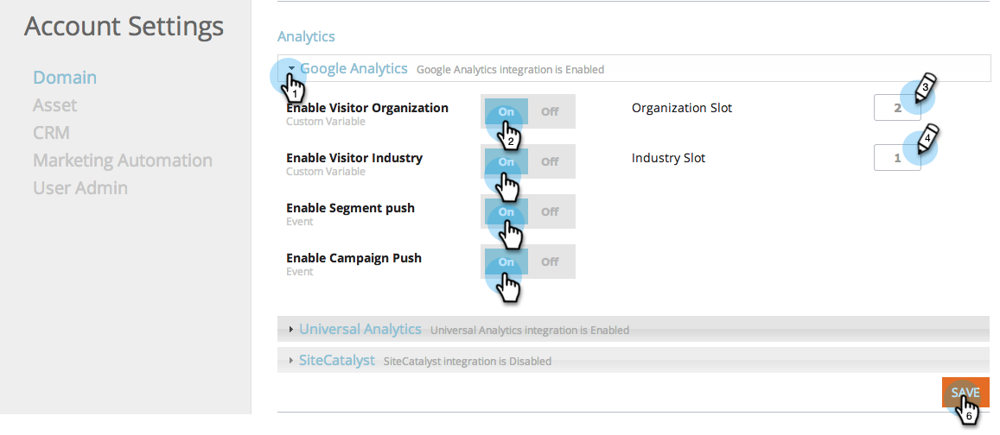

# Integrieren von RTP mit Google Analytics {#integrate-rtp-with-google-analytics}

>[!NOTE]
>
>Universal Analytics ist jetzt der Betriebsstandard, und alle Eigenschaften in Google wurden auf Universal Analytics aktualisiert.
>
>In diesem Artikel wird gezeigt, wie Sie die alte Google-Standardanalyse verwenden. Wir empfehlen jedoch, zu Universal Analytics zu wechseln.
>
>Wenn Sie den Trackingcode „analytics.js[ noch nicht verwenden, ](https://developers.google.com/analytics/devguides/collection/analyticsjs/) Google dringend, Ihre Site neu zu taggen, um ihn zu verwenden. Folgende Elemente werden von Google nicht mehr unterstützt:
>
>* ga.js
>* urchin.js
>* WAP/Server-seitige Snippets
>* JT/MO
>* Benutzerdefinierte Variablen
>* Benutzerdefinierte Variablen
>
>Siehe Integration von [Web Personalization mit Universal Analytics](/help/marketo/product-docs/web-personalization/reporting-for-web-personalization/web-analytics-integrations/integrate-rtp-with-google-universal-analytics.md)

## Einführung {#introduction}

Analysieren Sie Ihre Web-Analysen aus einem neuen Blickwinkel, indem Sie den direkten Datenfluss von Marketo Real-Time Personalization (RTP) zu Ihrem Google Analytics-Konto (GA) verwenden. Messen Sie Ihre Web-Besuche in GA nach Organisationen, Branchen und RTP-Kampagnen. Sehen Sie sich Metriken wie die Arten von Branchen oder RTP-Segmenten in GA an und erfahren Sie, wie diese Leads funktionieren und entsprechend den verschiedenen Traffic-Quellen (Social, Paid, Organic) generieren. Analysieren Sie Clickthrough-Raten von Kampagnen und messen Sie die Wirkung von Personalisierungskampagnen auf Ihre Website. Nutzen Sie diese Möglichkeit, um den maximalen Nutzen aus Ihrem RTP-Konto zu ziehen

**RTP Audience Analytics**

Mit der Integration erhalten Sie eine neue Dimension in Ihrem GA-Konto. RTP verbessert Ihre Dashboards automatisch um:

1. Organisationen und Branchen
1. Benutzerdefinierte Segmente in RTP
1. Account-Based Marketing-Listen

Konzentrieren Sie sich auf Ihre wichtigsten B2B-Perspektiven. Analysieren Sie Kanäle nach ausgewählten Branchen und Segmenten.

## Kanalbericht {#channel-report}

Das RTP B2B-Dashboard hilft Ihnen, die Aufschlüsselung Ihrer Besucher nach Vertikalen und RTP-Segmentierung zu verstehen. Sie können die Leistung Ihrer Besucher je nach Finanzbranche und nach verschiedenen Marketing-Kampagnen (bezahlt, organisch, sozial) anzeigen. Das Dashboard bietet außerdem einen allgemeinen Überblick über die Leistung Ihrer RTP-Segmente und zeigt die wichtigsten Organisationen an, die Ihre Site besuchen.

## Verhaltensablauf {#behavioral-flow}

Der Bericht zum Verhalten-Fluss (siehe Bild) visualisiert den Pfad, den Besucherinnen und Besucher von einer Seite oder einem Ereignis zur nächsten fahren. Das Bildbeispiel zeigt den Weg aller Besucher aus dem Finanzsektor. Dieser Bericht kann Ihnen dabei helfen herauszufinden, mit welchen Inhalten Besucher mit Ihrer Site interagieren.

## RTP-Leistung {#rtp-performance}

Messen Sie Ihre RTP-Kampagnen und korrelieren Sie sie mit Ihrem gesamten Website-Durchschnitt. Erfahren Sie, wie sich diese Kampagnen auf Ihre Website-Metriken auswirken, und nutzen Sie diese Daten, um Ihre Personalisierungsbemühungen auf die richtigen Ziele zu konzentrieren. Erstellen Sie benutzerspezifische Berichte, um die Leistung Ihrer Personalisierungskampagnen besser zu verstehen.

## Einrichten von RTP mit Google Analytics {#setting-up-rtp-with-google-analytics}

1. Fügen Sie die E-Mail-<rtp.ga2@gmail.com> als Benutzer „Lesen und Analysieren“ zu Ihrem GA-Konto hinzu. Weitere Informationen finden Sie unter [hier](https://support.google.com/analytics/answer/2884495?hl=en).

1. In Ihrem RTP-Konto. Navigieren Sie **[!UICONTROL Kontoeinstellungen]**.

   

1. Unter **[!UICONTROL Kontoeinstellungen]**, **[!UICONTROL Domain]** und **[!UICONTROL Analytics]**.

1. Klicken Sie auf **Google Analytics**.

1. Aktivieren Sie die entsprechenden **benutzerdefinierten Variablen** und **Ereignisse**, um diese Daten von RTP an Google Analytics anzuhängen.

1. Geben Sie die **Slot**-Nummer ein, um benutzerdefinierte Variablendaten zu senden (Standard ist 1,2).

1. Klicken Sie auf **[!UICONTROL Speichern]**.

>[!NOTE]
>
>Um Segmentdaten an GA zu senden, aktivieren Sie auf der Seite [[!UICONTROL Segment bearbeiten] in ](/help/marketo/product-docs/web-personalization/using-web-segments/create-a-basic-web-segment.md) RTP-Plattform das Kontrollkästchen **[!UICONTROL Ereignis an Google Analytics senden bei Segment Match]**.

## Einrichten von Google Analytics-Berichten mit RTP-Daten {#setting-up-google-analytics-reports-with-rtp-data}

In Google Analytics können Sie Dashboards, GA-Segmentierung und Reporting verwenden, um Ihre RTP-Daten anzuzeigen:

* [Dashboards](https://support.google.com/analytics/answer/1068216?hl=en) bieten einen Überblick über die Leistung der Website.
* Ein GA-Segment dient zum Filtern von Besuchern in der GA-Oberfläche und zum Anzeigen des Traffics pro Segment. Siehe Erstellen eines Segments [hier](https://support.google.com/analytics/answer/3124493?hl=en).
* Erstellen [benutzerdefinierter Berichte](https://support.google.com/analytics/answer/1033013?hl=en) um geplante E-Mails anzuzeigen und/oder einzurichten. Siehe unter **[!UICONTROL Anpassung]** > **[!UICONTROL Neuer benutzerdefinierter Bericht]**.
