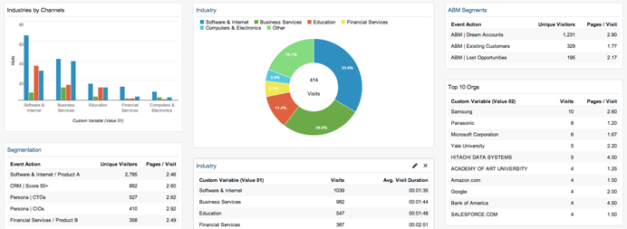

# RTP mit Google Analytics {#integrate-rtp-with-google-analytics} integrieren

>[!NOTE]
>
>Universal Analytics ist jetzt der Betriebsstandard und alle Eigenschaften in Google wurden auf Universal Analytics aktualisiert.
>
>In diesem Artikel wird die Verwendung der alten Google Standard Analytics-Version erläutert. Es wird jedoch empfohlen, zu Universal Analytics zu wechseln.
>
>Wenn Sie noch nicht den Rückverfolgungscode [analytics.js](https://developers.google.com/analytics/devguides/collection/analyticsjs/) verwenden, empfiehlt Google dringend, Ihre Site neu zu taggen, um sie zu verwenden. Folgende Elemente werden von Google nicht mehr unterstützt:
>
>* ga.js
>* urchin.js
>* WAP-/serverseitige Snippets
>* YT/MO
>* Benutzerdefinierte Variablen
>* Benutzerdefinierte Variablen

>
>
Erfahren Sie, wie Sie [Web-Personalisierung in Universal Analytics integrieren.](integrate-rtp-with-google-universal-analytics.md)

## Einführung {#introduction}

Analysieren Sie Ihre Webanalyse unter Verwendung des direkten Datenflusses von Marketing zu Echtzeit-Personalisierung (RTP) zu Ihrem Google Analytics-Konto (GA). Messen Sie Ihre Web-Besuche in GA nach Organisationen, Branchen und RTP-Kampagnen. Metriken zur Ansicht wie Industrien oder RTP-Segmente in GA und wie sie funktionieren und Interessenten gemäß verschiedenen Traffic-Quellen (Social, gebührenpflichtig, Organisch) generieren, die Analyse der Durchklickraten auf Kampagnen und die Messung der Auswirkungen von Personalisierungs-Kampagnen auf Ihrer Website. Nutzen Sie diese Möglichkeit, um den größtmöglichen Nutzen aus Ihrem RTP-Konto zu ziehen.

**RTP-Audience Analytics**

Mit der Integration haben Sie eine neue Dimension in Ihrem GA-Konto. RTP verbessert Ihre Dashboards automatisch durch:

1. Organisationen und Industrie
1. Benutzerdefinierte Segmente in RTP
1. Kontobasierte Marketing-Listen

Konzentrieren Sie sich auf Ihre wichtigsten B2B-Potenzieller Kunde. Analysieren Sie Kanal nach Branchen und Segmenten.

## Kanal-Bericht {#channel-report}

Das RTP B2B-Dashboard hilft Ihnen, die Aufschlüsselung Ihrer Besucher nach Vertikalen und RTP-Segmentierung zu verstehen. Sie können Ihre Besucher-Performance nach der Finanzbranche und nach verschiedenen Marketing-Kampagnen (gebührenpflichtig, kostenlos, sozial) sehen. Das Dashboard bietet außerdem einen Überblick über die Leistung Ihrer RTP-Segmente und zeigt die wichtigsten Organisationen, die Ihre Site besuchen, in einer Drilldown-Liste an.

## Verhaltensfluss {#behavioral-flow}

Der Bericht &quot;Verhaltensfluss&quot;(siehe Bild) visualisiert den Pfad, den Besucher von einer Seite oder einem Ereignis zur nächsten wechseln. Das Bildbeispiel zeigt den Pfad aller Besucher aus dem Finanzsektor. Dieser Bericht kann Ihnen dabei helfen, herauszufinden, welcher Inhalt Besucher mit Ihrer Site in Kontakt hält.

## RTP-Leistung {#rtp-performance}

Messen Sie Ihre RTP-Kampagnen und ordnen Sie sie Ihrem Site-Durchschnitt insgesamt zu. Erfahren Sie, wie sich diese Kampagnen auf Ihre Website-Metriken auswirken, und nutzen Sie diese Daten, um Ihre Personalisierungsbemühungen auf die richtigen Zielgruppen zu konzentrieren. Erstellen Sie benutzerspezifische Berichte, um besser zu verstehen, wie Ihre Kampagnen zur Personalisierung abschneiden.

## RTP mit Google Analytics {#setting-up-rtp-with-google-analytics} einrichten

1. hinzufügen Sie die E-Mail [`[email protected]`](http://docs.marketo.com/cdn-cgi/l/email-protection#0674727628616734466b67746d6372692865696b) als Benutzer zum Lesen und Analysieren auf Ihr GA-Konto. Weitere Informationen finden Sie unter [hier](https://support.google.com/analytics/answer/2884495?hl=en).
1. In Ihrem RTP-Konto. Gehen Sie zu **Kontoeinstellungen**.

   

1. Unter **Kontoeinstellungen**, **Domäne** und **Analytics**
1. Klicken Sie auf** Google Analytics.**
1. Aktivieren Sie die entsprechenden **Benutzerspezifische Variablen** und **Ereignis**, um diese Daten von RTP an Google Analytics anzuhängen.
1. Geben Sie die Zahl **Steckplatz** ein, um benutzerdefinierte Variablendaten zu senden (Standard ist 1,2).

Klicken Sie auf **SAVE**.

>[!NOTE]
>
>Um Segmentdaten an GA zu senden, aktivieren Sie unter der Seite [Segment bearbeiten](/help/marketo/product-docs/web-personalization/using-web-segments/create-a-basic-web-segment.md) auf der RTP-Plattform das Kontrollkästchen **Ereignis an Google Analytics senden bei Segmentübereinstimmung**.

## Einrichten von Google Analytics-Berichten mit RTP-Daten {#setting-up-google-analytics-reports-with-rtp-data}

In Google Analytics können Sie zur Ansicht Ihrer RTP-Daten Dashboard, GA-Segmentierung und Berichte verwenden:

* [In ](https://support.google.com/analytics/answer/1068216?hl=en) Dashboards erhalten Sie einen Überblick über die Website-Performance.
* Ein GA-Segment dient zum Filtern von Besuchern in der GA-Oberfläche und zur Ansicht des Traffics pro Segment. Erfahren Sie, wie Sie ein Segment [hier](https://support.google.com/analytics/answer/3124493?hl=en) erstellen.
* Erstellen von [benutzerspezifischen Berichten](https://support.google.com/analytics/answer/1033013?hl=en) zur Ansicht und/oder Einrichtung geplanter E-Mails. Siehe Anpassen > Neuer benutzerdefinierter Bericht.
