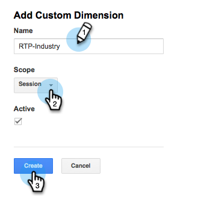

# Integrieren von RTP mit Google Universal Analytics {#integrate-rtp-with-google-universal-analytics}

## Einführung {#intro}

Nutzen Sie Google Universal Analytics (GUA) mit den firmografischen und Personalisierungsdaten von Marketo Real-time Personalization (RTP), um Ihre Online-Marketing-Maßnahmen besser zu messen und zu analysieren.

In diesem Beitrag wird erläutert, wie Sie die Marketo Real-Time Personalization (RTP)-Plattform mit Google Universal Analytics (GUA)-Konten einrichten und integrieren. RTP-Daten können an Ihr GUA-Konto angehängt werden, sodass Sie die Leistung von Organisationen, Branchen, Unternehmensgrafiken und RTP-Segmenten, die Ihre Website besuchen, anzeigen und anzeigen können.

**Google Universal Analytics**

Google Universal Analytics mit den RTP-Daten bietet Ihnen ein besseres Verständnis dafür, wie B2B-Benutzer mit Ihren Online-Inhalten interagieren, und hilft Ihnen, Ihre Personalisierungskampagnen zu messen und bessere Ergebnisse zu erzielen. [Weitere Informationen zu Google Universal Analytics](https://support.google.com/analytics/answer/2790010/?hl=en&amp;authuser=1).

>[!NOTE]
>
>**Nur für Benutzende von Google Tag Manager**
>
>Es ist keine Codierung oder spezielle Konfiguration erforderlich. Stellen Sie sicher, dass Sie die folgende Checkliste ausfüllen:
>
>* RTP-Dimensionen werden in Google Universal Analytics erstellt
>* [RTP-Tag wird ordnungsgemäß im Google Tag Manager installiert](https://docs.marketo.com/display/public/DOCS/Implementing+RTP+using+Google+Tag+Manager)
>* Die Google Universal Analytics-Integration ist in den Kontoeinstellungen des RTP aktiviert
>* [Google Universal Analytics-Tag ist im Google Tag Manager ordnungsgemäß konfiguriert](https://support.google.com/tagmanager/answer/6107124?hl=en)
>* [Tag des Google-Tag-Managers ist ordnungsgemäß auf Ihrer Website installiert](https://developers.google.com/tag-manager/quickstart)

## Einrichten benutzerdefinierter Dimensionen in GUA {#set-up-custom-dimensions-in-gua}

1. In Google Analytics

   1. Wechseln Sie zu **Admin**
   1. Wählen Sie das **Konto.**
   1. Wählen Sie die **Eigenschaft.**
   1. Wählen Sie **Benutzerdefinierte Definitionen** und **Benutzerdefinierte Dimensionen** aus.
      

1. Eine neue benutzerdefinierte Dimension hinzufügen. Klicken Sie auf **+Neue benutzerdefinierte Dimension**

   

1. Fügen Sie die folgenden **Benutzerdefinierte Dimensionen:**

<table> 
 <tbody> 
  <tr> 
   <td>
<strong>Name der benutzerdefinierten Dimension</strong>
</td> 
   <td>
<strong>Umfang</strong>
</td> 
   <td>
<strong>Aktiv</strong>
</td> 
  </tr> 
  <tr> 
   <td>
<strong>RTP-Organisation</strong>
</td> 
   <td>
Sitzung
</td> 
   <td>
✓
</td> 
  </tr> 
  <tr> 
   <td>
<strong>RTP-Industry</strong>
</td> 
   <td>
Sitzung
</td> 
   <td>
✓
</td> 
  </tr> 
  <tr> 
   <td>
<strong>RTP-Kategorie</strong>
</td> 
   <td>
Sitzung
</td> 
   <td>
✓
</td> 
  </tr> 
  <tr> 
   <td>
<strong>RTP-Gruppe</strong>
</td> 
   <td>
Sitzung
</td> 
   <td>
✓
</td> 
  </tr> 
 </tbody> 
</table>

>[!NOTE]
>
>**Benutzerdefinierte Dimension-Namen** müssen genau wie in der obigen Tabelle definiert sein (andernfalls werden benutzerdefinierte RTP-Dashboards und -Berichte in GUA nicht korrekt angezeigt)

1. Fügen Sie den **Name** hinzu. Wählen Sie den Bereich als &quot;**&quot;**. Klicken Sie auf **Erstellen**.

   

Die Liste Benutzerdefinierte Dimension sollte wie folgt aussehen.

Nachdem Sie die benutzerdefinierten Dimensionen in GUA aktiviert haben, wechseln Sie zur RTP-Plattform, um diese Dimensionen in RTP zu aktivieren.

## Aktivieren der GUA-Integration in Ihrem RTP-Konto {#activate-the-gua-integration-in-your-rtp-account}

1. Navigieren Sie in der RTP-Plattform zu **Kontoeinstellungen.**

   

1. Klicken **unter &quot;**&quot; auf **Domain**.
1. Klicken **unter &quot;**&quot; auf **Google Universal Analytics**.
1. Aktivieren **die** benutzerdefinierten Dimensionen und Ereignisse, um diese Daten von RTP an Google Universal Analytics anzuhängen.
1. Geben Sie die **Indexnummer** der Dimension ein, die mit der Indexnummer in GUA ausgerichtet ist.
1. Klicken Sie auf **Speichern**.

>[!NOTE]
>
>Die Indexnummer für die benutzerdefinierte Dimension finden Sie in der GUA unter „Benutzerdefinierte Dimensionen&quot;.
>
>Beispiel: RTP-Industry Index Number ist gleich 1, RTP-Organization Index Number ist gleich 2.

## Alte Dashboards in Google Analytics entfernen {#remove-old-dashboards-in-google-analytics}

1. In Google Analytics. Navigieren Sie zu **Berichterstellung.**
1. Klicken Sie auf **Dashboards.**
1. Wählen Sie ein **Dashboard** aus (RTP B2B- oder RTP-Leistung)
1. Klicken Sie **Dashboard löschen**.

