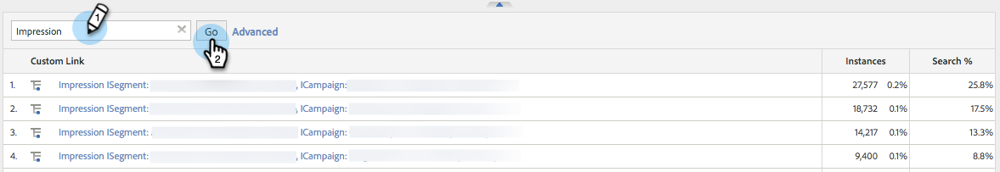

# Integration mit Adobe Analytics {#integrate-with-adobe-analytics}

## Einführung {#intro}

Analysieren Sie Ihre Web-Analysen aus der B2B-Perspektive, indem Sie die Kampagnendaten von Organisation, Branche und Marketo Real-Time Personalization (RTP) in Ihrem Adobe Analytics-Konto anzeigen.

Dieses Dokument ermöglicht die Integration zwischen Marketo Real-Time Personalization (RTP) und Adobe Adobe Analytics. Daten von RTP ermöglichen es Ihnen, Trends in allen Branchensegmenten und Organisationen, die Ihre Site besuchen, zu erkennen und zu analysieren und die Effektivität Ihrer RTP-Kampagnen zu messen, um die Einblicke und Analysen zu erhalten, um optimale Ergebnisse zu erzielen.

Dies können Sie erreichen, indem Sie sich Metriken wie die Anzahl der neuen oder wiederkehrenden Besucher in jedem Segment ansehen, Klickraten in Kampagnen analysieren und herausfinden, welche Branchen und benutzerdefinierten Segmente und Echtzeit-Kampagnen die besten Konversions-Leads generiert haben. Nutzen Sie diese Möglichkeit, um den maximalen Nutzen aus Ihrem RTP-Konto zu ziehen.

## RTP AUDIENCE ANALYTICS {#rtp-audience-analytics}

Mit der Integration von RTP - AA erhalten Sie eine neue Dimension in Ihrer Web-Analyse-Oberfläche. RTP verbessert Ihre Web-Analyse-Dashboards automatisch um:

1. Organisations- und Branchendaten
1. Angepasste RTP-Segmente
1. Spezifische Kontolisten (Account-Based Marketing)

Dadurch werden Ihre B2B-Daten verbessert und Sie können sich auf relevante Besucher konzentrieren, indem Sie Folgendes optimieren:

1. Ausgehende Kanäle
1. Inhalt
1. Retargeting

## Kanalbericht {#channel-report}

Das RTP-Dashboard hilft Ihnen, die Aufschlüsselung Ihrer Besucher nach Vertikalen und RTP-Segmenten zu verstehen. Sie können die Leistung Ihrer Besucher je nach Branche und verschiedenen Marketing-Kampagnen (bezahlt, organisch, sozial) mit Bezug zu dieser Branche anzeigen. Das Dashboard bietet außerdem einen allgemeinen Überblick darüber, welche Site-Bereiche Ihre Besucherinnen und Besucher je nach Branchentyp anzeigen.

## Verhaltensbericht {#behavioral-report}

Basierend auf Organisations-, Branchen- und RTP-Segmentdaten können in Adobe Analytics verschiedene Verhaltensberichte erstellt werden. Diese Flussberichte visualisieren den Pfad, den Besucher von einer Seite oder einem Ereignis zur nächsten gehen. Dieser Bericht kann Ihnen dabei helfen herauszufinden, mit welchen Inhalten Besucher mit Ihrer Site interagieren.

## RTP-Leistung {#rtp-performance}

Zeigen Sie RTP-Kampagnenimpressionen und -konversionen unter Benutzerdefinierte Links in Adobe Analytics an.

Dieser Bericht zu benutzerspezifischen Links zeigt Impressionen und Konversionen von Kampagnen im folgenden Benennungsformat an:

* Impression ISegment: [RTP-Segmentname], ICcampaign: [RTP-Kampagnenname]
* Konversion ISegment: [RTP-Segmentname], ICcampaign: [RTP-Kampagnenname]

## In Adobe Analytics einrichten {#set-up-in-adobe-analytics}

Die Integration verwendet die von Adobe Analytics angebotene JavaScript-API. Benutzerdefinierte Konversionsvariablen (eVar), benutzerspezifische Ereignisse (Ereignis) und Traffic-Variablen werden in der Integration verwendet. Alle müssen von AA-Admins aus aktiviert werden. Sie müssen die Konversionsvariablen, benutzerdefinierten Ereignisse und Traffic-Variablen in festlegen. Andernfalls können Sie keine Daten in der Suite sehen, selbst wenn Sie diese in RTP aktiviert haben.

Führen Sie die folgenden Schritte aus, um diese Variablen in AA einzurichten:

1. Navigieren Sie **Admin Tools** in Ihrem AA-Konto.
1. Wählen Sie **Report Suite** aus, die mit der Integration verwendet werden soll.
1. Gehen Sie **„Einstellungen bearbeiten** zu **Konversion** und wählen Sie **[Konversionsvariablen](https://microsite.omniture.com/t2/help/en_US/reference/#Edit_conversion_variables)**.\
   Wählen Sie die Nummer [Konversionsvariable](https://microsite.omniture.com/t2/help/en_US/reference/#Conversion_Variables_eVar) aus (wird empfohlen):

   1. eVar 20 für benutzerspezifische Konversionen in der Branche
   1. eVar Nr. 21 für benutzerdefinierte Konversionen von Organisationen

   >[!NOTE]
   >
   >Wenn diese # verwendet werden, wählen Sie eine andere verfügbare Zahl. Richten Sie diese Nummer an der Slot-Nummer in den RTP-Kontoeinstellungen aus.

   1. Ändern Sie den Status in _Aktiviert_.

      1. Ändern Sie den Namen in **Branche** und **Organisation**. (So wird sie in der Report Suite angezeigt.)

      1. Ändern Sie das Feld Ablauf nach in **Besuch**.

1. Wechseln **unter** zu **Konversion** und wählen Sie **[Erfolgsereignisse](https://microsite.omniture.com/t2/help/en_US/reference/#Configure_success_events)**.

   1. Wählen Sie die Ereignisnummer für benutzerdefinierte Erfolgsereignisse aus (wird empfohlen):

      1. event20 für RTP-Kampagnen
      1. event21 für RTP-Segmente

      >[!NOTE]
      >
      >Wenn diese # verwendet werden, wählen Sie eine andere verfügbare Zahl. Richten Sie diese Nummer an der Slot-Nummer in den RTP-Kontoeinstellungen aus.

      1. Ändern Sie die beiden Ereignisnamen in **RTP-Kampagnen** und **RTP-**. Dies ist der Name, der in der Report Suite angezeigt wird.

   1. Wählen Sie das Feld Typ als **Zähler (keine untergeordneten Beziehungen)**

1. Wechseln **unter „Einstellungen bearbeiten** zu **[Traffic](https://microsite.omniture.com/t2/help/en_US/reference/#Traffic_Variable)** und wählen Sie **[Traffic-Variablen](https://microsite.omniture.com/t2/help/en_US/reference/#Enable_traffic_variable_reports)**.

   1. Wählen Sie die Eigenschaft „Traffic-Variable“ # (empfohlen):

      1. Eigenschaft Nr. 20 - Name: RTP-Segmentorganisation
      1. Eigenschaft Nr. 21 - Name: RTP Segment Industry
      1. Eigenschaft Nr. 25 - Name: Kampagnenorganisation
      1. Eigenschaft Nr. 26 - Name: RTP Campaign Industry

      >[!NOTE]
      >
      >Wenn diese # verwendet werden, wählen Sie eine andere verfügbare Zahl. Diese Nummer an die Slot-Nummer in den RTP-Kontoeinstellungen anpassen)

      1. Ändern Sie die vier Eigenschaftsnamen. Dies ist der Name, der in der Report Suite angezeigt wird.

   1. Wählen Sie das Feld Aktiviert aus, um **Aktiviert**.

   1. Wählen Sie das Feld Pfadberichte zu **Aktiviert**.

## In Marketo Real-Time Personalization (RTP) einrichten {#set-up-in-marketo-real-time-personalization-rtp}

1. Navigieren Sie in der RTP-Plattform zu **Kontoeinstellungen**.

   

1. Klicken **unter &quot;**&quot; auf **Domain**.
1. Klicken Sie unter **Analytics** auf **Adobe Analytics**.
1. Schalten **die** Konversions-, Custom- und Traffic-Variablen ein.
1. Weisen Sie die Konversions-, Ereignis- und Traffic **Variablen (Slot-Nummern** zu, um die Slot-Nummern in AA zu entsprechen
1. Klicken Sie auf **Speichern**.

>[!NOTE]
>
>Unsere empfohlenen Steckplatzeinstellungen sind
>
>**Konversionsvariablen**
>
>* Benutzerdefinierte Konversionen in der Branche - Steckplatz 20
>* Benutzerdefinierte Konversionen für Organisationen - Steckplatz 21
>
>**Benutzerspezifische Ereignisse**
>
>* Benutzerdefiniertes Ereignis in Campaign - Slot 20
>* Benutzerdefiniertes Ereignis segmentieren - Steckplatz 21
>
>**Traffic-Variablen**
>
>* Traffic-Variable der Segmentorganisation - Slot 20
>* Segment-Traffic-Variable der Branche - Slot 21
>* Traffic-Variable der Campaign-Organisation - Slot 22
>* Campaign-Traffic-Variable der Branche - Slot 23
>
>**Stellen Sie sicher, dass diese Steckplatznummern mit den in AA erstellten Variablen und Ereignisnummern übereinstimmen.**

## Berichte {#reports}

Erstellen Sie erweiterte SiteAdobe Analytics-Berichte anhand von Organisationsnamen, Branchen und RTP-Segmenten sowie Echtzeitdaten zu Kampagnen.

Beispiele für benutzerdefinierte Berichte und Dashboards in AA:

* Leistung nach Branche oder definiertem Segment (Account-basierte spezifische Listen)
* Aufschlüsselung der Branche nach KPI-Leistung
* Angesehene Seiten pro Organisation
* Leistung des Marketing-Kanals nach Organisation, Branche, Segmenten

Beispiele für **-Berichte-**

**Bericht zu Top-Branchen**

**Organisationsbericht**

**Erstellen des RTP-Dashboards**

Erstellen Sie ein [neues Dashboard](https://microsite.omniture.com/t2/help/en_US/sc/user/t_dashboard_add.html) namens **RTP-Dashboard**. Dieses Dashboard hilft Ihnen, die Aufschlüsselung Ihrer Besucher nach Vertikalen und RTP-Segmenten zu verstehen.

1. Klicken Sie **Dashboard** klicken Sie auf **Dashboard hinzufügen**.

1. Benennen Sie das Dashboard **RTP-Dashboard**.

1. Wählen Sie die **Dashboard-Größe** 3 x 2, 2 x 2 aus.

1. Erstellen Sie das [reportlet](https://microsite.omniture.com/t2/help/en_US/sc/user/t_dashboard_add_report.html#task_EC3AFBBAA51C45CEBAF632F841C305B3) und fügen Sie [Inhalt“ zum Dashboard ](https://docs.marketo.com/Add%2520content%2520to%2520a%2520dashboard).

Hinzufügen des Branchen-Reportlets zum Dashboard

1. Gehen Sie zu **Benutzerdefinierte Konversionen** und klicken Sie auf **Branche**.

1. Konfigurieren des Diagramms für **Tortendiagramm**.

1. Klicken Sie auf **Dashboard**, fügen Sie **Reportlet** hinzu.

1. Benennen Sie den Bericht **Top-Branchen**.

1. In Dashboard (**-Dashboard)**.

1. Erstellen **Neu**.

Hinzufügen des Segment-Reportlets zum Dashboard

1. Navigieren Sie zu **Site-Metriken**. Klicken Sie auf **Benutzerspezifische Ereignisse**, **Segmente**.

1. Konfigurieren Sie das Diagramm für **vertikalen Balken**.

1. Klicken Sie auf **Dashboard**, fügen Sie **Reportlet** hinzu.

1. Benennen Sie den Bericht **Top-Segmente**.

1. In Dashboard (**-Dashboard)**.

1. Erstellen **Neu**.

Ihre Reportlets werden im Dashboard angezeigt.

## Anzeigen von Impressionen und Klicks (Konversionen) in Adobe Analytics {#view-impressions-and-clicks-conversions-in-adobe-analytics}

1. Klicken Sie auf **Benutzerdefinierte Links**.

   

1. Suchen Sie nach Impressionen , um Segment- und Kampagnennamen anzuzeigen, die die Anzahl der Impressionen für die Kampagne darstellen.\
   

1. Suchen Sie nach Konversion , um Segment- und Kampagnennamen anzuzeigen, die die Anzahl der Klicks für die Kampagne darstellen.

   
