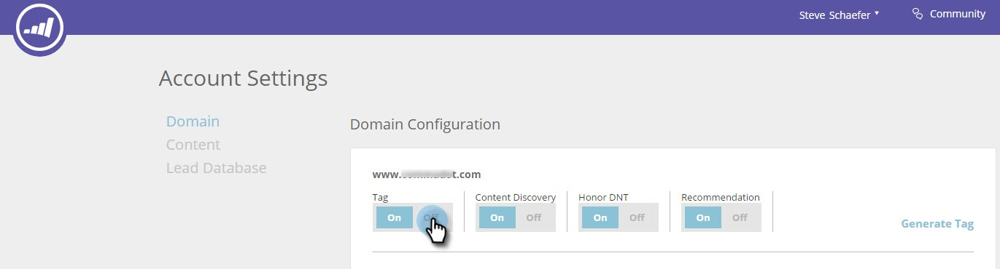

# Aktivieren oder Deaktivieren des RTP-JavaScript-Tags {#enabling-or-disabling-the-rtp-javascript-tag}

Das RTP-JavaScript-Tag steuert, ob Web Personalization Web-Aktivitäten nachverfolgt oder Kampagnen oder Inhaltsempfehlungen auf Ihrer Website ausführt.

>[!NOTE]
>
>**Es ist nicht erforderlich, das Tag aus Ihrem HTML-Code auf Ihrer Website zu entfernen.** steuern es über Kontoeinstellungen.

## Aktivieren oder Deaktivieren des Tags {#enable-or-disable-the-tag}

1. Navigieren Sie **Kontoeinstellungen**.

   

1. Wählen Sie in der Domain- und Domain-Konfiguration unter Tag die Option **Aus**, um das JavaScript-Tag zu deaktivieren.

   

   Wenn das Tag auf Aus gesetzt ist, ist der JavaScript-Code deaktiviert und Web Personalization verfolgt keine Web-Aktivitäten und führt keine Kampagnen oder Inhaltsempfehlungen auf Ihrer Website aus.

1. Um das RTP-Tag zu aktivieren, wählen Sie in der Domain- und Domain-Konfiguration unter Tag den Umschalter **Ein** aus.

   Einfach.
