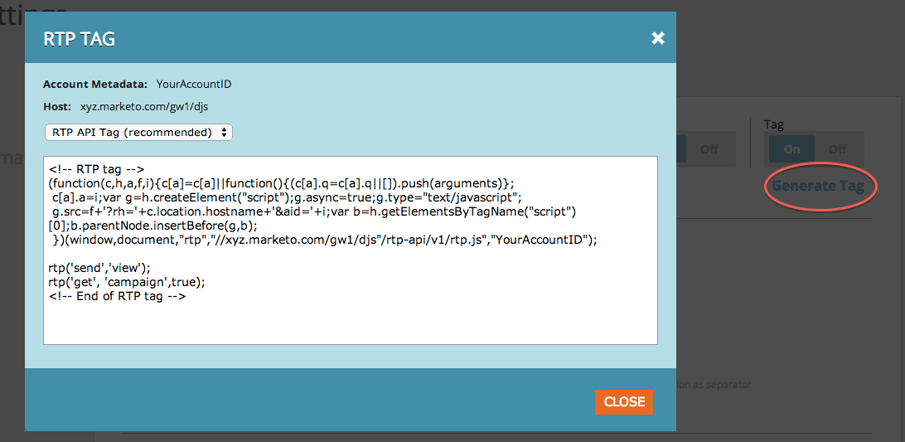

# Implementieren von RTP mit [!DNL Google Tag Manager] {#implementing-rtp-using-google-tag-manager}

Um Ihr RTP-Tag zu implementieren, folgen Sie bitte den unten stehenden Installationsanweisungen.

1. Melden Sie sich bei Ihrem [!DNL Google Tag Manager] an.

1. Fügen Sie ein neues **[!UICONTROL Tag]** > **[!UICONTROL Tag-Konfigurationen]** > **[!UICONTROL Benutzerdefiniertes HTML-Tag] hinzu.** Nennen Sie es **RTP**.

1. Melden Sie sich bei Ihrem **RTP-** an.

1. Navigieren Sie **[!UICONTROL Kontoeinstellungen]**.

   a. Wenn Sie Ihr JavaScript-Tag bereits vom Support erhalten haben, fahren Sie mit Schritt 6 fort.

   

1. Suchen Sie unter [!UICONTROL Domain] die entsprechende Domain und klicken Sie auf **[!UICONTROL Tag generieren]**.

   

1. Kopieren Sie das RTP-JavaScript-Tag und fügen Sie es in das neue **benutzerdefinierte HTML-Tag** ein, das Sie erstellt haben (Schritt 1).

1. Klicken Sie **[!UICONTROL Regel zu Auslöser-Tag hinzufügen]**. Wählen Sie **[!UICONTROL Alle Seiten]** aus.

1. Klicken Sie auf **[!UICONTROL Speichern]** und [veröffentlichen Sie die neue Version](https://support.google.com/tagmanager/answer/2699097?hl=en).

1. Vergewissern Sie sich, dass sie auf allen Seiten angezeigt wird, einschließlich Landingpages und Subdomains.

   a. Klicken Sie dazu mit der rechten Maustaste auf die Seite Ihrer Website. Navigieren Sie zu **[!UICONTROL Element überprüfen]**, suchen Sie nach **RTP**, um das Tag zu finden.
