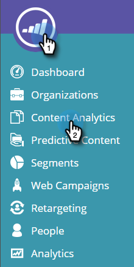
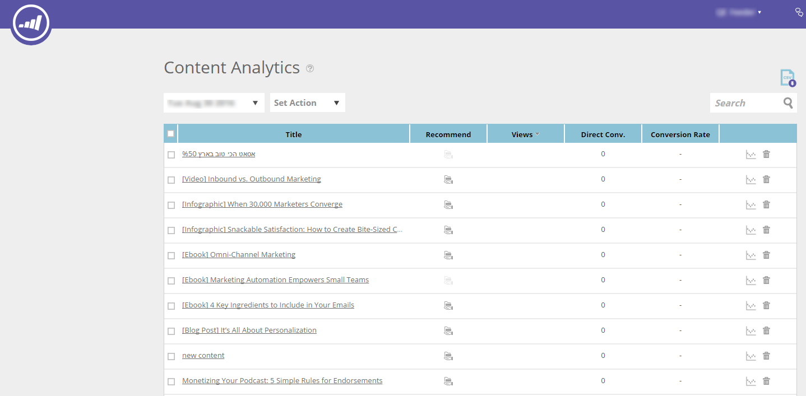
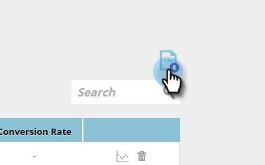
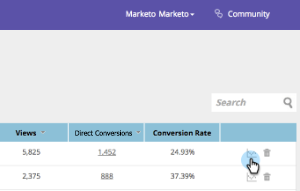
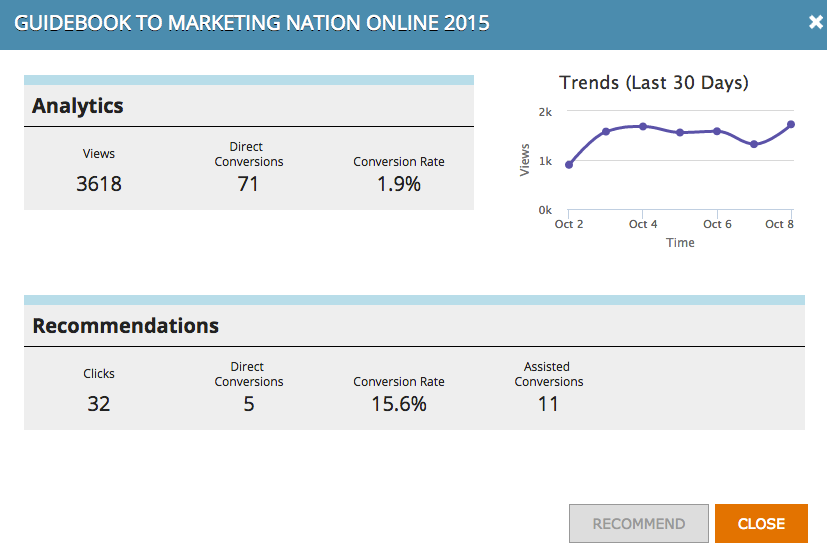
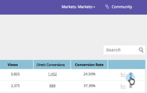

# Grundlegendes zur Inhaltsanalyse {#understanding-content-analytics}

Auf der Content Analytics-Seite werden die von Ihrer Website entdeckten Inhalte (Fallstudien, Blog-Posts, Videos, Pressemitteilungen usw.) angezeigt. Es zeigt auch die Leistung Ihrer Inhalte und Personen an, die generiert werden, wenn Besucher mit ihnen interagieren.

## Content Analytics anzeigen {#view-content-analytics}

Zu **[!UICONTROL Content Analytics]**.

Auf der Seite [!UICONTROL Content Analytics] haben Sie folgende Möglichkeiten:

* Filtern nach Zeitbereich (Tag, Woche und Monat)
* Suche nach Inhaltstitel und Inhalts-URL
* Sortieren Sie in absteigender oder aufsteigender Reihenfolge, indem Sie auf den Spaltentitel für Ansichten, Direktkonversionen und Konversionsrate klicken.

Sie können auch eine Datei im CSV-Format exportieren, indem Sie auf das Symbol klicken.

Die Analytics-Tabelle enthält die folgenden Details:

<table>
 <thead>
  <tr>
   <th colspan="1" rowspan="1">Name</th>
   <th colspan="1" rowspan="1">Beschreibung</th>
  </tr>
 </thead>
 <tbody>
  <tr>
   <td colspan="1" rowspan="1"><strong>[!UICONTROL Titel]</strong></td>
   <td colspan="1" rowspan="1">Name des Assets mit digitalen Inhalten. Klicken Sie <strong>Titel</strong>, um die Inhalts-URL in einer neuen Registerkarte zu öffnen.</td>
  </tr>
  <tr>
   <td colspan="1">
<strong>Recommendation </strong><strong>icon</strong>

</td>
   <td colspan="1">Zeigt an, ob das Inhaltselement für Inhaltsempfehlungen <a href="#"> wurde</a>.</td>
  </tr>
  <tr>
   <td colspan="1" rowspan="1">
<strong>[!UICONTROL -Ansichten]</strong>
</td>
   <td colspan="1" rowspan="1">
Die Anzahl der Ansichten von Web-Besuchern über das Inhalts-Asset. Die Häufigkeit, mit der sie angezeigt, geöffnet, angesehen oder heruntergeladen wurde. Klicken Sie auf die Anzahl der Anzeigen in der Spalte, um einen Drilldown durchzuführen und zu sehen, wer den Inhalt angezeigt hat
</td>
  </tr>
  <tr>
   <td colspan="1" rowspan="1"><strong>[!UICONTROL Direct Conversions]</strong></td>
   <td colspan="1" rowspan="1">Web-Besucherinnen und -Besucher, die den Inhalt angesehen und ein Formular während desselben Besuchs ausgefüllt haben</td>
  </tr>
  <tr>
   <td colspan="1">
<strong>Analytics-Symbol</strong>

</td>
   <td colspan="1">Weitere Analysen zum Inhaltsteil anzeigen</td>
  </tr>
  <tr>
   <td colspan="1">
<strong>Löschsymbol</strong>

</td>
   <td colspan="1">Löscht den Inhalt aus Content Analytics</td>
  </tr>
 </tbody>
</table>

## Weitere Content Analytics anzeigen {#view-additional-content-analytics}

Klicken Sie auf das Analytics-Symbol eines Inhaltselements.

Ein Dialogfeld mit zusätzlichen Content Analytics für dieses spezifische Inhaltselement wird geöffnet.

Zu den zusätzlichen Inhaltsanalysen gehören:

**Analytics**

* **[!UICONTROL Ansichten]**: Ansichten dieses Inhaltselements für den ausgewählten Zeitraum
* **[!UICONTROL Direkte Konversionen]**: Web-Besucher, die den Inhalt angesehen und ein Formular während desselben Besuchs ausgefüllt haben.
* **[!UICONTROL Konversionsrate]**&#x200B;**:** Eine prozentuale Konversionsrate, berechnet durch direkte Konversionen dividiert durch Klicks

**[!UICONTROL Trends]**

* Ein **[!UICONTROL Trends]**-Diagramm, das die letzten 30 Tage der Ansichten des jeweiligen Inhaltselements anzeigt. Bewegen Sie den Mauszeiger über das Liniendiagramm, um die Anzahl der Inhaltsansichten von einem bestimmten Tag anzuzeigen

## Löschen von Inhalten {#delete-content}

Klicken Sie auf der Seite 0&rbrace;Content Analytics&quot; auf das Löschsymbol des Inhalts, den Sie löschen möchten. Es wird eine Meldung angezeigt, die bestätigt, dass Sie den Inhalt löschen möchten.

>[!MORELIKETHIS]
>
>* [Aktivieren der Inhaltsempfehlungsleiste](/help/marketo/product-docs/predictive-content/enabling-predictive-content/enable-the-content-recommendation-bar.md)
>* [Prädiktive Inhalte für Web-Rich-Media aktivieren](/help/marketo/product-docs/predictive-content/enabling-predictive-content/enable-predictive-content-for-web-rich-media.md)
