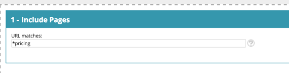
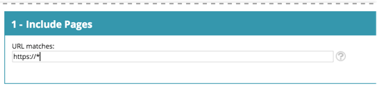
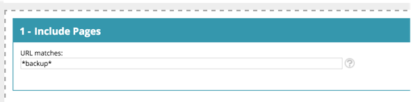

# [!DNL Web Personalization] Glossar {#web-personalization-glossary}

Einige Einblicke in die Welt und Sprache der [!DNL Marketo Web Personalization].

| Begriff | Definition |
|---|---|
| **Anonymer Besucher** | Eine Person, die eine Website besucht hat, dort aber nie ein Formular ausgefüllt oder ihre Details hinterlassen hat. |
| **Web-Kampagne** | Eine benutzerdefinierte Reaktion, die mit einem bestimmten Segment verknüpft ist. Mit Web Personalization umfassen Web-Kampagnen Dialogfelder, In-Zonen und Widgets. |
| **Clickstream** | Die Aktivität und der URL-Pfad des Besuchers auf der Website und wie lange er die einzelnen Seiten besucht hat |
| **ISP** | Internet-Dienstleister |
| **Bekannter Besucher** | Ein Web-Besucher, der ein Formular ausgefüllt und seine Details (E-Mail-Adresse) auf Ihrer Website hinterlassen oder auf einen Link in einer Marketo-E-Mail geklickt hat. |
| **Kontoliste** | Eine Liste der Namen wichtiger Konten/Organisationen. Wird auch als Account-Based Marketing-Liste (ABM) bezeichnet. |
| **Segmente** | Eine Sammlung von Besucherinnen und Besuchern, die die auf der Seite „Segment [&quot; festgelegten Kriterien erfüllen](/help/marketo/product-docs/web-personalization/using-web-segments/web-segments.md). |
| **Split-Tests** | Ein Experiment mit zwei oder mehr Varianten zur Messung der Differenz der Ergebnisse. Das Ziel ist es, Änderungen an Web-Seiten zu identifizieren, mit denen sich ein gewünschtes Ergebnis verbessern oder maximieren lässt. |
| **Platzhalter** | Ein Platzhalterzeichen (&#42; wird verwendet), das vor oder nach einer Zeichenfolge verwendet wird, um ein anderes Zeichen oder andere Zeichen in einer Zeichenfolge zu ersetzen. Siehe dazu die Beispiele weiter unten. |

## Beispiele für Platzhalter {#wildcard-examples}

Im Folgenden finden Sie drei Möglichkeiten, einen Platzhalter in [!DNL Web Personalization] zu verwenden.

Abgleichen aller Besucher auf Seiten-URLs, die mit Preisen enden (z. B. `www.marketo.com/pricing`

Allen Besuchern auf Seiten-URLs zuordnen, die mit https:// beginnen (z. B. `https://www.marketo.com`

Abgleich aller Besucher auf Seiten-URLs, die das Wort „Backup“ enthalten (z. B. `https://www.marketo.com/backup/pricing.html`

