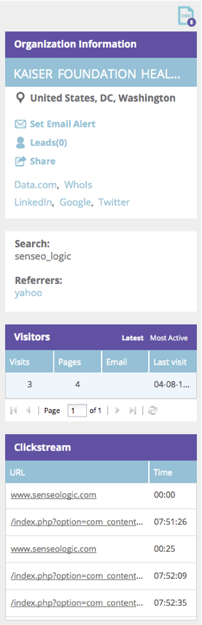
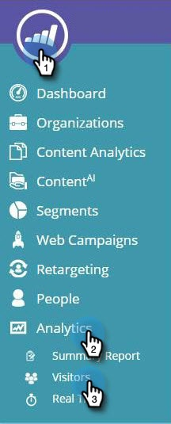

# Übersicht über Web Personalization {#web-personalization-overview}

## Einführung {#introduction}

Für neue Marketo-Kunden [!UICONTROL Real-Time Personalization] in vier Apps unterteilt, auf die über die beiden Kacheln zugegriffen wird: [!UICONTROL Web Personalization] und [!UICONTROL ContentAI].

 

>[!NOTE]
>
>[!UICONTROL Web Personalization] und [!UICONTROL ContentAI] sind in allen von Marketo unterstützten Sprachen verfügbar (Deutsch, Englisch, Französisch, Japanisch, Portugiesisch, Spanisch).

Bestehende Kundinnen und Kunden greifen bis zur Verlängerung über die Kachel Echtzeit-Personalization auf die Apps zu. Zu diesem Zeitpunkt verwenden sie die oben beschriebene Anmeldung.

Wenn Sie auf die Kachel [!UICONTROL Web Personalization] klicken, wird die Dashboard-Seite angezeigt. Klicken Sie auf [!UICONTROL ContentAI]-Kachel und gehen Sie direkt zur Seite „Inhaltsempfehlungen“.

Die vier Apps sind:

* [!UICONTROL Web-Personalization]
* [!UICONTROL Account-Based Web Marketing]
* [!UICONTROL Website-Retargeting]
* [!UICONTROL ContentAI]

Die **[!UICONTROL Web Personalization]**-Kachel ist Ihr Zugriffspunkt zum Erstellen personalisierter Web-Kampagnen. Account-basiertes Web-Marketing und Web-Retargeting. Sie können Inhalte auf der Content Analytics-Seite hinzufügen.

**[!UICONTROL Account-Based Web Marketing]** arbeitet mit Web Personalization und Funktionen namens Konten. Auf der Seite Benannte Konten finden Sie grafische Informationen zu Bestandskunden, Gesamtinteraktionen und Organisationstrends sowie eine Liste der Konten. Sie können auch dort neue benannte Konten erstellen.

**[!UICONTROL Website-Retargeting]** ermöglicht die erneute Vermarktung an segmentierte Zielgruppen. Sie können Segmente festlegen, aber keine spezifischen Konten im Filter verwenden.

**[!UICONTROL ContentAI]** ist der Ort, um Inhaltsempfehlungen zu geben. Sie können der Seite Inhaltsempfehlungen mühelos Inhalte hinzufügen.

>[!NOTE]
>
>Um auf [!UICONTROL Account-Based Web ] oder [!UICONTROL Website Retargeting] zuzugreifen, müssen Sie auf die Kachel [!UICONTROL Web Personalization] klicken, auch wenn Sie nicht über die [!UICONTROL Web Personalization]-App verfügen.

## Organisationen {#organizations}

Auf der Registerkarte Organisationen werden alle Details (Name, Standort, Aktivität und Zeitstempel) der Organisationen angezeigt, die Ihre Website während eines bestimmten Zeitraums besucht haben. Die Tabelle kann nach Zeit, Ort, Domain und über eine Freitextsuche sortiert und organisiert werden.

>[!TIP]
>
>„Am aktivsten“ vs. „am aktuellsten“ - Die Tabelle ist nach identifizierten Organisationen und dann nach Internet-Service-Anbietern organisiert (durch ein ISP-Symbol gekennzeichnet). Er kann nach folgenden Kriterien sortiert werden:
>
>* Am aktivsten: die aktivsten Organisationen in der Tabelle, basierend auf der Anzahl der Seitenansichten
>* Neueste: die neuesten Organisationen in der Tabelle (Standard)
>* Für wertvolle Einblicke filtern Sie nach den aktivsten

**Organisationen - Bedienfeld rechts**

Das rechte Bedienfeld der Seite „Organisationen“ bietet die folgenden Funktionen und Einblicke:

<table> 
 <tbody> 
  <tr> 
   <td>
<strong>Tabellensymbol</strong>: Das Symbol oben rechts im Bedienfeld lädt die Tabelle Organisationen zur Offline-Verwendung im CSV-Format herunter

<strong>[!UICONTROL E-Mail-Warnhinweis festlegen]</strong>: Sendet dem angemeldeten Benutzer jedes Mal eine E-Mail, wenn das ausgewählte Unternehmen die Website besucht

<strong>[!UICONTROL Leads]</strong>: Öffnet die Lead-Tabelle der ausgewählten Organisation

<strong>[!UICONTROL Share]</strong>: Öffnet ein Pop-up-Fenster zum Senden von E-Mails und zum Freigeben der Details der Organisation, die die Web-Seite besucht hat

<strong>Standortsymbol</strong>: Zeigt das Land und die Stadt der ausgewählten Organisation an

<strong>Links</strong>: Jigsaw, Whois, LinkedIn, Google, Twitter öffnet ein neues Fenster mit zusätzlichen Informationen von der jeweiligen Webseite, die zusätzliche insight für das ausgewählte Unternehmen anbieten

<strong>[!UICONTROL Search]</strong>: Zeigt das Keyword an, das verwendet wird, wenn der Besucher über eine Suchmaschine angekommen ist

<strong>[!UICONTROL Referrers]</strong>: Zeigt den URL-Link der Seite an, die den Traffic auf Ihre Site verwiesen hat

<strong>[!UICONTROL Visitors]</strong>: Zeigt die Anzahl der Besuche, die Anzahl der von der ausgewählten Organisation angezeigten Seiten und deren E-Mail-Adresse (sofern sie ein Formular zum Senden ausgefüllt haben) sowie die Uhrzeit und das Datum des letzten Besuchs an

<strong>[!UICONTROL Clickstream]</strong>: Zeigt eine Tabelle der Benutzeraktivität und des URL-Pfads auf der Website sowie die Dauer der Seitenbesuche an
</td> 
   <td></td> 
  </tr> 
 </tbody> 
</table>

**Organisationen freigeben**

Möchten Sie die Informationen Ihres Website-Besuchers an einen Kollegen weitergeben? Klicken Sie auf eine Organisation und dann auf den Link Freigeben im rechten Bedienfeld.

Dadurch wird die Überlagerung [!UICONTROL Diese Organisation freigeben] aktiviert, mit der Sie eine E-Mail senden können, in der der Name und die Details der Organisation, die die Website besucht hat, freigegeben werden.

## Besucher {#visitors}

Auf der Seite Besucher werden alle Details und das Online-Verhalten jedes Besuchers angezeigt, der innerhalb eines bestimmten Zeitraums zu Ihrer Site gelangt ist. Die Seite bietet eine ausführliche insight zu den Aktivitäten und dem Online-Verhalten jedes einzelnen Besuchers. Die Besucherdaten in der Tabelle werden innerhalb von 24 bis 48 Stunden aktualisiert.

Das rechte Bedienfeld der Seite [!UICONTROL Besucher] bietet folgende Einblicke:

<table> 
 <thead> 
  <tr> 
   <th colspan="1" rowspan="1">Name</th> 
   <th colspan="1" rowspan="1">Beschreibung</th> 
  </tr> 
 </thead> 
 <tbody> 
  <tr> 
   <td colspan="1" rowspan="1"><strong>Tabellensymbol</strong></td> 
   <td colspan="1" rowspan="1">Oben rechts im Bedienfeld lädt das Symbol die Tabelle Besucher zur Offline-Nutzung im CSV-Format herunter</td> 
  </tr> 
  <tr> 
   <td colspan="1" rowspan="1">
<strong>Organisationsname</strong>
</td> 
   <td colspan="1" rowspan="1"> </td> 
  </tr> 
  <tr> 
   <td colspan="1" rowspan="1"><strong>Kampagne einstellen</strong></td> 
   <td colspan="1" rowspan="1">Ermöglicht das Einrichten einer mit dem ausgewählten Besucher verknüpften Campaign CTA</td> 
  </tr> 
  <tr> 
   <td colspan="1"><strong>Standort</strong></td> 
   <td colspan="1">Zeigt Land, Bundesland und Stadt des Besuchers an</td> 
  </tr> 
  <tr> 
   <td colspan="1" rowspan="1"><strong>Clickstream</strong></td> 
   <td colspan="1" rowspan="1">Zeigt eine Tabelle der Aktivität und des URL-Pfads des Besuchers auf der Website sowie die Dauer seiner Besuche auf den einzelnen Seiten an</td> 
  </tr> 
 </tbody> 
</table>

## Echtzeit {#real-time}

Auf der Seite „Echtzeit“ werden Besucher auf Ihrer Website in Echtzeit angezeigt und die Aktivität wird direkt gemessen.

Die Echtzeit-Seite ist in 6 informative Tabellen mit Details zu den Besuchern vor Ort unterteilt:

<table> 
 <thead> 
  <tr> 
   <th colspan="1" rowspan="1">Name</th> 
   <th colspan="1" rowspan="1">Beschreibung</th> 
  </tr> 
 </thead> 
 <tbody> 
  <tr> 
   <td colspan="1" rowspan="1"><strong>[!UICONTROL Visitors]</strong></td> 
   <td colspan="1" rowspan="1"> Stellt die Anzahl der Besucher dar, die derzeit auf Ihrer Website sind</td> 
  </tr> 
  <tr> 
   <td colspan="1" rowspan="1">
<strong>[!UICONTROL Klicks pro Minute]</strong>
</td> 
   <td colspan="1" rowspan="1"> Ein Live-Liniendiagramm, das die Anzahl der Klicks pro Minute auf Ihrer Site anzeigt</td> 
  </tr> 
  <tr> 
   <td colspan="1" rowspan="1"><strong>[!UICONTROL Top Organisations]</strong></td> 
   <td colspan="1" rowspan="1">Eine kurze Version der Tabelle „Organisationen“</td> 
  </tr> 
  <tr> 
   <td colspan="1"><strong>[!UICONTROL Echtzeit-Segment]</strong></td> 
   <td colspan="1">Die Anzahl der Besucherinnen und Besucher, die derzeit auf der Website sind und bestimmten Segmenten entsprechen</td> 
  </tr> 
  <tr> 
   <td colspan="1"><strong>[!UICONTROL durchsucht derzeit]</strong></td> 
   <td colspan="1">Die URL der Seiten, die derzeit von Besuchern vor Ort angezeigt werden</td> 
  </tr> 
  <tr> 
   <td colspan="1" rowspan="1"><strong>[!UICONTROL Top-Verweise]</strong></td> 
   <td colspan="1" rowspan="1">Die Verweis-URL, über die der Besucher zu Ihrer Site gelangte</td> 
  </tr> 
 </tbody> 
</table>
