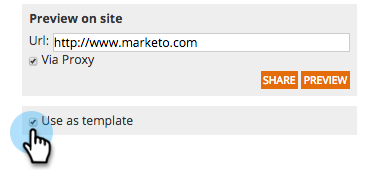

# Speichern Ihrer Kampagne als Vorlage {#save-your-campaign-as-a-template}

Haben Sie schon einmal Zeit damit verbracht, die perfekte Web-Kampagne zu erstellen? Jetzt können Sie sie als Vorlage speichern, um sie in Zukunft einfach wiederzuverwenden.

1. Wechseln Sie zu **Web-Kampagnen**.

   

1. Suchen Sie nach der Kampagne, die Sie als Vorlage speichern möchten.

   

1. Klicken Sie auf das Symbol Bearbeiten .

   

1. Aktivieren Sie die Option Als Vorlage verwenden und klicken Sie auf **Speichern**.

      

1. Das ist es! Wenn Sie das nächste Mal eine Kampagne erstellen und eine Vorlage auswählen, aktivieren Sie auf der Seite &quot;Kampagnen festlegen&quot;die Option Meine Vorlagen , um die gespeicherten Vorlagen anzuzeigen.

   
