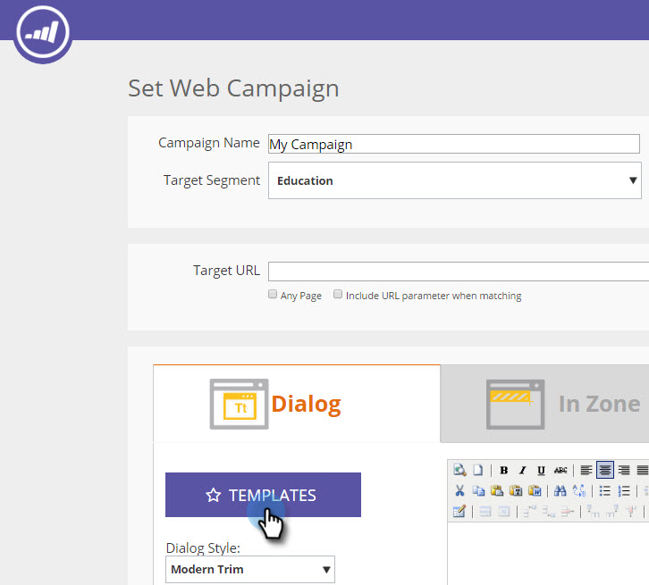

# Verwenden von Vorlagen zur Erstellung von Web-Kampagnen {#using-templates-to-create-web-campaigns}

Beschleunigen und vereinfachen Sie die Erstellung von Web-Kampagnen mithilfe unserer integrierten Vorlagen oder durch [Speichern Ihrer eigenen](save-your-campaign-as-a-template.md).

>[!NOTE]
>
>Vorlagen sind für alle Geräte und Browser-Erlebnisse sowohl für Desktop als auch für Mobilgeräte optimiert.

1. Gehen Sie zu **[!UICONTROL Web-Kampagnen]**.

   

1. Klicken Sie **[!UICONTROL Neue Web-Kampagne erstellen]**.

   

1. Benennen Sie Ihre Kampagne.

   

1. Wählen Sie ein [!UICONTROL Zielsegment] aus.

   

1. Klicken Sie auf **[!UICONTROL Vorlagen]**.

   

1. Wählen Sie den entsprechenden Bereich für Ihre Kampagne aus, um eine Vorlage anzuzeigen und auszuwählen, die für Sie geeignet ist.

   >[!NOTE]
   >
   >Es gibt einige coole Vorlagen zur Auswahl, und wir werden in Zukunft weitere hinzufügen.

   

   >[!TIP]
   >
   >Wählen Sie für Mobile-Kampagnen eine Vorlage aus dem Abschnitt **Mobile** aus.

1. Anpassen der Vorlage.

   

1. Klicken Sie auf **[!UICONTROL Speichern]**.

   

Gut gemacht! Haben Sie gesehen, wie viel Zeit Sie durch die Verwendung einer Vorlage gespart haben?

>[!MORELIKETHIS]
>
>[Kampagne als Vorlage speichern](/help/marketo/product-docs/web-personalization/using-templates/save-your-campaign-as-a-template.md)
