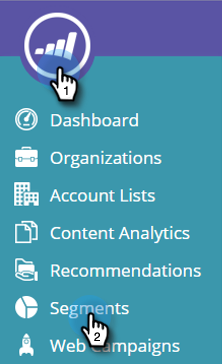

# Erstellen eines einfachen Websegments {#create-a-basic-web-segment}

Erstellen wir ein Basissegment, das alle Webbesucher aus den USA und der Finanzdienstleistungsbranche anspricht.

1. Navigieren Sie zu **Segmente**.

   

1. Klicks **Neu erstellen**.

   

1. Geben Sie den Segmentnamen ein.

   

1. Ziehen **Standort** aus dem Kontextmenü aus und legen Sie es im Segmenteditor ab.

   

1. Wählen Sie aus der Dropdown-Liste ein Land aus, das hinzugefügt werden soll. Wählen Sie die **Vereinigte Staaten**.

   

   >[!NOTE]
   >
   >Die Anzahl der Städte ist auf 300 pro Segment beschränkt.

1. Ziehen **Branchen** aus dem Kontextmenü aus und legen Sie es im Segmenteditor ab.

   

1. Wählen Sie aus der Dropdown-Liste die hinzuzufügenden Branchen aus. Wählen Sie die **Finanzdienstleistungsbranche**.

   

   Sie haben nun ein Basissegment für alle Interessenten eingerichtet, die Ihre Website aus den USA und der Finanzbranche besuchen.

1. Klicks **Speichern** zum Speichern des Segments oder **Kampagne speichern und definieren** , um zur Seite Kampagnen zu gelangen.

   

Jetzt haben Sie Ihre Besucher aus den Vereinigten Staaten segmentiert und fügen Sie die Finanzdienstleistungsbranche hinzu.

>[!MORELIKETHIS]
>
>[Websegmente](/help/marketo/product-docs/web-personalization/using-web-segments/web-segments.md)
