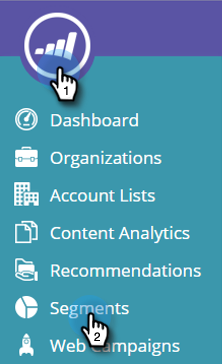
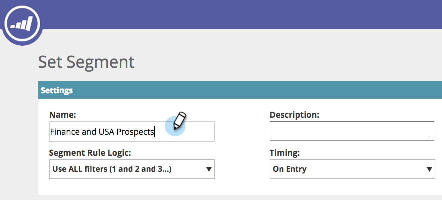
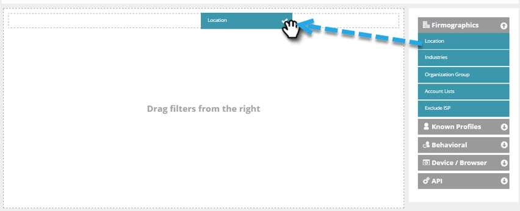
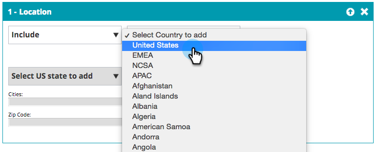

# Erstellen eines einfachen Web-Segments {#create-a-basic-web-segment}

Erstellen wir ein Basissegment für alle Web-Besucher aus den USA und der Finanzdienstleistungsbranche.

1. Navigieren Sie zu **[!UICONTROL Segmente]**.

   

1. Klicken Sie auf **[!UICONTROL Neu erstellen]**.

   

1. Geben Sie den Segmentnamen ein.

   

1. Ziehen Sie **[!UICONTROL Standort]** aus dem Menü rechts und legen Sie es im Segmenteditor ab.

   

1. Wählen Sie aus der Dropdown-Liste das Land aus, das hinzugefügt werden soll. Wählen Sie die **USA** aus.

   

   >[!NOTE]
   >
   >Die Anzahl der Städte ist auf 300 pro Segment begrenzt.

1. Ziehen Sie **[!UICONTROL Branchen]** aus dem Menü rechts und legen Sie es im Segmenteditor ab.

   

1. Wählen [!UICONTROL Branchen] aus der Dropdown-Liste aus, die hinzugefügt werden sollen. Wählen Sie die Branche **[!UICONTROL Finanzdienstleistungen] aus**.

   

   Sie haben jetzt ein Basissegment für alle Interessenten eingerichtet, die Ihre Website aus den USA und der Finanzbranche besuchen.

1. Klicken Sie auf **[!UICONTROL Speichern]**, um das Segment zu speichern, oder **[!UICONTROL Speichern und Kampagne definieren]**, um zur Seite Kampagnen zu gelangen.

   

Jetzt haben Sie Ihre Besucher aus den USA segmentiert, und fügen Sie die Finanzdienstleistungsbranche hinzu.

>[!MORELIKETHIS]
>
>[Web-Segmente](/help/marketo/product-docs/web-personalization/using-web-segments/web-segments.md)
