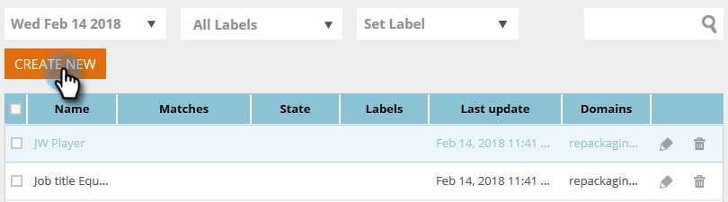
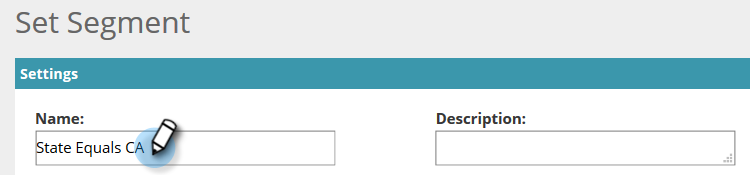
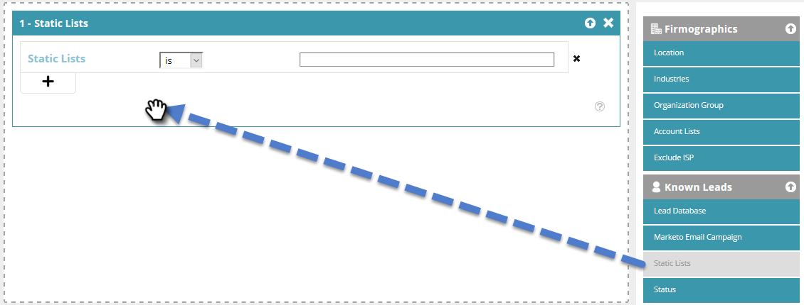
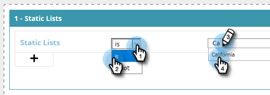
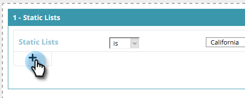
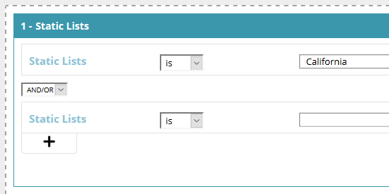
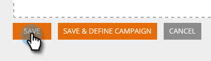

# Erstellen eines Segments mithilfe einer statischen Liste {#create-a-segment-using-a-static-list}

Segmentieren Sie bekannte Web-Besucher, wenn sie Ihre Website besuchen, je nachdem, ob sie sich in einer Ihrer Marketo-[ befinden oder nicht (statische Listen](/help/marketo/product-docs/core-marketo-concepts/smart-lists-and-static-lists/static-lists/understanding-static-lists.md).

1. Navigieren Sie zu **[!UICONTROL Segmente]**.

   

1. Klicken Sie auf **[!UICONTROL Neu erstellen]**.

   

1. Geben Sie einen Segmentnamen ein.

   

1. Ziehen Sie in Bekannte Leads **[!UICONTROL Statische Listen]** auf die Arbeitsfläche.

   

1. Klicken Sie auf die Dropdown-Liste, um **[!UICONTROL ist]** oder **[!UICONTROL ist nicht]** auszuwählen (je nachdem, was Sie möchten), und geben Sie den Namen Ihrer statischen Liste ein.

   

1. Wenn Sie mehrere Listen hinzufügen möchten, müssen Sie für jede Zeile eine neue Zeile erstellen, indem Sie auf das **+** klicken. Wenn Sie nur eine Liste wünschen, fahren Sie mit [Schritt 8](#eight) fort.

   

1. Wiederholen Sie bei mehreren Listen (oder mehreren Listen mit „ist nicht„) die Schritte, die Sie in [Schritt 5) ](#five) haben.

   

   >[!NOTE]
   >
   >Die Dropdown-Liste und/oder ist genau das. Klicken Sie darauf, um **[!UICONTROL und]**, **[!UICONTROL oder]** oder **[!UICONTROL und/oder]** auszuwählen.

1. Klicken Sie auf **[!UICONTROL Speichern]**, um das Segment zu speichern, oder **[!UICONTROL Speichern und Kampagne definieren]**, um es zu speichern und zur Seite [!UICONTROL Kampagnen] zu wechseln.

   
