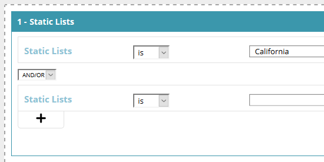

# Erstellen eines Segments mit einer statischen Liste {#create-a-segment-using-a-static-list}

Segmentieren Sie bekannte Web-Besucher, wenn sie Ihre Website besuchen, je nachdem, ob sie sich in einer Ihrer Marketo [statischen Listen](/help/marketo/product-docs/core-marketo-concepts/smart-lists-and-static-lists/static-lists/understanding-static-lists.md) befinden.

1. Gehen Sie zu **Segmente**.

   

1. Klicken Sie auf **Neu erstellen**.

   

1. Geben Sie einen Segmentnamen ein.

   

1. Ziehen Sie unter &quot;Bekannte Interessenten&quot;**Statische Listen** auf die Arbeitsfläche.

   

1. Klicken Sie auf die Dropdownliste, um **is** oder **is not** (je nachdem, was Sie möchten) auszuwählen und geben Sie den Namen Ihrer statischen Liste ein.

   

1. Wenn Sie mehrere Listen hinzufügen möchten, müssen Sie für jede Zeile eine neue Zeile erstellen, indem Sie auf **+** klicken. Wenn Sie nur eine Liste wünschen, gehen Sie zu [Schritt 8](#eight).

   

1. Wiederholen Sie für mehrere Listen (oder mehrere &quot;is not&quot;-Listen) die Schritte, die Sie in [Schritt 5](#five) gelernt haben.

   

   >[!NOTE]
   >
   >Die und/oder Dropdownliste ist genau das. Klicken Sie darauf, um **und**, **oder** oder **und/oder** auszuwählen.

1. Klicken Sie auf **Speichern**, um das Segment zu speichern, oder **Kampagne speichern und definieren**, um zu speichern und zur Seite &quot;Kampagnen&quot;zu wechseln.

   
