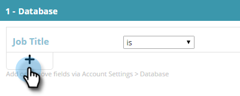

# Erstellen eines Segments mit Daten bekannter Personen {#create-a-segment-using-known-person-data}

So erstellen Sie ein Segment mit Werten für bekannte Personen.

>[!PREREQUISITES]
>
>[Verwalten von Personendaten](/help/marketo/product-docs/web-personalization/using-web-segments/manage-person-data.md)

1. Navigieren Sie zu **Segmente**.

   

1. Klicken Sie auf **Neu erstellen**.

   

1. Geben Sie einen Segmentnamen ein.

   

1. Ziehen Sie in der Profilsegmentierung **Datenbank** auf die Arbeitsfläche.

   

1. Wählen Sie ein Personendatenfeld aus der Dropdown-Liste aus.

   

1. Geben Sie einen Wert für Personendaten ein.

   

   Für jedes Feld kann nur ein Wert vorhanden sein. Wenn Sie beispielsweise mehrere Werte für das Feld &quot;Auftragstitel&quot;hinzufügen möchten, müssen Sie für jeden Wert eine neue Zeile mit demselben Feldnamen erstellen. Stellen Sie sicher, dass Sie den ODER -Wert verwenden, um sicherzustellen, dass ein beliebiger Wert eine Übereinstimmung erfasst.

   

## Auswählen von Datenfeldern für mehrere Personen {#selecting-multiple-person-data-fields}

1. Klicken Sie auf **+** , um ein weiteres Personendatenfeld hinzuzufügen.

   

1. Wählen Sie den UND/ODER-Operator aus. Wählen Sie das hinzuzufügende Feld aus. Wählen Sie ein Personendatenfeld aus. Geben Sie den Datenwert der Person ein.

   

1. Klicken Sie auf **Speichern** , um das Segment zu speichern, oder auf **Speichern und Definieren der Kampagne** , um zu speichern und zur Seite &quot;Kampagnen&quot;zu wechseln.

   

   Sie haben jetzt ein Segment eingerichtet, das auf Daten bekannter Personen abzielt.
