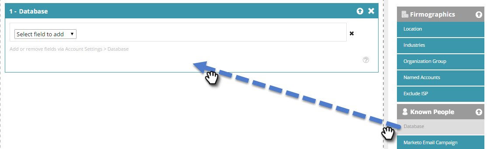

# Erstellen eines Segments mit Daten einer bekannten Person {#create-a-segment-using-known-person-data}

Im Folgenden wird beschrieben, wie Sie ein Segment mithilfe von Werten für bekannte Personendaten erstellen.

>[!PREREQUISITES]
>
>[Verwalten von Personendaten](/help/marketo/product-docs/web-personalization/using-web-segments/manage-person-data.md)

1. Navigieren Sie zu **[!UICONTROL Segmente]**.

   

1. Klicken Sie auf **[!UICONTROL Neu erstellen]**.

   

1. Geben Sie einen Segmentnamen ein.

   

1. Ziehen Sie in der Profilsegmentierung **[!UICONTROL Datenbank]** auf die Arbeitsfläche.

   

1. Wählen Sie ein Personendatenfeld aus der Dropdown-Liste aus.

   

1. Geben Sie einen Wert für die Personendaten ein.

   

   Für jedes Feld kann nur ein Wert vorhanden sein. Wenn Sie beispielsweise mehrere Werte für das Feld Auftragstitel hinzufügen möchten, müssen Sie für jeden Wert eine neue Zeile mit demselben Feldnamen erstellen. Stellen Sie sicher, dass der ODER-Wert verwendet wird, um sicherzustellen, dass ein beliebiger Wert eine Übereinstimmung erfasst.

   

## Auswählen mehrerer Personendatenfelder {#selecting-multiple-person-data-fields}

1. Klicken Sie auf **+**, um ein weiteres Personendatenfeld hinzuzufügen.

   

1. Wählen Sie den [!UICONTROL AND]/[!UICONTROL OR]Operator. Wählen Sie das hinzuzufügende Feld aus. Wählen Sie ein Personendatenfeld aus. Geben Sie den Wert für die Personendaten ein.

   

1. Klicken Sie auf **[!UICONTROL Speichern]**, um das Segment zu speichern, oder **[!UICONTROL Speichern und Kampagne definieren]**, um es zu speichern und zur Seite [!UICONTROL Kampagnen] zu wechseln.

   

   Sie haben jetzt ein Segment eingerichtet, das auf Daten zu bekannten Personen abzielt.
