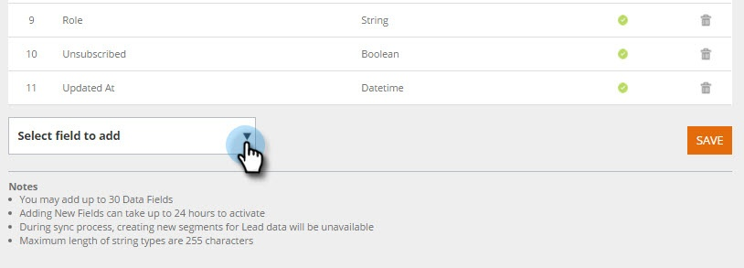

# Verwalten von Personendaten {#manage-person-data}

Nutzen Sie Personendaten für die [!DNL Web Personalization], indem Sie die in Ihrer Segmentierung zu verwendenden Personenfelder auswählen.

1. Navigieren Sie **[!UICONTROL Kontoeinstellungen]**.

   

1. Wechseln Sie zu **[!UICONTROL Datenbank]**.

   

## Hinzufügen eines Felds „Neue Person“ {#adding-a-new-person-field}

1. Wählen Sie **Feld zum Hinzufügen** aus der Dropdown-Liste aus, um der Liste ein Personendatenfeld hinzuzufügen.

   

   >[!NOTE]
   >
   >Ein neues Feld wird im Status Ausstehend hinzugefügt und kann bis zu 24 Stunden dauern, bis es aktiviert ist.

## Löschen eines Personenfelds {#deleting-a-person-field}

1. Klicken Sie auf das Löschsymbol ( ), um ein Feld aus der Liste zu entfernen. Klicken Sie **[!UICONTROL Ja]**, um zu bestätigen, dass Sie das Feld löschen möchten.

   

   >[!NOTE]
   >
   >**Verwalten von Personendatenfeldern**
   >
   >* Nur Personendatenfelder können einbezogen werden
   >* Sie können bis zu 30 Personendatenfelder hinzufügen
   >* Bis zum Aktivieren hinzugefügter neuer Felder können bis zu 24 Stunden vergehen
   >* Die maximal zulässige Länge der String-Typen ist 255 Zeichen
   >* Ausgeblendete Felder werden automatisch entfernt

<table>
 <tbody>
  <tr>
   <th>
REST-API-Name
</th>
   <th>
SOAP-API-Name
</th>
   <th>
Anzeigename
</th>
  </tr>
  <tr>
   <td>
Abteilung
</td>
   <td>
Abteilung
</td>
   <td>
Abteilung
</td>
  </tr>
  <tr>
   <td>
Titel
</td>
   <td>
Titel
</td>
   <td>
Job-Titel
</td>
  </tr>
  <tr>
   <td>
Bewertung
</td>
   <td>
Bewertung
</td>
   <td>
Bewertung
</td>
  </tr>
  <tr>
   <td>
LeadScore
</td>
   <td>
LeadScore
</td>
   <td>
Bewertung
</td>
  </tr>
  <tr>
   <td>
leadStatus
</td>
   <td>
LeadStatus
</td>
   <td>
Status
</td>
  </tr>
  <tr>
   <td>
Priorität
</td>
   <td>
Priorität
</td>
   <td>
Priorität
</td>
  </tr>
  <tr>
   <td>
leadRole
</td>
   <td>
LeadRole
</td>
   <td>
Rolle
</td>
  </tr>
  <tr>
   <td>
Abgemeldet
</td>
   <td>
Hat sich abgemeldet
</td>
   <td>
Abbestellt
</td>
  </tr>
 </tbody>
</table>

Die folgenden Lead-Felder sind für neue [!DNL Web Personalization]-Konten standardmäßig bereitgestellt:

>[!MORELIKETHIS]
>
>[Erstellen eines Segments mithilfe von Daten zu bekannten Personen](/help/marketo/product-docs/web-personalization/using-web-segments/create-a-segment-using-known-person-data.md)
