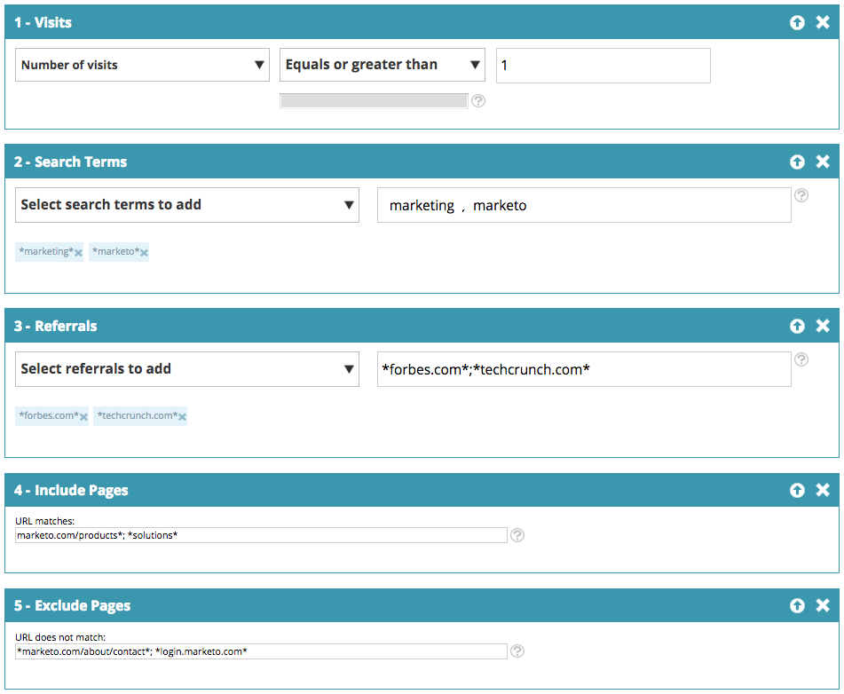

# Web-Segmente {#web-segments}

## Segment anzeigen {#view-segment}

Auf der Registerkarte Segmente werden alle benutzerdefinierten Segmente angezeigt, die Sie basierend auf verschiedenen Attributen einrichten.  **Ein Segment ist eine Sammlung von Besuchern, die die auf der Seite „Segment festlegen“ angegebenen Kriterien erfüllen.** Ein Segment kann Besucher aus einer bestimmten Branche, aus einem bestimmten Standort oder basierend auf der Onsite-Aktivität des Besuchers sein.

In [!DNL Web Personalizatio] kann ein Besucher mit mehr als einem Segment übereinstimmen. Wenn es beispielsweise ein Segment für US-Besucher und ein Segment für Finanzunternehmen gibt, würde ein Web-Besucher der Bank of America (**) sowohl mit** Segment für US-Besucher als auch mit dem Segment für Finanzunternehmen übereinstimmen.

**DIAGRAMM:** Die Seite Segmente zeigt ein Balkendiagramm der ausgewählten Segmente entsprechend der Anzahl der Besucher aus dem Segment (Y-Achse) und dem Segmentnamen (X-Achse) an.

<table>
 <thead>
  <tr>
   <th colspan="1" rowspan="1">Name</th>
   <th colspan="1" rowspan="1">Beschreibung</th>
  </tr>
 </thead>
 <tbody>
  <tr>
   <td colspan="1" rowspan="1"><strong>Name</strong></td>
   <td colspan="1" rowspan="1">Der Titel des Segments</td>
  </tr>
  <tr>
   <td colspan="1" rowspan="1">
<strong>Stimmt überein mit</strong>
</td>
   <td colspan="1" rowspan="1">Die Anzahl der Besucher, die die benutzerdefinierten, definierten Kriterien des Segments erfüllen</td>
  </tr>
  <tr>
   <td colspan="1" rowspan="1"><strong>Kampagne einstellen</strong></td>
   <td colspan="1" rowspan="1">Ermöglicht die Einrichtung einer CTA in Campaign, die mit dem ausgewählten Suchbegriff verknüpft ist</td>
  </tr>
  <tr>
   <td colspan="1"><strong>Besucher</strong></td>
   <td colspan="1">Eine Vorschau der Besuchertabelle, die mit dem ausgewählten Suchbegriff verknüpft ist</td>
  </tr>
  <tr>
   <td colspan="1" rowspan="1"><strong>Clickstream</strong></td>
   <td colspan="1" rowspan="1">Zeigt eine Tabelle der Aktivität und des URL-Pfads des Besuchers auf der Website sowie die Dauer seiner Besuche auf den einzelnen Seiten an </td>
  </tr>
 </tbody>
</table>

Siehe [Erstellen und Anzeigen von Segmentbeschriftungen](/help/marketo/product-docs/web-personalization/using-web-segments/label-your-segment.md)

**Segmente - Bereich rechts**

Wenn Sie ein Segment in der Tabelle auswählen, werden im rechten Bedienfeld zusätzliche Details zum Segment angezeigt.

Zu diesen Details gehören:

* Name des Segments
* Erstellungsdatum des Segments
* Die zugehörigen Kampagnen mit den Kampagnen, die mit dem Segment arbeiten. Wenn Sie auf die Anzahl der Reaktionen klicken, gelangen Sie zur Seite „Kampagnen“, auf der die Campaign CTA (Call to action) für das Segment angezeigt wird
* Die Anzahl der Übereinstimmungen (die Anzahl der Besucher, die die Segmentkriterien erfüllten) für das Segment und die Anzahl der eindeutigen (Unique Visitors), die dem Segment entsprachen. Durch Klicken auf den Link Unique Visitor gelangen Sie zur Seite des Besuchers, auf der die Ergebnisse des Segments angezeigt werden
* Inhaber/Ersteller des Segments
* Die mit dem Segment verknüpften Domain-Sites
* Eine kurze Zusammenfassung der ausgewählten Kriterien des Segments

## Aktivieren oder Deaktivieren eines Segments {#enable-or-disable-a-segment}

Um ein Segment zu aktivieren oder zu deaktivieren, aktivieren Sie das Kontrollkästchen dieses Segments in der Tabelle und wählen Sie im Dropdown-Feld &quot;[!UICONTROL Aktion auswählen]&quot; unten in der Tabelle die Aktion &quot;[!UICONTROL Aktivieren]&quot; oder &quot;[!UICONTROL Deaktivieren]. Wenn ein Segment deaktiviert ist, wird unter der Spalte [!UICONTROL Status“ das Wort ] angezeigt.

## Segmente erstellen {#create-segments}

Das Segment, das Sie erstellen, erfüllt alle spezifischen Kriterien, die Sie auf der Seite **[!UICONTROL Segment festlegen]** definieren. Sie können Ihre Segmente auch auf der Grundlage einer Kombination von Kriterien anpassen und sich an eine bestimmte Audience in Ihrer Kampagne richten.

So erstellen Sie ein neues Segment

Klicken Sie auf der **[!UICONTROL Segmente]**-Seite unter **[!UICONTROL Diagramm]** Neu erstellen“. Der folgende Bildschirm erscheint.

Definieren allgemeiner Parameter für Ihr Segment:

* **Name:** Benennen Sie Ihr Segment.
* **Beschreibung:** Geben Sie eine detailliertere Erklärung der Segmentkriterien an.
* **Domains:** Wählen Sie die Domains aus, die Sie in das Segment aufnehmen möchten.
* **Segmentregellogik:** Sie eine UND/ODER-Logik aus, um jedes Segmentierungsattribut zu erstellen.
* **Zeit:** Definieren Sie den Grad der Besucherinteraktion, den Sie in Ihrer Kampagne verwenden möchten

   * **Bei Eintritt**: Interagieren des Besuchers, der auf die Website kommt
   * **Nach dem 1. bis 9. Klick**: Interagieren Sie den Besucher nach einer bestimmten Anzahl von Klicks auf die Website

>[!TIP]
>
>**Segmentregellogik**
>
>Es gibt drei Filteroptionen:
>
>1. Alle Filter verwenden (1 und 2 und 3…)
>1. Beliebige Filter verwenden (1 oder 2 oder 3…)
>1. Erweiterte Filter (mit AND/OR-Ausdrücken)
>
>    Mithilfe erweiterter Filter können Sie die Segmentbedingung steuern. Geben Sie die Filternummern getrennt durch „und“ und „oder“ ein.
>
>    * 1 und 2 und 3
>    * 1 oder 2 oder 3
>
>    Beim Kombinieren von „und“ und „oder“ sind Klammern erforderlich, um die Logik zu klären. beispielsweise muss &quot;1 oder 2 und 3&quot; wie folgt geschrieben werden:
>
>    * 1 und (2 oder 3)
>    * (1 und 2) oder 3
>
>    Für eine kompliziertere Logik sind auch verschachtelte Klammern erlaubt, z. B. 
>
>    * (1 und 2) oder (3 und 4)
>    * 1 und (2 oder (3 und 4))
>
>    Überprüfen Sie nach jedem Einfügen, Löschen oder Neuordnen Ihre Logik.

Ziehen Sie Segmentattribute aus der rechten Spalte in den Segmenteditor auf der linken Seite:

### Firmenbezogene Daten {#firmographics}

**Ort**

Ziehen Sie &quot;**[!UICONTROL &quot; per Drag-]** in den Segmenteditor.

* Wählen Sie aus den folgenden Parametern:

   * **[!UICONTROL Einschließen]** - Wählen Sie aus, ob die Kampagne einen Standort ein- oder ausschließen soll.
   * **[!UICONTROL Land zum Hinzufügen auswählen]** - Wählen Sie aus der Dropdown-Liste das Land aus, das Sie in das Segment aufnehmen möchten. Der Name des Landes wird rechts angezeigt. Sie können mehrere Länder auswählen.

Nachdem das Land hinzugefügt wurde, können Sie auch Bundesland, Stadt und Postleitzahl des Segments angeben.

* **[!UICONTROL Bundesland oder Provinz zum Hinzufügen auswählen]** - Wählen Sie aus der Dropdown-Liste das Bundesland der USA oder die kanadische Provinz aus, die Sie einbeziehen möchten. Sie können mehrere Auswahlen treffen.
* **[!UICONTROL Postleitzahl]** - Geben Sie die Postleitzahl ein, die Sie in Ihr Segment aufnehmen möchten.
* **[!UICONTROL Städte]** - Geben Sie die Stadt(e) ein, die Sie einbeziehen möchten. Verwenden Sie ein Semikolon zwischen Städten.

>[!TIP]
>
>**Welche Segmentbedingungen wähle ich? „AND“ oder „OR“?** ODER fungiert als zusätzliche Option in jedem Feld. Interessenten müssen nur ein Kriterium aus den mehreren in jedem Feld ausgewählten Kriterien erfüllen, um sich für das Segment zu qualifizieren. (Interessenten können beispielsweise entweder aus den USA oder *sein* oder aus der Rüstungsindustrie). UND fungiert als zusätzlicher obligatorischer Parameter, der für dieses Segment erfüllt werden muss. (Interessenten müssen zum Beispiel sowohl aus den USA als auch aus der Rüstungsindustrie stammen). Innerhalb jedes Segmentierungsprofils kann jedes einzelne Feld je nach ausgewählter Segmentbedingung sowohl als „AND“ als auch als „OR“ funktionieren.

**Branchen** Aktivieren Sie im Abschnitt **[!UICONTROL Profilsegmentierung]** das Kontrollkästchen neben **[!UICONTROL Branche]**.

* Wählen Sie aus den folgenden Parametern:

   * **[!UICONTROL Einschlüsse]** - Wählen Sie aus, ob das Segment eine Branche ein- oder ausschließen soll.
   * **[!UICONTROL Hinzuzufügende Branchen auswählen]** - Wählen Sie die Branche aus, die Sie in das Segment aufnehmen möchten. Die Branche wird unter dem Dropdown-Feld angezeigt. Sie können mehrere Branchen auswählen.

**Organisationsgruppe**

Aktivieren Sie **[!UICONTROL Abschnitt]** Profilsegmentierung“ das Kontrollkästchen neben **[!UICONTROL Organisationsgruppe].**

* Wählen Sie aus der Dropdown-Liste eine der folgenden Optionen aus:

   * Fortune 500 - Enthält nur Fortune 500-Unternehmen in diesem Segment
   * Fortune 1000 - Enthält nur Fortune 1000-Unternehmen in diesem Segment
   * Global 2000 - Enthält die Global 2000-Unternehmen in diesem Segment
   * Unternehmen - Umfasst Unternehmen mit mehr als 1.000 Mitarbeitern und einem Umsatz von mehr als 250 Millionen US-Dollar
   * SMB - Nur kleine und mittlere Unternehmen in diesem Segment

**Konten-**

**Organisationen**

* **Ist von diesen Unternehmen (bestimmte Namen)**

   * Wählen Sie das Zielunternehmen aus der Dropdown-Liste „Hinzuzufügende Firma auswählen“ aus.
   * Sie können den genauen Organisationsnamen eingeben, den Sie ansprechen möchten. *Es wird *immer* empfohlen, Namenskontenlisten zu verwenden, anstatt die Namen manuell einzugeben, um bessere Übereinstimmungen zu erzielen (siehe unten).

**Liste benannter Konten**

Wählen Sie aus einer [benannten Kontenliste](/help/marketo/product-docs/web-personalization/account-based-web-marketing/create-a-new-account-list.md), um die wichtigsten Zielkonten zu segmentieren.

>[!NOTE]
>
>Die Zahl in den Klammern neben dem Namen der Liste benannter Konten wird als Indexreferenz für die Liste für Web Personalization ([-API) ](https://experienceleague.adobe.com/en/docs/marketo-developer/marketo/javascriptapi/web-personalization).

**ISP ausschließen**

Schließt Internet Service Provider (ISPs) aus dem Segment aus.

### Bekannte Personen {#known-people}

**[!UICONTROL Datenbank]**

[!DNL Web Personalization] lässt sich in Ihre Marketo-Datenbank integrieren, sodass Sie Kampagnen nach bekannten Personenattributen und -daten segmentieren und personalisieren können.

Wählen Sie Datenbank und danach ein Personendatenfeld aus der Dropdown-Liste aus. Wählen Sie das **+** aus, um -Felder aus der Dropdown-Liste hinzuzufügen.

Sie können Personendatenfelder über Kontoeinstellungen > Datenbank hinzufügen oder entfernen

>[!TIP]
>
>Erstellen Sie Ihre Segmentkriterien entsprechend allen Personendatenfeldern von Marketo-Personen, z. B. Berufsbezeichnung, Punktzahl, Rolle usw.
>
>Z. B. „Berufsbezeichnung ist gleich CMO“ und „Bewertung ist kleiner oder gleich 50“

**[!UICONTROL Marketo-E]** Mail-Kampagne: Kampagnen per E-Mail segmentieren und personalisieren, wenn ein Besucher auf eine Marketo-E-Mail klickt und zu uns gelangt. Segmentieren Sie nach Marketo-Programm- oder Kampagnenname und setzen Sie die Unterhaltung von E-Mail bis Web fort. Wählen Sie das Pluszeichen (+) aus, um Felder aus der Dropdown-Liste hinzuzufügen.

**[!UICONTROL Status]**

Definieren Sie Ihr Segment anhand des Status eines Interessenten: bekannt oder anonym.

* Bekannt - Wählen Sie diese Option für bekannte Besucher aus der Dropdown-Liste aus. Ein Besucher wird erkannt, wenn er ein Formular auf Ihrer Website sendet und auf der [!DNL Web Personalization] Seite [!UICONTROL Personen] angezeigt wird.
* Anonym : Wählen Sie diese Option aus der Dropdown-Liste für anonyme Besucher aus.

### Verhaltens- {#behavioral}

**[!UICONTROL Besuche] -** Definieren Sie Ihr Segment entsprechend dem Besucherverhalten oder der Identifikation.

* Anzahl der Besuche - Wählen Sie diese Option aus der Dropdown-Liste, um die Anzahl der Besuche für Interessenten auf der Website anzugeben.

   * Wählen Sie aus der Dropdown-Liste gleich, gleich oder größer oder gleich oder kleiner als aus.

* Spezifische Besuche : Wählen Sie diese Option aus der Dropdown-Liste, um einen bestimmten Besucher anzugeben.

   * Geben Sie im Textfeld rechts die Besuchernummer ein, die Sie verfolgen möchten. Die eindeutige [!DNL Web Personalization]-Besucheridentifikationsnummer finden Sie, wenn Sie auf einen Besucher klicken (auf der Besucherseite) und im rechten Seitenbereich auf Kampagne festlegen klicken. Die Besucher-ID befindet sich im Abschnitt Erweiterte Einstellungen . Die Besucher-ID finden Sie auch in der URL (z. B. VISITOR=JZZJIFJNUI60PZ8Y97BHTY9BL8PKWS).

**Suchbegriffe** - Definieren Sie ein Segment anhand der Suchbegriffe eines Interessenten.

* Der gesuchte Besucher - Wählen Sie in der Dropdown-Liste die Begriffe aus, die Sie über Ihre Besuchersuche verfolgen möchten, oder fügen Sie eigene Suchbegriffe hinzu. (Es ist nicht erforderlich, den &#42;-Platzhalter für Suchbegriffe zu verwenden, da er als Standard festgelegt ist, um Phrasen einzuschließen, die den Suchbegriff enthalten).

**[!UICONTROL Verweise]** - Fügen Sie URLs hinzu, von denen der Besucher referenziert wurde.

* Wählen Sie Empfehlungen zum Hinzufügen aus - Wählen Sie aus der Dropdown-Liste die Empfehlungs-Sites aus, die Sie verfolgen möchten, oder fügen Sie Ihre eigene Empfehlung hinzu. Nach der Auswahl werden die Empfehlungen in dem unten stehenden Feld angezeigt. (Die Verwendung von &#42; als Platzhalter ist erlaubt.)

**[!UICONTROL Seiten einschließen]** - Verfolgen Sie bestimmte Seiten und Interessenten, die auf Ihrer Website besucht werden.

* URL-Übereinstimmungen - Fügen Sie die URL bestimmter Web-Seiten hinzu, die Sie verfolgen möchten. Sie können mehrere URLs hinzufügen, indem Sie sie durch ein Semikolon voneinander trennen. (Die Verwendung von &#42; als Platzhalter ist erlaubt.)

**[!UICONTROL Seiten ausschließen]** - Schließt bestimmte Seiten aus, für die Sie keine Übereinstimmung im Segment suchen. (Die Verwendung von &#42; als Platzhalter ist erlaubt.)

* URL stimmt nicht überein - Fügen Sie die URL bestimmter Web-Seiten hinzu, die Sie vom Tracking ausschließen möchten. Sie können mehrere URLs hinzufügen, indem Sie sie durch ein Semikolon voneinander trennen

### Gerät / Browser {#device-browser}

**[!UICONTROL Mobile OS]**

Ziehen Sie per Drag-and[!UICONTROL Drop den ]Mobile OS) in den Segmenteditor

* **Besuchertyp** 
  **[!UICONTROL Betriebssystem für Mobilgeräte]**: Wählen Sie in der Dropdown-Liste ein oder mehrere Betriebssysteme für Mobilgeräte aus. Das ausgewählte mobile Betriebssystem wird unten angezeigt.

   * Der Besucher verwendet ein beliebiges Mobilgerät
   * Der Besucher verwendet dieses spezifische Gerät/Betriebssystem
   * Der Besucher verwendet kein Mobilgerät

* **[!UICONTROL Gerät]** - Wählen Sie aus der Dropdown-Liste ein oder mehrere Geräte aus (Apple, Samsung, LG, HTC, Nexus, Blackberry usw.). Die ausgewählten Geräte werden unten angezeigt.

**Browser**

Targeting von Besucherinnen und Besuchern, die bestimmte Browser-Typen und/oder Versionen verwenden.

* Browser-Typ - Wählen Sie in der Dropdown-Liste einen oder mehrere Internet-Browser aus. Die ausgewählten Browser werden unten angezeigt.
* Browser-Version : Geben Sie die Browser-Version ein, die Sie dem Segment hinzufügen möchten. Sie können mehrere Versionen auswählen, indem Sie jede durch ein Komma trennen. (Die Verwendung von &#42; als Platzhalter ist erlaubt.)

### API {#api}

**Datenereignisse** - Segmentieren von Besuchern, die Trigger für bestimmte benutzerdefinierte Datenereignisse sind

Fügen Sie den Ereigniswert hinzu, den Sie ansprechen möchten. z. B. aus Datenquellen von Drittanbietern.

**User Context-API**

Aufruf der Web Personalization[API (weitere Informationen dazu finden Sie hier)](https://experienceleague.adobe.com/en/docs/marketo-developer/marketo/javascriptapi/web-personalization)

>[!TIP]
>
>**Verwenden von Platzhaltern -** Wenn Sie einen Suchbegriff oder eine URL einbeziehen möchten, der bzw. die etwas darin enthält, z. B. &quot;[google.com](https://google.com)&quot; oder „Suchbegriffprodukt“, nennen wir dies einen Platzhalter, und er sollte mit einem Sternchen - diesem kleinen Kerl&#42; - an jedem Ende eingegeben werden. Daher sollte alles, was von [google.com](https://google.com) kommt, als &#42; ([.com) ](https://google.com)&#42; werden

## Bearbeiten [!UICONTROL Segmente] {#edit-segments}

Sie können ein Segment bearbeiten, das erstellt wurde.

1. Um ein Segment zu bearbeiten, navigieren Sie zu **[!UICONTROL Segmente]**.

   

1. Klicken Sie in **[!UICONTROL Tabelle]** Segmente“ auf das Bearbeitungssymbol () des Segments, das Sie bearbeiten möchten. Die **[!UICONTROL Segment festlegen]** Seite wird mit dem ausgewählten Segment geöffnet.
1. Wenden Sie alle Änderungen an, die Sie am Segment vornehmen möchten.
1. Klicken Sie auf **[!UICONTROL Speichern]**.

## Segmente löschen {#delete-segments}

Sie können die von Ihnen erstellten Segmente löschen.

1. Wählen Sie auf der **[!UICONTROL Segmente]** Seite oben ein Segment aus.
1. Klicken Sie auf das Löschsymbol (  ) des Segments, das Sie löschen möchten.
1. Es wird eine Bestätigungsmeldung angezeigt, die bestätigt, dass Sie im Begriff sind, das **Segment** zu löschen.

>[!NOTE]
>
>Ein Segment, das einer Kampagne zugeordnet ist, kann nicht gelöscht werden. Zunächst müssen Sie die Kampagne und dann das Segment löschen.

Sehr gut! Nachdem Sie sich mit dem Abschnitt Segmente vertraut gemacht haben, erfahren Sie mehr über Kampagnen.

>[!MORELIKETHIS]
>
>* [Erstellen eines einfachen Web-Segments](/help/marketo/product-docs/web-personalization/using-web-segments/create-a-basic-web-segment.md)
>* [Erstellen eines neuen Dialogfelds für eine Web-Kampagne](/help/marketo/product-docs/web-personalization/working-with-web-campaigns/create-a-new-dialog-web-campaign.md)
>* [Erstellen einer neuen Zone in einer Web-Kampagne](/help/marketo/product-docs/web-personalization/working-with-web-campaigns/create-a-new-in-zone-web-campaign.md)
>* [Erstellen einer neuen Widget-Web-Kampagne](/help/marketo/product-docs/web-personalization/working-with-web-campaigns/create-a-new-widget-web-campaign.md)
