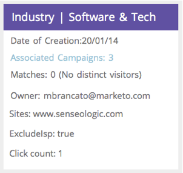

# Websegmente {#web-segments}

## Ansicht Segment {#view-segment}

Auf der Registerkarte &quot;Segmente&quot;werden alle benutzerdefinierten definierten Segmente angezeigt, die Sie basierend auf verschiedenen Attributen einrichten.  **Ein Segment ist eine Sammlung von Besuchern, die die auf der Seite &quot;Segment festlegen&quot;definierten Kriterien erfüllen.**  Ein Segment kann Besucher aus einer bestimmten Branche, einem bestimmten Standort oder basierend auf der Vor-Ort-Aktivität des Besuchers sein.

Bei der Web-Personalisierung kann ein Besucher mit mehr als einem Segment übereinstimmen. Wenn es beispielsweise ein Segment für US-Besucher und ein Segment für Firmen gibt, würde ein Web-Besucher der Bank of America mit **sowohl dem Segment für US-Besucher als auch dem Segment für Firmen für die Finanzierung übereinstimmen.**

**DIAGRAMM:**  Die Segmentseite zeigt ein Balkendiagramm der ausgewählten Segmente entsprechend der Anzahl der Besucher aus dem Segment (y-Achse) und dem Segmentnamen (x-Achse) an.

<table> 
 <thead> 
  <tr> 
   <th colspan="1" rowspan="1">Name</th> 
   <th colspan="1" rowspan="1">Beschreibung</th> 
  </tr> 
 </thead> 
 <tbody> 
  <tr> 
   <td colspan="1" rowspan="1"><strong>Name</strong></td> 
   <td colspan="1" rowspan="1">Der Titel des Segments</td> 
  </tr> 
  <tr> 
   <td colspan="1" rowspan="1">
<strong>Übereinstimmungen</strong>
</td> 
   <td colspan="1" rowspan="1">Die Anzahl der Besucher, die die benutzerdefinierten, definierten Segmentkriterien erfüllen</td> 
  </tr> 
  <tr> 
   <td colspan="1" rowspan="1"><strong>Kampagne festlegen</strong></td> 
   <td colspan="1" rowspan="1">Ermöglicht die Einrichtung einer Kampagne CTA, die mit dem ausgewählten Suchbegriff verknüpft ist</td> 
  </tr> 
  <tr> 
   <td colspan="1"><strong>Besucher</strong></td> 
   <td colspan="1">Eine Vorschau der mit dem ausgewählten Suchbegriff verknüpften Tabelle der Besucher</td> 
  </tr> 
  <tr> 
   <td colspan="1" rowspan="1"><strong>Clickstream</strong></td> 
   <td colspan="1" rowspan="1">Zeigt eine Tabelle mit der Aktivität und dem URL-Pfad des Besuchers auf der Site und der Besuchsdauer der einzelnen Seiten an </td> 
  </tr> 
 </tbody> 
</table>

Siehe [Erstellen und Ansicht von Segmentbezeichnungen](label-your-segment.md)

**Segmente - Rechtes Bedienfeld**

Wenn Sie ein Segment in der Tabelle auswählen, werden im rechten Bedienfeld weitere Details zum Segment angezeigt.

Dazu gehören:

* Segmentname
* Erstellungsdatum des Segments
* Die zugehörigen Kampagnen, die die Kampagnen anzeigen, die mit dem Segment arbeiten. Durch Klicken auf die Anzahl der Reaktionen gelangen Sie zur Seite Kampagnen mit der Kampagne CTA (Aktionsaufruf) für das Segment.
* Die Anzahl der Übereinstimmungen (Anzahl der Besucher, die die Segmentkriterien erfüllten) für das Segment und die Anzahl der eindeutigen (eindeutigen) Besucher, die mit dem Segment übereinstimmten. Durch Klicken auf den Link zum eindeutigen Besucher gelangen Sie zur Seite des Besuchers, auf der die Ergebnisse des Segments angezeigt werden
* Der Eigentümer/Benutzer, der das Segment erstellt
* Die mit dem Segment verbundenen Domänen
* Eine kurze Zusammenfassung der ausgewählten Kriterien des Segments

## Aktivieren oder Deaktivieren eines Segments {#enable-or-disable-a-segment}

Um ein Segment zu aktivieren oder zu deaktivieren, aktivieren Sie das Kontrollkästchen dieses Segments in der Tabelle und wählen Sie im Dropdownfeld &quot;Aktion auswählen&quot;unten in der Tabelle die Aktion &quot;Aktivieren&quot;oder &quot;Deaktivieren&quot;aus. Wenn ein Segment deaktiviert ist, wird unter der Spalte Status das Wort &quot;deaktivieren&quot;angezeigt.

## Erstellen von Segmenten {#create-segments}

Das erstellte Segment erfüllt alle spezifischen Kriterien, die Sie auf der Seite **Segment** festlegen definieren. Sie können Ihre Segmente auch auf Grundlage einer Kriterienkombination anpassen und auf eine bestimmte Audience in Ihrer Kampagne abzielen.

So erstellen Sie ein neues Segment

Klicken Sie auf der Seite **Segmente** unter dem Diagramm auf **Neu erstellen**. Der folgende Bildschirm wird angezeigt.

Definieren Sie allgemeine Parameter für Ihr Segment:

* **Name:**  Benennen Sie Ihr Segment.
* **Beschreibung:**  Geben Sie eine detailliertere Erläuterung der Segmentkriterien ein.
* **Domänen:**  Wählen Sie die Domäne(n) aus, die Sie in das Segment einbeziehen möchten.
* **Segmentregellogik:**  Wählen Sie eine UND/ODER-Logik aus, um jedes Segmentierungsattribut zu erstellen
* **Zeitpunkt:** Definieren Sie die Ebene, in der der Besucher in Ihrer Kampagne engagiert sein soll.

   * **Bei Eingang**: Interagieren vom Besucher kommt auf die Website
   * **Nach dem 1. - 9. Klicken**: Besucher nach einer bestimmten Anzahl von Klicks auf die Website einbinden

>[!TIP]
>
>**Segmentregellogik**
>
>Es gibt drei Filteroptionen:
>
>1. Alle Filter verwenden (1, 2 und 3...)
>1. Alle Filter verwenden (1 oder 2 oder 3...)
>1. Erweiterte Filter (mit und/oder Ausdrücken)
>
>    Mit erweiterten Filtern können Sie die Segmentbedingung steuern. Geben Sie die Filternummern getrennt durch &quot;und&quot;und &quot;oder&quot;ein.
>
>    * 1 und 2 und 3
>    * 1 oder 2 oder 3
>
>    Das Mischen von &quot;and&quot;und &quot;or&quot;erfordert Klammern, um die Logikabsicht zu verdeutlichen. z. B. &quot;1 oder 2 und 3&quot; muss wie folgt geschrieben sein:
>
>    * 1 und (2 oder 3)
>    * (1 und 2) oder 3
>
>    Verschachtelte Klammern werden für eine kompliziertere Logik, z.
>
>    * (1 und 2) oder (3 und 4)
>    * 1 und 2 oder 3 und 4)
>
>    Überprüfen Sie Ihre Logik nach Einfügen, Löschen oder Neuanordnen.

Ziehen Sie Segmentattribute aus der rechten Spalte in den Segmenteditor auf der linken Seite:

### Firmographics {#firmographics}

**Ort**

Ziehen Sie **Position** in den Segment-Editor.

* Wählen Sie aus den folgenden Parametern:

   * **Einbeziehen** : Wählen Sie aus, ob die Kampagne einen Ort einschließen oder ausschließen soll.
   * **Wählen Sie das hinzuzufügende**  Land aus. Wählen Sie aus der Dropdownliste das Land aus, das Sie in das Segment einbeziehen möchten. Der Ländername wird rechts angezeigt. Sie können mehrere Länder auswählen.

Nachdem das Land hinzugefügt wurde, können Sie auch das Bundesland, den Ort und die Postleitzahl des Segments angeben.

* **Wählen Sie Bundesland oder Bundesland hinzufügen** : Wählen Sie aus dem Dropdownfeld den US-Bundesstaat oder die kanadische Provinz aus, die Sie einbeziehen möchten. Sie können mehrere Auswahlen auswählen.
* **Postleitzahl** : Geben Sie die Postleitzahl ein, die Sie in Ihr Segment aufnehmen möchten.
* **Städte**  - Geben Sie die Stadt bzw. Städte ein, die Sie einbeziehen möchten. Verwenden Sie ein Semikolon zwischen Städten.

>[!TIP]
>
>**Welche Segmentbedingungen wähle ich aus? &quot;AND&quot;oder &quot;OR&quot;?** OR fungiert als zusätzliche Option in jedem Feld. Potenzieller Kunde müssen nur ein Kriterium aus mehreren Kriterien erfüllen, die in den einzelnen Feldern ausgewählt wurden, um sich für das Segment qualifizieren zu können. (Potenzieller Kunde können beispielsweise aus den USA kommen. *oder* aus der Verteidigungsindustrie). UND fungiert als zusätzlicher obligatorischer Parameter, der für dieses Segment erfüllt werden muss. (Potenzieller Kunde müssen beispielsweise sowohl aus den USA als auch aus der Verteidigungsindustrie kommen.) In jedem Segmentierungsfeld kann jedes separate Profil je nach ausgewählter Segmentbedingung sowohl als &quot;AND&quot;als auch als &quot;OR&quot;funktionieren.

**** IndustriesMarkieren Sie unter  **Profil** Segmentationabschnitt das Kästchen neben  **Branche**.

* Wählen Sie aus den folgenden Parametern:

   * **Umfasst** : Wählen Sie aus, ob das Segment eine Branche einschließen oder ausschließen soll.
   * **Wählen Sie hinzuzufügende**  Branchen - Wählen Sie die Branche aus, die Sie in das Segment aufnehmen möchten. Die Branche wird unter dem Dropdown-Feld angezeigt. Sie können mehrere Branchen auswählen.

**Organisationsgruppe**

Markieren Sie unter dem Abschnitt **Profil-Segmentierung** das Kontrollkästchen neben **Unternehmensgruppe.**

* Wählen Sie aus dem Dropdownfeld eine der folgenden Optionen aus:

   * Fortune 500 - Enthält nur Fortune 500-Firmen in diesem Segment
   * Fortune 1000 - Enthält nur Fortune 1000-Firmen in diesem Segment
   * Global 2000 - Enthält die Firmen von Global 2000 in diesem Segment
   * Unternehmen - Umfasst Organisationen mit mehr als 1.000 Mitarbeitern und einem Umsatz von mehr als 250 Mio. USD
   * SMB - Schließt nur kleine und mittlere Unternehmen in dieses Segment ein

**Benannte Konten**

**Organisationen**

* **stammt aus diesen Firmen (spezifische Bezeichnungen)**

   * Wählen Sie Firma zu Zielgruppe aus der Dropdownliste Firma zum Hinzufügen auswählen.
   * Sie können den exakten Unternehmensnamen eingeben, den Sie zur Zielgruppe verwenden möchten. *Es wird immer empfohlen, Listen mit benannten Konten zu verwenden, anstatt die Namen manuell einzugeben, um bessere Übereinstimmungen zu erzielen (siehe unten).**

**Liste für benanntes Konto**

Wählen Sie aus einer [Liste für ein benanntes Konto](../../../product-docs/web-personalization/account-based-web-marketing/create-a-new-account-list.md), um mit einem Schlüssel versehene Konten zu segmentieren.

>[!NOTE]
>
>Die Nummer in den Klammern neben dem Namen der Liste des benannten Kontos wird als Indexverweis für die Liste für die Web-Personalisierung [Read-API](http://developers.marketo.com/documentation/websites/rtp-js-api/) verwendet.

**ISP ausschließen**

Schließt Internet-Dienstleister (ISPs) aus dem Segment aus.

### Bekannte Personen {#known-people}

**Datenbank**

Die Web-Personalisierung wird in Ihre Marketo-Datenbank integriert, sodass Sie Kampagnen nach bekannten Personenattributen und Daten segmentieren und personalisieren können.

Wählen Sie &quot;Datenbank&quot;und wählen Sie aus der Dropdownliste ein Datenfeld für die Person aus. Wählen Sie die   **+**, um Felder aus der Dropdownliste hinzuzufügen.

Sie können Personendatenfelder zu Kontoeinstellungen > Datenbank hinzufügen oder entfernen.

>[!TIP]
>
>Erstellen Sie Ihre Segmentkriterien gemäß allen Personendatenfeldern von Marketing zu Personen, wie z. B. Auftragsbezeichnung. Ergebnis; Rolle; etc...
>
>z. &quot;Auftragstitel gleich CMO&quot;und &quot;Ergebnis kleiner als oder gleich 50&quot;

**Marketo E-Mail-** KampagnenSegment und Personalisieren Sie Kampagnen per E-Mail-Verweisung von einem Besucher, der auf eine Marketing-E-Mail klickt und auf die Site gelangt. Segmentieren nach Marketo-Programm oder Kampagne-Name und führen Sie die Konversation von E-Mail zu Web. Wählen Sie das + aus, um Felder aus der Dropdownliste hinzuzufügen.

**Status**

Definieren Sie das Segment entsprechend dem Status des Potenzieller Kunden: bekannt oder anonym.

* Bekannt - Wählen Sie diese Option aus dem Dropdownfeld für bekannte Besucher. Ein Besucher ist bekannt, wenn er ein Formular auf Ihrer Website sendet und auf der Seite &quot;Web-Personalisierung - Personen&quot;angezeigt wird.
* Anonym: Wählen Sie diese Option aus dem Dropdownfeld für anonyme Besucher.

### Verhalten {#behavioral}

**Besuche -** Definieren Sie Ihr Segment entsprechend dem Verhalten des Besuchers oder der Identifizierung.

* Anzahl der Besuche: Wählen Sie diese Option aus dem Dropdownfeld, um die Anzahl der Besuche für Potenzieller Kunde auf der Website anzugeben.

   * Wählen Sie &quot;Gleich&quot;, &quot;Gleich&quot;oder &quot;Größer als&quot;oder &quot;Gleich&quot;oder &quot;Kleiner als&quot;aus dem Dropdownfeld.

* Spezifische Besuche: Wählen Sie diese Option aus dem Dropdownfeld aus, um einen bestimmten Besucher anzugeben.

   * Geben Sie im Textfeld rechts die Besucher-Nummer ein, die Sie verfolgen möchten. Die eindeutige Web-Personalisierung-Besucher-ID wird angezeigt, wenn Sie auf einen Besucher (auf der Seite &quot;Besucher&quot;) klicken, und die Kampagne &quot;Festlegen&quot;auf der rechten Seite. Die Besucher-ID befindet sich im Abschnitt &quot;Erweiterte Einstellungen&quot;. Die Besucher-ID befindet sich auch in der URL (z. B. BESUCHER=JZZIFJNUI60PZ8Y97BHTY9BL8PKWS).

**Suchbegriffe**  - Definieren Sie ein Segment entsprechend den Suchbegriffen eines Potenzieller Kunden.

* Der gesuchte Besucher - Wählen Sie aus der Dropdown-Liste die Begriffe, die Sie verfolgen möchten, aus der Suche Ihrer Besucher oder fügen Sie Ihre eigenen Suchbegriffe hinzu. (Der Platzhalter * muss nicht in den Suchbegriffen verwendet werden, da er standardmäßig so eingestellt ist, dass er Sätze enthält, die den Suchbegriff enthalten.)

**Verweise** : Hinzufügen URLs, auf die der Besucher verwiesen wurde.

* Wählen Sie die hinzuzufügenden Verweise aus - Wählen Sie aus der Dropdown-Liste die Verweisseiten aus, die Sie verfolgen möchten, oder fügen Sie Ihre eigene Verweise hinzu. Nach der Auswahl werden die Verweise im Feld unten angezeigt. (Die Verwendung von * als Platzhalter ist zulässig)

**Seiten**  einschließen - Verfolgen Sie spezifische Seiten, die Potenzieller Kunde auf Ihrer Website besuchen.

* URL stimmt überein - Hinzufügen die URL der Webseiten, die Sie verfolgen möchten. Sie können mehrere URLs hinzufügen, indem Sie sie durch ein Semikolon trennen. (Die Verwendung von * als Platzhalter ist zulässig).

**Seiten**  ausschließen: Schließen Sie bestimmte Seiten aus, die im Segment nicht übereinstimmen sollen. (Die Verwendung von * als Platzhalter ist zulässig).

* Die URL stimmt nicht überein - Hinzufügen die URL bestimmter Webseiten, die von der Verfolgung ausgeschlossen werden sollen. Sie können mehrere URLs hinzufügen, indem Sie sie mit einem Semikolon trennen

### Gerät / Browser {#device-browser}

**Mobilbetriebssystem**

Ziehen Sie das Mobile OS in den Segment-Editor

* **Besucher**

   **Mobile OS** : Wählen Sie aus dem Dropdownfeld aus einem oder mehreren aufgelisteten Mobilbetriebssystemen aus. Das ausgewählte Mobilbetriebssystem wird unten angezeigt.

   * Der Besucher verwendet ein beliebiges Mobilgerät
   * Der Besucher verwendet dieses spezielle Gerät/Betriebssystem
   * Der Besucher verwendet kein Mobilgerät

* **Gerät**  : Wählen Sie aus der Dropdown-Liste eines oder mehrere Geräte aus (Apple, Samsung, LG, HTC, Nexus, Blackberry usw.). Die ausgewählten Geräte werden unten angezeigt.

**Browser**

Zielgruppe Besucher, der bestimmte Browsertypen und/oder -versionen verwendet.

* Browsertyp: Wählen Sie aus dem Dropdownfeld einen oder mehrere Internetbrowser aus. Die ausgewählten Browser werden unten angezeigt.
* Browserversion - Geben Sie die Browserversion ein, die Sie dem Segment hinzufügen möchten. Sie können mehrere Versionen auswählen, indem Sie sie jeweils durch ein Komma trennen. (Die Verwendung von * als Platzhalter ist zulässig).

### API {#api}

**Data Ereignisses**  - Segment-Besucher, die bestimmte benutzerspezifische Daten-Ereignis auslösen

hinzufügen Sie den zu Zielgruppe Ereignis-Wert. z.B. aus externen Datenquellen.

**Benutzerkontext-API**

Web-Personalisierungs-API-Aufruf [Lesen Sie hier mehr darüber.](http://developers.marketo.com/documentation/websites/rtp-user-context-api/)

>[!TIP]
>
>**Verwendung von Platzhaltern -** Wenn Sie einen Suchbegriff oder eine URL einschließen möchten, der etwas darin enthält, z. B. &quot;[google.com](http://google.com)&quot; oder &quot;search term product&quot;, nennen wir dies einen Platzhalter und es sollte mit einem Sternchen - dieser kleine Kerl* - auf jedem Ende eingefügt werden. Daher sollte alles, was von [google.com](http://google.com) kommt, als * [google.com](http://google.com)* eingegeben werden.

## Segmente bearbeiten {#edit-segments}

Sie können ein Segment bearbeiten, das erstellt wurde.

1. Um ein Segment zu bearbeiten, gehen Sie zu **Segmente**.

   

1. Klicken Sie in der Tabelle **Segmente** auf das Bearbeitungssymbol ( ) des Segments, das Sie bearbeiten möchten. Die Seite **Segment** festlegen wird mit dem ausgewählten Segment geöffnet.
1. Wenden Sie alle Änderungen oder Änderungen an, die Sie am Segment vornehmen möchten.
1. Klicken Sie auf **Speichern**.

## Segmente {#delete-segments} löschen

Sie können von Ihnen erstellte Segmente löschen.

1. Wählen Sie oben auf der Seite **Segmente** ein Segment aus.
1. Klicken Sie auf das Löschsymbol ( ) des Segments, das Sie löschen möchten.
1. Es wird eine Bestätigungsmeldung angezeigt, die bestätigt, dass Sie im Begriff sind, das **Segment** zu löschen.

>[!NOTE]
Ein Segment, das mit einer Kampagne verknüpft ist, kann nicht gelöscht werden. Zunächst müssen Sie die Kampagne und dann das Segment löschen.

Großartig! Nachdem Sie jetzt den Segmentabschnitt verstanden haben, sollten wir uns mit Kampagnen beschäftigen.

>[!MORELIKETHIS]
* [Ein einfaches Websegment erstellen](create-a-basic-web-segment.md)
* [Eine neue Dialogfeld-Web-Kampagne erstellen](../../../product-docs/web-personalization/working-with-web-campaigns/create-a-new-dialog-web-campaign.md)
* [Eine neue Web-Kampagne in einer Zone erstellen](../../../product-docs/web-personalization/working-with-web-campaigns/create-a-new-in-zone-web-campaign.md)
* [Neue Widget-Web-Kampagne erstellen](../../../product-docs/web-personalization/working-with-web-campaigns/create-a-new-widget-web-campaign.md)

