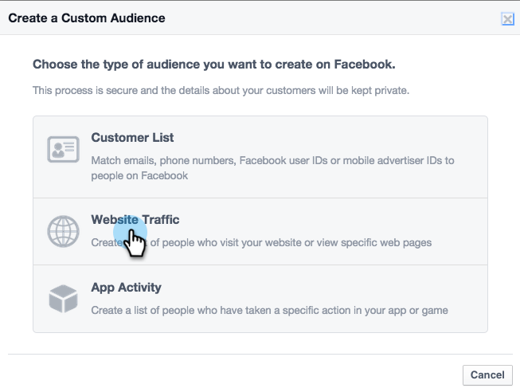

# Personalisiertes Remarketing in [!DNL Facebook] {#personalized-remarketing-in-facebook}

Personalisiertes Remarketing ermöglicht Ihnen die erneute Interaktion mit Ihren Benutzern mithilfe von RTP-Daten und der Leistungsfähigkeit von Facebook-Remarketing.

>[!PREREQUISITES]
>
>* Schließen Sie das Setup [Retargeting mit Web Personalization-Daten](/help/marketo/product-docs/web-personalization/website-retargeting/retargeting-with-web-personalization-data.md) ab
>* Lesen Sie die  [Facebook-Dokumentation zu benutzerdefinierten Zielgruppen](https://developers.facebook.com/docs/ads-for-websites/website-custom-audiences/getting-started#install-the-pixel) und Remarketing.

## Erstellen einer Zielgruppe in [!DNL Facebook] {#creating-an-audience-in-facebook}

1. Wechseln Sie in [!DNL Facebook] zur Registerkarte [Zielgruppe](https://www.facebook.com/ads/audience_manager) in Ads Manager.

1. Klicken Sie auf **[!UICONTROL Tools]** und wählen Sie **[!UICONTROL Zielgruppen]** aus.

   

1. Klicken Sie **[!UICONTROL Benutzerdefinierte Zielgruppe erstellen]**.

   

1. Wählen Sie **[!UICONTROL Website-Traffic]** aus.

   

1. Wählen Sie in [!UICONTROL  Liste „Website]Traffic“ **[!UICONTROL Benutzerdefinierte Kombination]** aus.

   

1. Wählen Sie in der Liste Einschließen die Option **[!UICONTROL Ereignis]** aus.

   

1. Wählen Sie in der [!UICONTROL Ereignis]-Liste **[!UICONTROL RTP-Remarketing]** aus und wählen Sie einen Parameter aus.

   

1. Wählen Sie für dieses Beispiel [!UICONTROL Branche] aus, um **[!UICONTROL Bildung]** einzuschließen. Geben Sie **[!UICONTROL Bildung]** ein und bearbeiten Sie **[!UICONTROL In den letzten]** auf 180 Tage. Geben Sie den Zielgruppennamen ein: **Education Industry**. Klicken Sie **[!UICONTROL Zielgruppe erstellen]**.

   

1. Sie haben jetzt eine neue benutzerdefinierte Zielgruppe mit RTP-Daten in [!DNL Facebook] erstellt.

   

## RTP-Datenpunkte in [!DNL Facebook] {#rtp-data-points-in-facebook}

<table> 
 <tbody> 
  <tr> 
   <th>Ereignisname</th> 
   <th> </th> 
  </tr> 
  <tr> 
   <td>RTP-Remarketing</td> 
   <td> 
    
 
     <table> 
      <tbody> 
       <tr> 
        <th>Parameter</th> 
        <th>Wert</th> 
       </tr> 
       <tr> 
        <td>ABM-Liste</td> 
        <td>(Name der kontobasierten Liste)</td> 
       </tr> 
       <tr> 
        <td colspan="1">Kategorie</td> 
        <td colspan="1">
Fortune 500

Fortune 1000

Global 2000
</td> 
       </tr> 
       <tr> 
        <td colspan="1">Gruppe</td> 
        <td colspan="1">
Enterprise

KMU
</td> 
       </tr> 
       <tr> 
        <td>Branche</td> 
        <td>
Verteidigung

Aus- und Weiterbildung

Finanzdienstleistungen

Regierung

Gesundheitswesen, Pharma, Biotechnologie

Software und Internet

etc… (gemäß RTP Industry-Optionen)
</td> 
       </tr> 
       <tr> 
        <td colspan="1">Segmentierte Zielgruppe</td> 
        <td colspan="1">(Name der in RTP erstellten segmentierten Zielgruppe)</td> 
       </tr> 
      </tbody> 
     </table> 
    
</td> 
  </tr> 
 </tbody> 
</table>

## Targeting Ihrer Audience mit einer Anzeige {#target-your-audience-with-an-ad}

Weitere Informationen finden Sie [Dokumentation von Facebook](https://developers.facebook.com/docs/ads-for-websites/website-custom-audiences/getting-started#target-your-audience).

1. Wechseln Sie zum Anzeigen-Manager und klicken Sie auf **[!UICONTROL Anzeige erstellen]**.

   

1. Wählen Sie **[!UICONTROL Personen auf Ihre Website senden]** als Ziel Ihrer Kampagne aus.

   

1. Geben Sie Ihre Website-URL ein.

   

1. Erstellen Sie Ihr Anzeigen-Set. Wählen Sie in der Liste der von Ihnen erstellten Zielgruppen eine benutzerdefinierte Zielgruppe aus, z. B. „Bildungsindustrie“.

   

1. Wählen Sie alle anderen Anzeigenset-Optionen aus, legen Sie Ihr Budget fest und definieren Sie Ihre Werbe-Kreativen.

   

1. Sie haben nun in [!DNL Facebook] eine personalisierte Remarketing-Kampagne eingerichtet.

>[!MORELIKETHIS]
>
>* [Retargeting mit Web Personalization-Daten](/help/marketo/product-docs/web-personalization/website-retargeting/retargeting-with-web-personalization-data.md)
>* [Personalisiertes Remarketing in Google](/help/marketo/product-docs/web-personalization/website-retargeting/personalized-remarketing-in-google.md)
