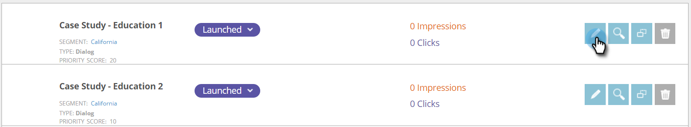

# Durchführen von A/B-Test für Ihre Web-Kampagne {#ab-test-your-web-campaign}

Testen ist eine hervorragende Möglichkeit, um Ihre Web-Kampagnen für eine bessere Interaktion zu optimieren. So fängt man an.

Um Ihre personalisierten Kampagnen A/B-Tests zu unterziehen, können Sie zwei oder mehr Kampagnen auswählen, sie derselben **[!UICONTROL Split-Test]**-Gruppe zuordnen und **[!UICONTROL Auto-Tune]** auswählen, um automatisch mit der Kampagne mit der besten Leistung fortzufahren.

>[!TIP]
>
>Wenn Sie es vorziehen, manuell zu berechnen und zu sehen, welche Kampagne eine bessere Leistung erzielt, aktivieren Sie nicht [!UICONTROL Auto-Tune].

## Einrichten eines A/B-Split-Tests {#how-to-set-up-a-split-a-b-test}

1. Gehen Sie zu **[!UICONTROL Web-Kampagnen]**.

   

   >[!NOTE]
   >
   >Um das Auffinden der gewünschten Kampagne zu vereinfachen, verwenden Sie die [Filterfunktion](/help/marketo/product-docs/web-personalization/working-with-web-campaigns/filter-web-campaigns.md).

1. Wählen Sie die erste Kampagne aus, die Sie A/B-Tests unterziehen möchten. Klicken Sie auf **[!UICONTROL Bearbeiten]**.

   

1. Wählen Sie auf der Kampagnenseite &quot;**[!UICONTROL &quot; und]** Sie auf **[!UICONTROL Neu erstellen]**.

   

1. Geben Sie den **Namen der aufgeteilten Testgruppe** ein und klicken Sie auf **[!UICONTROL Erstellen]**. Wählen Sie **[!UICONTROL Auto Tune]** aus.

   

1. **[!UICONTROL Speichern]** oder **[!UICONTROL Starten]** der Kampagne.

   >[!TIP]
   >
   >Wenn Sie **[!UICONTROL AutoTune]** auswählen, erkennt die [!DNL Web Personalization]-Plattform automatisch die Split-Test-Kampagne mit der besseren Leistung und fährt mit der höchsten Konvertierungskampagne fort, während die anderen angehalten werden.

1. Wiederholen Sie den obigen Vorgang mit der zweiten Kampagne.

1. Wählen Sie die zweite Kampagne aus, die Sie A/B-Tests unterziehen möchten. Klicken Sie auf **[!UICONTROL Bearbeiten]**.

   

1. Wählen Sie auf der **[!UICONTROL Kampagnensatz]** die Option **Aufspaltungstest** und wählen Sie die **Gruppe** aus der Dropdown-Liste aus. Wählen Sie **[!UICONTROL Auto Tune]** aus.

   

1. **[!UICONTROL Speichern]** oder **[!UICONTROL Starten]** der Kampagne.

1. Wiederholen Sie diesen Vorgang für eine dritte oder vierte zu testende Kampagne.

1. In **[!UICONTROL Web]** Kampagnen) können Sie die aufgeteilten Testkampagnen sehen, die durch das A/B-Symbol gekennzeichnet sind.

   

>[!TIP]
>
>1. Sie können beliebig viele Kampagnen testen. Best Practice sind zwei bis drei Kampagnen
>1. Stellen Sie sicher, dass jede aufgeteilte Testgruppe demselben Segment zugeordnet ist. Testen Sie für dieselbe Zielgruppe.
>1. Probieren Sie verschiedene Inhalte aus (Fallstudie A vs. Fallstudie B), ändern Sie die Werbebotschaft und die Kreativen, Farben, Größen oder rufen Sie Aktionen auf.
>1. Optimieren und genießen Sie Ihre personalisierten Inhalte!

>[!MORELIKETHIS]
>
>* [Erstellen einer Dialogfeldkampagne](/help/marketo/product-docs/web-personalization/working-with-web-campaigns/create-a-new-dialog-web-campaign.md)
>* [Erstellen einer RTP-Zone in Campaign](/help/marketo/product-docs/web-personalization/working-with-web-campaigns/create-a-new-in-zone-web-campaign.md)
>* [Erstellen einer RTP-Widget-Kampagne](/help/marketo/product-docs/web-personalization/working-with-web-campaigns/create-a-new-widget-web-campaign.md)
