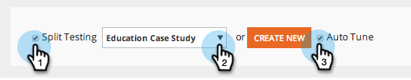

# AB Test Your Web Kampagne {#ab-test-your-web-campaign}

Mit Tests können Sie Ihre Web-Kampagnen optimal für eine bessere Interaktion optimieren. Hier ist, wie man anfängt.

Zum A/B-Test Ihrer personalisierten Kampagnen können Sie zwei oder mehr Kampagnen auswählen, sie derselben Gruppe **Teilungstest** zuordnen und **Automatisches Optimieren** auswählen, um automatisch mit der leistungsstärksten Kampagne fortzufahren.

>[!TIP]
>
>Wenn Sie lieber manuell berechnen möchten und sehen möchten, welche Kampagne besser läuft, aktivieren Sie nicht die Option Automatisches Tuning.

## So richten Sie einen A/B-Teilinstest ein {#how-to-set-up-a-split-a-b-test}

1. Gehen Sie zu Web-Kampagnen.

   

   >[!NOTE]
   >
   >Um die gewünschte Kampagne leichter zu finden, verwenden Sie die Filterfunktion [a1/>.](filter-web-campaigns.md)

1. Wählen Sie die erste Kampagne aus, die Sie A/B-Tests durchführen möchten. Klicken Sie auf **Bearbeiten**.

   

1. Wählen Sie auf der Seite &quot;Kampagne&quot;die Option **Test teilen** und klicken Sie auf **Neu erstellen**.

   

1. Geben Sie **Split Testing Group Name** ein und klicken Sie auf **Erstellen.** Wählen Sie **Auto-Tune.**

   

1. **Speichern **oder** Starten Sie **die Kampagne.

   >[!TIP]
   >
   >Durch Auswahl von **Auto-Tune** erkennt die Web-Personalisierungsplattform automatisch die leistungsfähigere Split-Test-Kampagne und fährt mit der Kampagne mit der höchsten Umrechnung fort, während die anderen angehalten werden.

1. Wiederholen Sie den obigen Vorgang mit der zweiten Kampagne.
1. Wählen Sie die zweite Kampagne aus, die Sie A/B-Tests durchführen möchten. Klicken Sie auf **Bearbeiten**.

   ** 

   **

1. Wählen Sie auf der Seite **Kampagne einstellen** die Option **S****plit Testing** und wählen Sie **Gruppe** aus der Dropdownliste. Wählen Sie** Auto-Tune**.

   

1. **Speichern **oder **Starten Sie **die Kampagne.
1. Wiederholen Sie diesen Vorgang für eine dritte oder vierte Kampagne zum Testen.
1. Unter **Web** **Kampagnen** können Sie die durch das A/B-Symbol gekennzeichneten geteilten Kampagnen des geteilten Tests sehen.

   

>[!TIP]
>
>1. Sie können beliebig viele Kampagnen testen. Bewährte Verfahren: zwei bis drei Kampagnen
>1. Stellen Sie sicher, dass jede aufgeteilte Testgruppe mit demselben Segment verknüpft ist. Sie möchten auf dieselbe Audience testen.
>1. Probieren Sie verschiedene Inhaltselemente aus (Fallstudie A im Vergleich zu Fallstudie B), ändern Sie die Nachrichten und kreativen Elemente, Farben, Größen oder den Aktionsaufruf.
>1. Optimieren und genießen Sie Ihren personalisierten Inhalt!

>

>[!MORELIKETHIS]
>
>* [Erstellen einer Dialog-Kampagne](create-a-new-dialog-web-campaign.md)
>* [RTP in Zone-Kampagne erstellen](create-a-new-in-zone-web-campaign.md)
>* [RTP-Widget-Kampagne erstellen](create-a-new-widget-web-campaign.md)

>

