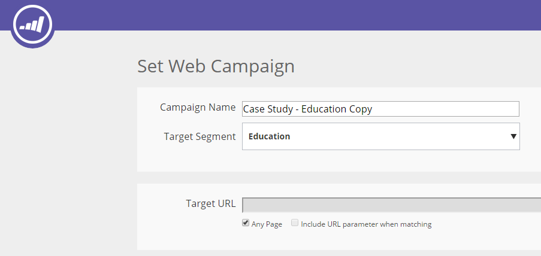

# Klonen einer Web-Kampagne {#clone-a-web-campaign}

Verwenden Sie die Klon-Funktion auf der [!UICONTROL Web-Kampagnen]-Seite, um die Kampagneneinstellungen zu kopieren und den Inhalt für die Optimierung der Aufspaltungstests zu ändern, oder klonen Sie eine Kampagne mit demselben Inhalt und richten Sie sie auf ein anderes Segment aus. Erstellen Sie Web-Kampagnen in Sekunden!

## Klonen einer Kampagne {#create-a-clone-campaign}

1. Gehen Sie zu **[!UICONTROL Web-Kampagnen]**.

   

   >[!NOTE]
   >
   >Um das Auffinden der gewünschten Web-Kampagne zu vereinfachen, verwenden Sie die [Filterfunktion](/help/marketo/product-docs/web-personalization/working-with-web-campaigns/filter-web-campaigns.md).

1. Klicken Sie für die Web-Kampagne auf **Klonen**.

   

1. Beim Klonen von Kampagnen wird der gesamte Inhalt aus der vorhandenen Web-Kampagne in die neue geklonte Kampagne kopiert. Die neue geklonte Web-Kampagne trägt den Titel [KAMPAGNENNAME] Kopie“.

   

   >[!TIP]
   >
   >Alle Inhalte der Web-Kampagne werden mit Ausnahme des Split-Tests in die Klon-Kampagne kopiert. Vergessen Sie daher nicht, der geklonten Kampagne eine Split-Testgruppe hinzuzufügen, wenn Sie sie mit anderen testen möchten.

>[!MORELIKETHIS]
>
>* [Erstellen einer Dialogfeldkampagne](/help/marketo/product-docs/web-personalization/working-with-web-campaigns/create-a-new-dialog-web-campaign.md)
>* [Erstellen einer RTP-Zone in Campaign](/help/marketo/product-docs/web-personalization/working-with-web-campaigns/create-a-new-in-zone-web-campaign.md)
>* [Erstellen einer RTP-Widget-Kampagne](/help/marketo/product-docs/web-personalization/working-with-web-campaigns/create-a-new-widget-web-campaign.md)
