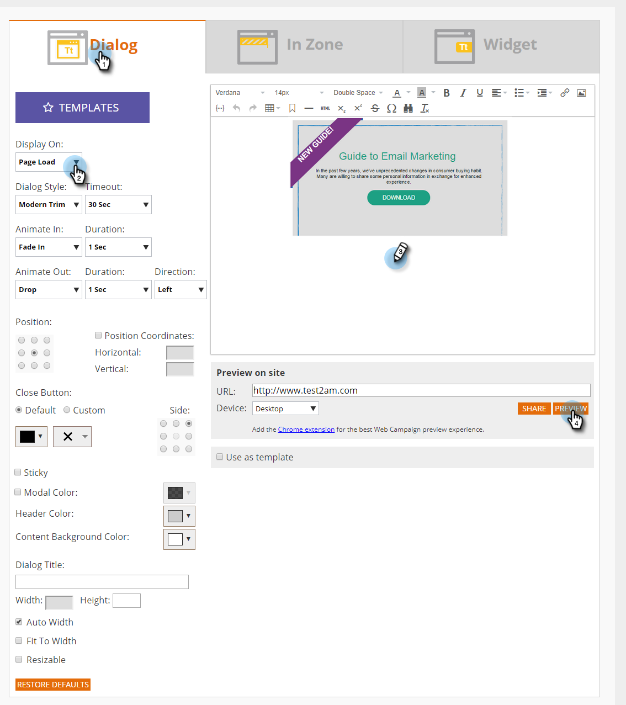

# Erstellen eines neuen Web-Kampagnendialogfelds {#create-a-new-dialog-web-campaign}

## Erstellen eines Web-Kampagnendialogfelds {#create-a-dialog-web-campaign}

Erstellen Sie eine Web-Kampagne, um Ihre Web-Inhalte in Echtzeit zu personalisieren und die richtige Botschaft zum richtigen Zeitpunkt für den richtigen Benutzer bereitzustellen.

Eine Web-Kampagne ist eine benutzerdefinierte Reaktion, die mit einem bestimmten Segment verknüpft ist. Die Reaktion kann ein Dialogfeld auf Ihrer Website, ein [In-Zone-Ersatz](/help/marketo/product-docs/web-personalization/working-with-web-campaigns/create-a-new-in-zone-web-campaign.md) eine [Widget-Funktion](/help/marketo/product-docs/web-personalization/working-with-web-campaigns/create-a-new-widget-web-campaign.md) oder ein E-Mail-Warnhinweis sein.

1. Gehen Sie zu **[!UICONTROL Web-Kampagnen]**.

   

1. Wählen **[!UICONTROL Neue Web-Kampagne erstellen]**.

   

1. Wählen Sie den **[!UICONTROL Dialog]** Web-Kampagnentyp aus. Gestalten und fügen Sie Ihr Kreativ im Editor hinzu. Klicken Sie **[!UICONTROL Vorschau]**, um zu sehen, wie die Web-Kampagne auf Ihre Site reagieren wird.

   

<table> 
 <thead> 
  <tr> 
   <th colspan="1" rowspan="1">Name</th> 
   <th colspan="1" rowspan="1">Beschreibung</th> 
  </tr> 
 </thead> 
 <tbody> 
  <tr> 
   <td colspan="1"><strong>Anzeige am</strong></td> 
   <td colspan="1">Ermöglicht die <a href="/help/marketo/product-docs/web-personalization/working-with-web-campaigns/set-how-your-web-campaign-displays.md" rel="nofollow"> (wann und wie) </a> Anzeige Ihrer Web-Kampagne.</td> 
  </tr> 
  <tr> 
   <td colspan="1" rowspan="1"><strong>Dialogstil</strong></td> 
   <td colspan="1" rowspan="1"> 
    <ul> 
     <li>Moderne Verkleidung - Ein stilvolles und markantes Dialogfeld mit halbtransparenten schwarzen Verkleidungen und abgerundeten Ecken</li> 
     <li>Modern Trim II - Ein stilvolles und unverwechselbares Dialogfeld mit einer hellen Schattenbeschneidung und abgerundeten Ecken und Schließen-Taste</li> 
     <li>Transparent : Ein vollständig transparentes Dialogfeld, das sich ideal für transparente (PNG)-Bilder für Ihren Aktionsaufruf eignet. </li> 
     <li>Einfach : Ein einfaches Dialogfeld mit einem dickeren Kopfzeilenbereich für Titel, der die grundlegenden Anforderungen des Dialogfelds erfüllt.</li> 
    </ul></td> 
  </tr> 
  <tr> 
   <td colspan="1"><strong>Animieren von Ein-/Ausgängen</strong></td> 
   <td colspan="1">Wird beim Ein- und/oder Beenden eines Dialogfelds festgelegt. Wählen Sie den Effekt (Drop, Blind, Slide, Fade, No Effect), die Dauer (in Sekunden) und die Richtung (nach oben, unten, links, rechts).</td> 
  </tr> 
  <tr> 
   <td colspan="1" rowspan="1">
<strong>Position</strong>
</td> 
   <td colspan="1" rowspan="1">Wählen Sie eine der 9 Optionen für die Position des Dialogfelds auf der Seite aus. Wenn Sie beispielsweise das mittlere Feld auswählen, wird das Dialogfeld in der Mitte des Bildschirms angezeigt.</td> 
  </tr> 
  <tr> 
   <td colspan="1" rowspan="1">
<strong>Nach Koordinaten</strong>

 
</td> 
   <td colspan="1" rowspan="1">Für weitere Positionierungsoptionen des Dialogfelds aktivieren Sie das Kontrollkästchen „Positionskoordinaten“ und geben Sie die genauen Bildschirmkoordinaten (horizontal, vertikal) an, an denen das Dialogfeld angezeigt werden soll.</td> 
  </tr> 
  <tr> 
   <td colspan="1"><strong>Ausfüllen Schaltfläche</strong></td> 
   <td colspan="1">Passen Sie die Schließen-Schaltfläche des Modals mit Farbe, Stil und Position an. Sie können auch Ihre eigene Schaltfläche verwenden, indem Sie im Feld Bild-URL eine Verknüpfung mit ihr herstellen.</td> 
  </tr> 
  <tr> 
   <td colspan="1"><strong>Anhaftend</strong></td> 
   <td colspan="1">Durch Auswahl des Kontrollkästchens Kleben bleibt das Dialogfeld ohne Zeitbeschränkung an seiner Position, bis es vom Benutzer geschlossen wird, und wird während der gesamten Besuchersitzung auf allen Seiten angezeigt.</td> 
  </tr> 
  <tr> 
   <td colspan="1"><strong>Modal</strong></td> 
   <td colspan="1">Bietet mehr Fokus auf das Dialogfeld und startet es mit einem dunklen Hintergrund hinter dem Dialogfeldfenster, wodurch das Benutzerbewusstsein des Dialogfelds erhöht wird.</td> 
  </tr> 
  <tr> 
   <td colspan="1"><strong>Modale Farbe</strong></td> 
   <td colspan="1">Passen Sie die Farbe des Modals sowie die Deckkraft an.</td> 
  </tr> 
  <tr> 
   <td colspan="1"><strong>Zeitüberschreitung </strong></td> 
   <td colspan="1">Die Zeit in Sekunden, die das Dialogfeld aktiviert wird, bevor es ausgeblendet wird.</td> 
  </tr> 
  <tr> 
   <td colspan="1"><strong>Header-Farbe</strong></td> 
   <td colspan="1">Legen Sie für die Kopfzeilenleiste des Dialogfelds die gewünschte Farbe fest. Die Farbe kann aus einem Farbdiagramm ausgewählt oder als hexadezimaler Farbcode eingegeben werden. </td> 
  </tr> 
  <tr> 
   <td colspan="1"><strong>Hintergrundfarbe des Inhalts </strong></td> 
   <td colspan="1">Legen Sie die Hintergrundfarbe des Dialogfelds auf Ihre bevorzugte Farbe fest. Die Farbe kann aus einem Farbdiagramm ausgewählt oder als hexadezimaler Farbcode eingegeben werden. </td> 
  </tr> 
  <tr> 
   <td colspan="1"><strong>Dialogtitel</strong></td> 
   <td colspan="1">Fügen Sie der Titelleiste der Kopfzeile des Dialogfelds einen Titel hinzu.</td> 
  </tr> 
  <tr> 
   <td colspan="1"><strong>Breite und Höhe</strong></td> 
   <td colspan="1">Wählen Sie die Pixelgröße im Dialogfeld aus.</td> 
  </tr> 
  <tr> 
   <td colspan="1"><strong>Breite automatisch</strong></td> 
   <td colspan="1">Wenn Sie dieses Kontrollkästchen aktivieren, passt sich das Dialogfeld automatisch an die Inhaltsbreite an.</td> 
  </tr> 
  <tr> 
   <td colspan="1"><strong>Veränderbare Größe </strong></td> 
   <td colspan="1">Wenn Sie das Kontrollkästchen zur Größenanpassung aktivieren, kann die Größe des Dialogfelds vom Benutzer geändert werden.</td> 
  </tr> 
  <tr> 
   <td colspan="1"><strong>Rich-Text-Editor</strong></td> 
   <td colspan="1">
Der Rich-Text-Editor ermöglicht Textformatierung, Verknüpfung und Bildeinfügung. <a href="/help/marketo/product-docs/web-personalization/working-with-web-campaigns/using-the-web-personalization-rich-text-editor.md">Mehr dazu hier</a>.
</td> 
  </tr> 
  <tr> 
   <td colspan="1"><strong>Vorschau auf Website</strong></td> 
   <td colspan="1">Zeigen Sie Kampagnen eine Vorschau an, bevor sie gestartet werden.  
    <ul> 
     <li>URL : Geben Sie eine Beispiel-URL ein, unter der die Kampagne ausgeführt werden soll, um ein Vorschaubeispiel dafür zu erhalten, wie die Kampagne live aussehen würde.</li> 
     <li>Gerät : Vorschau des Erscheinungsbilds Ihrer Kampagne nach Gerät: Desktop, Mobilgerät - Hochformat, Mobilgerät - Querformat, Tablet - Hochformat, Mobilgerät - Querformat. </li> 
     <li>Vorschau : Klicken Sie auf <strong>Vorschau</strong>, um ein neues Fenster der Beispiel-URL zu öffnen und zu sehen, wie die Kampagne reagiert. </li> 
     <li>Freigeben : Verwenden Sie die Schaltfläche Freigeben , um eine E-Mail an einen Kollegen mit einem Link zur Proxy-Kampagne zu senden.</li> 
    </ul></td> 
  </tr> 
 </tbody> 
</table>

>[!TIP]
>
>Beschleunigen und vereinfachen Sie die Erstellung von Kampagnen mithilfe unserer [ Vorlagen ](/help/marketo/product-docs/web-personalization/using-templates/using-templates-to-create-web-campaigns.md) durch [Speichern Ihrer vorhandenen Kampagne](/help/marketo/product-docs/web-personalization/using-templates/using-templates-to-create-web-campaigns.md) als Vorlage zur Wiederverwendung.

## Bearbeiten einer Web-Kampagne {#edit-a-web-campaign}

1. Klicken Sie auf der **[!UICONTROL Web]** Kampagnenseite in der Web **[!UICONTROL Kampagne auf]** Bearbeiten“.

>[!NOTE]
>
>Um das Auffinden der gewünschten Web-Kampagne zu vereinfachen, verwenden Sie die [Filterfunktion](/help/marketo/product-docs/web-personalization/working-with-web-campaigns/filter-web-campaigns.md).

## Vorschau einer Web-Kampagne {#preview-a-web-campaign}

1. Klicken Sie auf der **[!UICONTROL Web]** Kampagnen **[!UICONTROL auf]** Vorschau“ der Web-Kampagne, die Sie anzeigen möchten.

## Klonen einer Web-Kampagne {#clone-a-web-campaign}

Siehe [Klonen einer Web-](/help/marketo/product-docs/web-personalization/working-with-web-campaigns/clone-a-web-campaign.md).

## Löschen einer Web-Kampagne {#delete-a-web-campaign}

1. Klicken Sie auf der **[!UICONTROL Web]****[!UICONTROL Kampagnen]** auf die Web-Kampagne, die Sie löschen möchten.

   

1. Es wird eine Bestätigungsmeldung angezeigt, die bestätigt, ob Sie die Web-Kampagne löschen möchten.

>[!MORELIKETHIS]
>
>* [Erstellen einer RTP-Zone in Campaign](/help/marketo/product-docs/web-personalization/working-with-web-campaigns/create-a-new-in-zone-web-campaign.md)
>* [Erstellen einer RTP-Widget-Kampagne](/help/marketo/product-docs/web-personalization/working-with-web-campaigns/create-a-new-widget-web-campaign.md)
