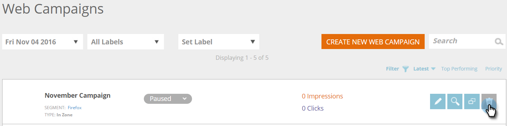

# Erstellen einer neuen Zone in einer Web-Kampagne {#create-a-new-in-zone-web-campaign}

Eine Web-Kampagne ist eine benutzerdefinierte Reaktion, die mit einem bestimmten Segment verknüpft ist und ein [Dialogfeld](/help/marketo/product-docs/web-personalization/working-with-web-campaigns/create-a-new-dialog-web-campaign.md) auf Ihrer Website, ein Zonenersatz, eine [Widget-Funktion](/help/marketo/product-docs/web-personalization/working-with-web-campaigns/create-a-new-widget-web-campaign.md) oder ein E-Mail-Warnhinweis sein kann. Eine In-Zone-Web-Kampagne ersetzt ein Element Ihrer Website basierend auf der Zone-ID durch Inhalte oder grafische Banner.

## Erstellen einer Zone in einer Web-Kampagne {#create-an-in-zone-web-campaign}

1. Gehen Sie zu **Web-Kampagnen**.

   

1. Wählen Sie **Neue Web-Kampagne erstellen.**

   

1. Wählen Sie den Kampagnentyp **In-Zone** aus. Anpassen und Hinzufügen einer &quot;**&quot;-ID.** Legen Sie die Kampagne auf **Sticky** fest und fügen Sie Ihre Kreativen im Editor hinzu. Fügen Sie die URL der Seite hinzu, die Sie in der Vorschau anzeigen möchten, und **Sie auf „Vorschau**, um zu sehen, wie die Kampagne auf Ihre Website reagieren wird.

   

   >[!NOTE]
   >
   >**Was ist eine Zonen-ID?**
   >
   >Mit einer Zonen-ID möchten Sie Ihre „In Zone“-Web-Kampagne auf der Site platzieren. Um eine „Zonen-ID“ zu finden, gehen Sie einfach auf Ihre Website, wählen Sie den Bereich aus, den Sie durch eine Web-Kampagne ersetzen möchten, und klicken Sie mit der rechten Maustaste darauf. In Chrome lautet die Option &quot;Inspect-Element“, in anderen Browsern kann sie variieren.
   >
   >Anschließend möchten Sie die mit diesem Abschnitt der Website verknüpfte „ID“ suchen, die hervorgehoben ist, weil Sie dieses Element untersuchen. Wenn beispielsweise nach dem Rechtsklick in Chrome der hervorgehobene Text `
` lautet, sollten Sie im Abschnitt „Zonenkennung“ „Vorgestellter Schieberegler“ eingeben. Normalerweise wird „div id“ verwendet, es können jedoch auch beliebige IDs verwendet werden, z. B. h1-ID, p-ID usw.

<table> 
 <thead> 
  <tr> 
   <th colspan="1" rowspan="1">Name</th> 
   <th colspan="1" rowspan="1">Beschreibung</th> 
  </tr> 
 </thead> 
 <tbody> 
  <tr> 
   <td colspan="1" rowspan="1"><strong> Bereichs-ID </strong></td> 
   <td colspan="1" rowspan="1">
Geben Sie den Namen der ID ein, die sich im HTML-Code Ihres Website-Elements befindet, das durch die Kampagne ersetzt wird.
</td> 
  </tr> 
  <tr> 
   <td colspan="1" rowspan="1">
<strong> Anhaftend </strong>
</td> 
   <td colspan="1" rowspan="1">Das Kontrollkästchen Beibehalten ist standardmäßig für die Kampagne In Zone aktiviert und behält die Kampagne In Zone in ihrer Position als Zonen-ID während der gesamten Besuchersitzung auf der Website bei. Es wird empfohlen, für „In Zone“ immer Sticky festzulegen.</td> 
  </tr> 
  <tr> 
   <td colspan="1" rowspan="1">
<strong> Fading</strong> 
</td> 
   <td colspan="1" rowspan="1">Wenn Sie das Kontrollkästchen Effekt verwenden und Überblenden aktivieren, wird der Bereich mit der Zonen-ID auf der Website überblendet. Wenn es sich bei der Einstiegszone um ein grafisches Banner handelt, wird die Seite zuerst geladen und die Kampagne wird dann mit einem Überblendungseffekt aktiviert.</td> 
  </tr> 
  <tr> 
   <td colspan="1"><strong>Gleiten</strong></td> 
   <td colspan="1">Wenn Sie das Kontrollkästchen Effekt verwenden und die Option Verschieben aktivieren, wird der Bereich für die Zonen-ID auf der Website verschoben. Wenn es sich bei der In-Zone um ein grafisches Banner handelt, wird die Seite zuerst geladen und die Kampagne wird dann mit einem Schiebeeffekt von links nach rechts aktiviert.</td> 
  </tr> 
  <tr> 
   <td colspan="1"><strong> Rich-Text-Editor  </strong></td> 
   <td colspan="1">Der Rich-Text-Editor ermöglicht Textformatierung, Verknüpfung und Bildeinfügung. <a href="/help/marketo/product-docs/web-personalization/working-with-web-campaigns/using-the-web-personalization-rich-text-editor.md">Mehr dazu hier</a> .</td> 
  </tr> 
  <tr> 
   <td colspan="1"><strong> Vorschau auf Website   </strong></td> 
   <td colspan="1">Zeigen Sie Kampagnen eine Vorschau an, bevor sie gestartet werden.   
    <ul> 
     <li> URL : Geben Sie eine Beispiel-URL ein, unter der die Kampagne ausgeführt werden soll, um ein Vorschaubeispiel dafür zu erhalten, wie die Kampagne live aussehen würde.</li> 
     <li>Gerät : Vorschau des Erscheinungsbilds Ihrer Kampagne nach Gerät: Desktop, Mobilgerät - Hochformat, Mobilgerät - Querformat, Tablet - Hochformat, Mobilgerät - Querformat.</li> 
     <li> Vorschau : Klicken Sie auf <strong>Vorschau</strong>, um ein neues Fenster der Beispiel-URL zu öffnen und zu sehen, wie die Kampagne reagiert.</li> 
     <li> Freigeben : Verwenden Sie die Schaltfläche Freigeben , um eine E-Mail an einen Kollegen mit einem Link zur Proxy-Kampagne zu senden.</li> 
    </ul></td> 
  </tr> 
 </tbody> 
</table>

>[!TIP]
>
>Beschleunigen und vereinfachen Sie die Erstellung von Kampagnen mithilfe unserer [ Vorlagen ](/help/marketo/product-docs/web-personalization/using-templates/using-templates-to-create-web-campaigns.md) durch [Speichern Ihrer vorhandenen Kampagne](/help/marketo/product-docs/web-personalization/using-templates/using-templates-to-create-web-campaigns.md) als Vorlage zur Wiederverwendung.

>[!NOTE]
>
>**Möchten Sie Ihre Web-Kampagnen mit A/B-Tests testen?** Eine oder mehrere Web-Kampagnen können [A/B-Tests durchgeführt werden, um optimale Ergebnisse zu ](/help/marketo/product-docs/web-personalization/working-with-web-campaigns/ab-test-your-web-campaign.md). Mit der Funktion „Auto-Tune“ erkennt die Plattform automatisch die Kampagnen mit besseren Ergebnissen, fährt mit den höchsten Konvertierungskampagnen fort und hält die anderen an.

## Bearbeiten einer Web-Kampagne {#edit-a-web-campaign}

Klicken Sie auf der **Web** Kampagnen **auf der Kampagne auf** Bearbeiten“.

>[!NOTE]
>
>Um das Auffinden der gewünschten Kampagne zu vereinfachen, verwenden Sie die [Filterfunktion](/help/marketo/product-docs/web-personalization/working-with-web-campaigns/filter-web-campaigns.md).

## Vorschau einer Web-Kampagne {#preview-a-web-campaign}

1. Klicken Sie auf der Seite Web-Kampagnen **der Web** Kampagne, die Sie anzeigen möchten, auf „Vorschau“.

   

## Klonen einer Web-Kampagne {#clone-a-web-campaign}

Siehe [Klonen einer Web-](/help/marketo/product-docs/web-personalization/working-with-web-campaigns/clone-a-web-campaign.md).

## Löschen einer Web-Kampagne {#delete-a-web-campaign}

1. Klicken Sie auf der Seite Web-Kampagnen **die Kampagne** die Sie löschen möchten, auf „Löschen“.

   

1. Es wird eine Bestätigungsmeldung angezeigt, die bestätigt, ob Sie die Kampagne löschen möchten.

>[!MORELIKETHIS]
>
>* [Erstellen einer neuen Widget-Web-Kampagne](/help/marketo/product-docs/web-personalization/working-with-web-campaigns/create-a-new-widget-web-campaign.md)
>* [Erstellen eines neuen Dialogfelds für eine Web-Kampagne](/help/marketo/product-docs/web-personalization/working-with-web-campaigns/create-a-new-dialog-web-campaign.md)
